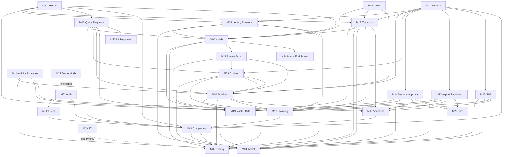
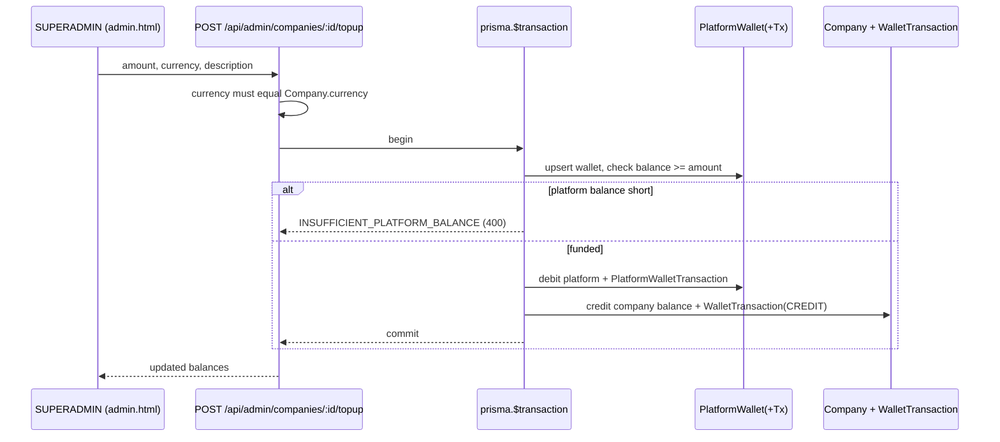
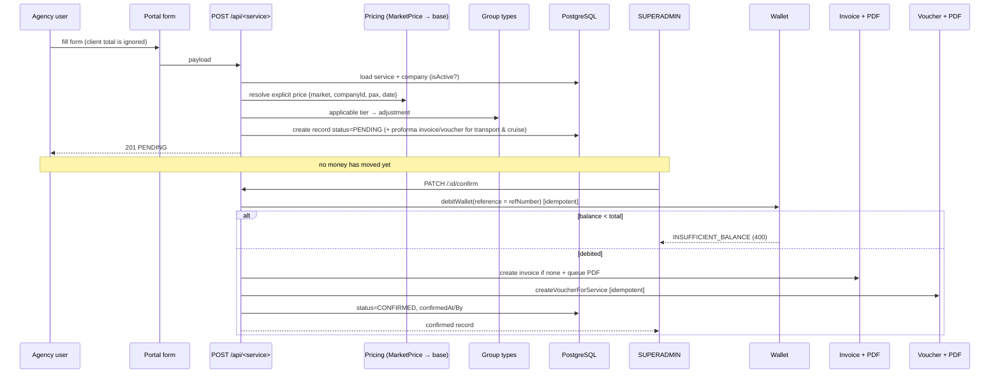
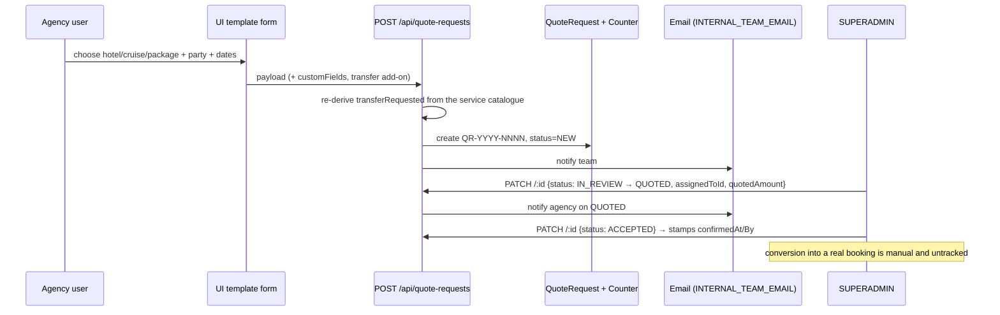
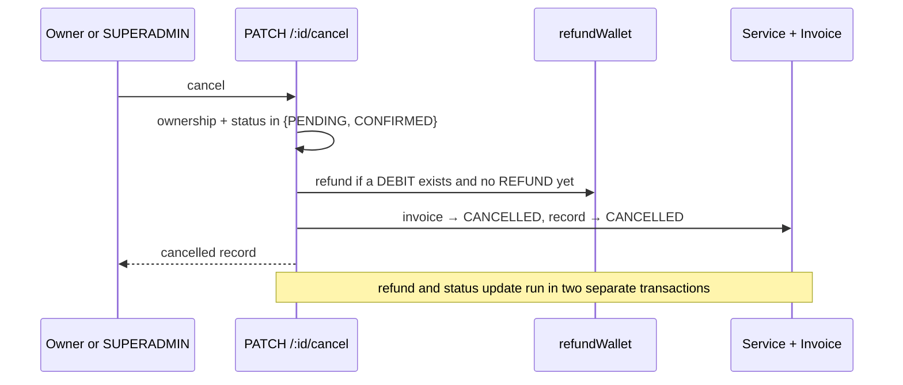
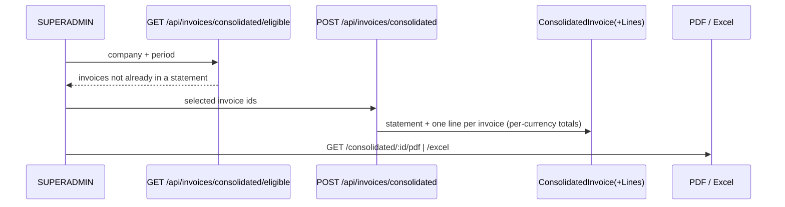
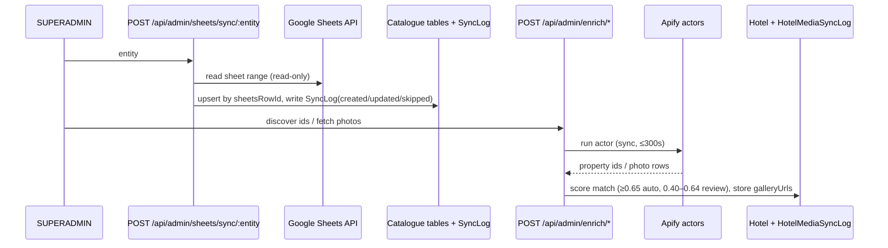

# APPLICATION AUDIT REPORT — Elbakri Overseas B2B Travel Portal

**Phase:** Discovery & Module Identification (read-only)
**Repository:** `eyadsofian/elbakri-portal` · branch `claude/cruise-program-options-oovbji`
**Date of audit:** 2026-08-30
**Scope of this document:** application discovery, module identification, feature inventory, dependency mapping, risk identification.
**Explicitly out of scope:** scoring, fixing, refactoring, schema change, dependency change. Nothing in the application was modified while producing this report.

---

## 1. Executive Summary

### What the application appears to do

Elbakri Portal is a **B2B travel-booking portal for a single Egyptian tour operator (Elbakri Overseas)**, selling ground services to *partner travel agencies* rather than to end travellers. It is not a consumer OTA: every buyer is a `Company` (an agency) that holds a **prepaid wallet**, and every purchase is either

* booked directly in-app against an **admin-configured rate table** (activities, transport, airport assistance, security approvals/visa, SIM cards, activity packages, Nile cruises), or
* raised as a **Quote Request (RFQ)** that the operator's back office prices manually (hotels, packages, cruises, flights, multi-service).

The commercial model is: agency wallet is topped up from a **platform wallet** → agency raises a service request (status `PENDING`) → operator confirms → the **wallet is debited**, an **Invoice** is created and a PDF generated, and for customer-facing services a **Voucher** PDF (with no prices) is issued for the traveller.

Prices are **explicit, admin-entered, per-market amounts that are never FX-converted** at the point of sale — this is the single most load-bearing rule in the codebase and is stated repeatedly in code comments (`src/shared/money.ts`, `src/shared/pricing.ts`).

### Overall architecture

A **monolithic Express + TypeScript API** (modular-by-feature folders under `src/modules/*`, each with `*.routes.ts` / `*.controller.ts` / optional `*.schema.ts`), a **Prisma/PostgreSQL** data layer, and a **hand-written static HTML front end** — three files (`public/dashboard.html`, `public/admin.html`, `public/login.html`) with several thousand lines of inline JavaScript each, served by the same Express process with an SPA-style catch-all.

There is no separate service layer for most modules: business logic lives in controllers, with genuinely shared/pure rules extracted into `src/shared/*` (pricing, wallet, cruise rates, activity pricing, transfer add-on, itinerary, inclusions, invoicing, money).

### Main technologies

Node 20 · TypeScript 5.4 (strict) · Express 4 · Prisma 5 / PostgreSQL · Zod · JWT (access) + opaque-ish refresh token rows + httpOnly cookie · bcryptjs · PDFKit · Nodemailer · googleapis (Sheets) · xlsx · multer · helmet · express-rate-limit · `node:test` runner.

### Primary actors

| Actor | Where they work | Summary |
|---|---|---|
| **SUPERADMIN** | `public/admin.html` | Operator back office. Owns all catalogue, all rate tables, confirms/rejects every request, funds the platform wallet, tops up agencies, marks invoices paid, runs Sheets sync and hotel media enrichment. |
| **COMPANY_ADMIN** | `public/dashboard.html` | Agency owner. Everything an agent can do, plus creating/managing that agency's `AGENT` users. |
| **AGENT** | `public/dashboard.html` | Agency staff. Browses catalogue at their own market's prices, raises bookings and quote requests, downloads invoices/vouchers, sees the wallet. |
| **System / background** | — | Email notifications, PDF generation (fire-and-forget), FX rate refresh, Google Sheets pull, Apify (Booking.com) media enrichment. |

### Identified business modules

**27 modules** (see §4). Of these, 12 are *sellable-service* modules, 6 are *money/document* modules, 6 are *catalogue & reference* modules, and 3 are *platform/ops* modules.

### Major cross-module workflows

1. **Agency top-up** — Platform Wallet → Company Wallet (double-entry across two ledgers).
2. **In-app service booking** — catalogue → server-authoritative pricing → `PENDING` booking (+ proforma invoice for some services) → admin confirm → wallet debit → invoice → voucher → emails.
3. **Quote-request (RFQ)** — agency request → admin triage/assign/quote → `ACCEPTED`/`CLOSED`. This path is the *only* path available to agencies for hotels, packages and cruises.
4. **Cancellation/rejection** — status change → idempotent wallet refund → invoice `CANCELLED`.
5. **Consolidated statement** — many confirmed invoices → one `ConsolidatedInvoice` + lines → PDF/Excel.
6. **Catalogue ingestion** — Google Sheets → upsert into hotels/pricing/cruises/activities/transport/visa fees/reception services; and Apify → hotel Booking.com ids + gallery photos.

### Areas requiring the deepest future testing

* **Wallet money movement + credit limit semantics** (`src/shared/wallet.ts` vs `Company.creditLimit`) — see R-01, R-02.
* **The pricing resolution chain** (`MarketPrice` → base column) across every booking flow, and the "never FX a sale price" rule.
* **Nile cruise pricing** (cabin vs programme vs transfer, occupancy semantics, supplements, schedule binding) — the most recently and most heavily changed area.
* **Transport rate resolution** (rateId vs route matching vs at-disposal, round-trip pricing rules) — the largest single controller in the codebase (947 lines).
* **Status transitions and idempotency** on confirm/cancel for all seven service types.
* **Authorization scoping** (`companyId` isolation) on every list/read endpoint.

*No scores are given anywhere in this document.*

---

## 2. Technology Stack

**Frontend**
* Hand-written static HTML with inline `<script>` logic — `public/dashboard.html` (6,638 lines), `public/admin.html` (8,717 lines), `public/login.html` (221 lines).
* Shared browser assets: `public/assets/i18n.js` (2,390 lines, EN/AR dictionary + `PortalI18n`), `global-search.js`, `theme.js`, `icons.js`, `responsive-tables.js`, `portal.css` (8,855 lines).
* Vendored icon font (Phosphor) + self-hosted Tajawal font under `public/assets/`.
* No framework, no bundler, no build step for the client. State is module-level `state` objects and `localStorage` for the access token.

**Backend**
* Node.js ≥18 ≤20 (`.nvmrc` = 20), TypeScript 5.4 compiled to CommonJS in `dist/`.
* Express 4 with `helmet` (CSP explicitly disabled), `cors` pinned to `BASE_URL`, `cookie-parser`, `express.json({limit:'10mb'})`.
* Feature-module layout: `src/modules/<feature>/<feature>.routes.ts|controller.ts|schema.ts`.
* Cross-cutting middleware: `authenticate` (JWT), `requireRole`, `validate` (Zod), `asyncHandler`.

**Database**
* PostgreSQL via Prisma 5 (`prisma/schema.prisma`, 2,096 lines) — **31 enums, 57 models**.
* 21 forward migrations in `prisma/migrations/`; two legacy migration trees kept in-tree (`migrations_postgres_backup/`, `migrations_mysql_backup/`) plus `database/mysql/init.sql`.

**Authentication**
* JWT access token (default `1h`, `JWT_SECRET`), signed refresh JWT (`30d`, `REFRESH_TOKEN_SECRET`) **also persisted as a `RefreshToken` row** and returned in an httpOnly/SameSite=strict cookie; access token is held in browser `localStorage`.

**State management (frontend)** — plain JS objects + `localStorage`; no store library.

**External services**
* Google Sheets API (read-only, service account) — catalogue sync.
* Apify actors (Booking.com search + photo scrapers) — hotel media enrichment.
* `open.er-api.com` — daily FX rates (cached in-memory + `FxRateCache` row).
* SMTP (Nodemailer) — transactional email.
* `bstatic.com` image proxy endpoint `GET /media/hotel-image` (host allow-list).

**Testing** — `node:test` via `ts-node/register/transpile-only`; 17 unit suites + 1 skipped DB integration suite; plus four bespoke static-audit scripts in `scripts/`.

**Infrastructure**
* Railway (`railway.json`: NIXPACKS, `prisma migrate deploy` pre-deploy, healthcheck `/api/health`); cPanel/Passenger deployment documented as an alternative.
* Local disk storage for uploads (`uploads/`, `uploads-private/`) and generated PDFs (`generated/`), all overridable by env.
* `DEMO_MODE=1` mounts a fixture router ahead of all real routes.

---

## 3. High-Level Architecture

```
Browser (dashboard.html | admin.html | login.html, inline JS)
        │  apiFetch("/…")  → Bearer access token from localStorage
        │  401 → POST /api/auth/refresh (httpOnly cookie) → retry once
        ▼
Express app (src/app.ts)
   helmet · cors(BASE_URL) · json · cookie-parser
   static: public/, /uploads, /generated · GET /api/health · GET /media/hotel-image
   [DEMO_MODE] fixture router mounted ahead of everything
        ▼
/api/auth (public) ── all other /api/* behind authenticate
        ▼
Feature routers  →  requireRole(...) / validate(zodSchema)
        ▼
Controllers (business logic lives here)
        ├── src/shared/pricing.ts       explicit price matrix resolution
        ├── src/shared/wallet.ts        idempotent debit / refund
        ├── src/shared/cruise-rates.ts  cruise fare rules (pure)
        ├── src/shared/activity-pricing.ts party composition (pure)
        ├── src/shared/transfer-addon.ts transfer parsing (pure)
        ├── src/shared/money.ts         explicitMoney / convertMoney
        └── src/shared/invoicing.ts     invoice totals, per-currency totals
        ▼
Prisma Client → PostgreSQL   (prisma.$transaction for money paths)
        ▼
Side effects: Nodemailer email · PDFKit invoice & voucher PDFs (fire-and-forget)
              Google Sheets pull · Apify actors · FX provider
```

**Architectural patterns actually observed**

* **Modular monolith by business feature**, mounted centrally in `app.ts`.
* **Controller-centric**: only `group-types`, `sheets-sync`, `fx` and `transport` have a distinct service/resolver file; everything else keeps rules in the controller.
* **Pure-rule extraction for testability** — `src/shared/*` modules are deliberately DB-free so they can be unit-tested (`tests/*.test.ts`).
* **Replace-all set saves** for rate matrices (hotel rates, cruise rates/schedules/programmes/transfer rates, price rows): `deleteMany` + `createMany` inside one transaction.
* **Money snapshotting** — every priced record stores `sourceAmount/sourceCurrency/exchangeRate/exchangeRateAt` alongside `totalAmount/currency`; `explicitMoney()` fixes `exchangeRate = 1` for sale prices.
* **Idempotency-by-reference** for wallet moves (`WalletTransaction.reference` = booking `refNumber`) and for vouchers (`@unique` per-service FK on `Voucher`).
* **Server-authoritative pricing** — client-submitted totals are explicitly ignored in transport, activities, packages, reception, SIM, visa.
* **Soft delete** for catalogue rows (`isActive = false`) rather than hard delete.
* **Fail-fast env validation** at boot (`src/config/env.ts`) and a process-level `unhandledRejection`/`uncaughtException` net.

---

## 4. Business Module Map

Testing Priority = how urgently the module needs deep testing in later phases. **It is not a quality judgement.**

| # | Module | Business Responsibility | Main Actors | Dependencies | Testing Priority |
|---|--------|-------------------------|-------------|--------------|------------------|
| M01 | Authentication & Session | Login, refresh, logout, identity | All | Users, Companies | Critical |
| M02 | Users & Roles | Staff accounts, role assignment, password reset | SUPERADMIN, COMPANY_ADMIN | Auth, Companies | Critical |
| M03 | Companies (Agencies) | Agency master record, tier, market, credit limit, activation | SUPERADMIN | Users, Wallet, Pricing | Critical |
| M04 | Wallet & Platform Treasury | Prepaid balance, top-ups, debits, refunds, platform funding | SUPERADMIN, agency users (read) | Companies, all booking modules | Critical |
| M05 | Pricing & Market Price Matrix | Explicit per-market/per-company sale prices, no FX | SUPERADMIN (config), all (consume) | Companies, all catalogue | Critical |
| M06 | Quote Requests (RFQ) | Manual-quote intake for hotel/package/cruise/flight/multi | Agency users, SUPERADMIN | Companies, Hotels, Destinations, Cruises, Activities, UI Templates | Critical |
| M07 | Hotels (catalogue, rates, visibility, media) | Hotel inventory, rate matrix, per-company price visibility, images, Excel import/export | SUPERADMIN, agency users (read) | Destinations, Pricing, Sheets, Enrichment | High |
| M08 | Legacy Bookings (hotel/flight/package) | The original `Booking` entity; now SUPERADMIN-only entry | SUPERADMIN | Hotels, Wallet, Invoicing, Pricing | High |
| M09 | Nile Cruises (catalogue + bookings) | Boats, schedules, cabin rates, programmes, transfer rates, shared catalogue, cruise bookings | SUPERADMIN; agents read + RFQ | Wallet, Invoicing, Pricing, Activities (add-ons) | Critical |
| M10 | Activities (catalogue + bookings) | Excursion catalogue and single-excursion bookings | SUPERADMIN, agency users | Destinations, Group Types, Pricing, Wallet, Vouchers | Critical |
| M11 | Activity Packages | Multi-activity package: one ref, one invoice, one voucher | Agency users, SUPERADMIN | Activities, Group Types, Pricing, Wallet, Vouchers | Critical |
| M12 | Transport (rates + bookings) | Transfers, intercity, at-disposal charters, round trips | SUPERADMIN, agency users | Airports, Destinations, Hotels, Group Types, Pricing, Wallet, Vouchers | Critical |
| M13 | Airport Reception (Airport Assist) | Meet & greet / VIP lounge / full assistance at airports | Agency users, SUPERADMIN | Airports, Reception rates, Wallet, Vouchers | High |
| M14 | Security Approval (Visa) | Entry/security approvals with fee matrix and document upload | Agency users, SUPERADMIN | Visa fees, Files, Wallet, Vouchers | High |
| M15 | SIM Cards | SIM package catalogue and per-request fulfilment | Agency users, SUPERADMIN | Pricing, Wallet, Vouchers | Medium |
| M16 | Invoicing & Consolidated Statements | Per-service invoices, PDFs, bulk PDF, period statements (PDF/Excel) | SUPERADMIN, agency users | All booking modules, Companies | High |
| M17 | Vouchers | Price-free traveller documents per service | SUPERADMIN, agency users | Transport, Activities, Packages, Visa, Reception, SIM | High |
| M18 | Offers & Marketing Packages | Promotional offers and multi-component package cards | SUPERADMIN, agency users (read) | Hotels, Transport, Activities | Medium |
| M19 | Master Data & Reference | Destinations, airports, meal plans, visa fees, reception rates, transport rates, group types | SUPERADMIN | Used by nearly every module | High |
| M20 | Reports & Dashboards | Cross-service KPI aggregation, per-company report | SUPERADMIN, agency users (own) | All booking modules, Companies | Medium |
| M21 | Global Search | Cross-entity top-bar search with page routing | All | Bookings, Transport, Invoices, Quotes, Companies, Hotels | Medium |
| M22 | UI Templates / Request Form Builder | Admin-authored dynamic dashboard blocks and request forms | SUPERADMIN (author), all (consume) | Quote Requests, service booking forms | Medium |
| M23 | Google Sheets Sync | Catalogue ingestion from spreadsheets | SUPERADMIN | Hotels, Pricing, Cruises, Activities, Transport, Visa fees, Reception | Medium |
| M24 | Hotel Media Enrichment | Booking.com id matching + gallery photo import via Apify | SUPERADMIN | Hotels | Low |
| M25 | Files & Uploads | Public image uploads, private document storage + gated download | All (upload), owner/admin (read) | Visa, Reception | High |
| M26 | FX Rates | Daily reference rates for display (never for sale prices) | All | — | Low |
| M27 | Preview / Demo Mode | Whole API answered from fixtures, DB never touched | Reviewer | — | Medium |

---

## 5. Detailed Module Inventory

> Every module below lists what was found in the code. "Confirmed" = read directly in source; "Inferred" = deduced from structure/naming plus at least one supporting code path.

### Module: M01 — Authentication & Session

**Business Purpose** — Establish who is calling, keep them signed in for 30 days, and deny access when the user or their agency is deactivated.

**Actors** — SUPERADMIN, COMPANY_ADMIN, AGENT (and anonymous at `/login`).

**Frontend**
* Routes/pages: `public/login.html` (standalone), plus token bootstrap + `apiFetch` interceptor at `public/dashboard.html:264-290` and the equivalent in `admin.html`.
* Components/forms: login form; silent-refresh-on-401 wrapper; logout button calling `/auth/logout`.

**Backend**
* Routes: `src/modules/auth/auth.routes.ts` — `POST /api/auth/login` (rate-limited), `POST /api/auth/refresh`, `POST /api/auth/logout`, `GET /api/auth/me`.
* Controller: `src/modules/auth/auth.controller.ts`.
* Schema: `src/modules/auth/auth.schema.ts` (`loginSchema` trims + lower-cases email).
* Middleware: `src/middleware/auth.ts` (`authenticate`), `src/middleware/role.ts` (`requireRole`).
* Jobs: none.

**Database** — `User`, `RefreshToken`, read-only join to `Company.isActive`.
Statuses: `User.isActive`, `Company.isActive`, `RefreshToken.expiresAt`.

**Features**

| Feature | Description | Actors | Frontend | Backend | DB Entities |
|---|---|---|---|---|---|
| Login | Email+password → access token + refresh cookie | All | `login.html` | `login()` | User, RefreshToken, Company |
| Silent refresh | 401 → refresh → retry once | All | `apiFetch` | `refresh()` | RefreshToken, User, Company |
| Logout | Delete the refresh row, clear cookie | All | logout button | `logout()` | RefreshToken |
| Current user | Identity + company summary incl. balance | All | dashboard bootstrap | `me()` | User, Company |
| Brute-force limit | 10 failed attempts / 15 min / IP | — | — | `loginLimiter` | — |

**Known Use Cases** — valid login; wrong password; unknown email; inactive user; active user in a deactivated company (403 `COMPANY_INACTIVE`); capitalised email login; expired refresh row; tampered refresh JWT; missing refresh cookie; rate-limited login; SUPERADMIN with `companyId = null`.

**Business Rules Discovered**
* Email is normalised (trim + lower-case) at login, create and update — PostgreSQL text comparison is case-sensitive (confirmed, `auth.schema.ts` and `users.controller.ts`).
* An inactive user is indistinguishable from bad credentials (401), but an inactive *company* returns an explicit 403 — deliberate asymmetry (confirmed).
* Refresh verifies the JWT signature **and** requires the stored row; the stored row is treated as the identity source (confirmed).
* Only failed logins count toward the rate limit (`skipSuccessfulRequests: true`).

**State Transitions** — `RefreshToken`: created → (expiresAt passes) → rejected; deleted on logout. Tokens are **not** rotated on refresh and old rows are never pruned.

**Dependencies** — M02 Users, M03 Companies.

**External Integrations** — none.

**Existing Tests** — `tests/accounts.test.ts` covers email normalisation parity between create/login/update and duplicate-email error classification. No test exercises `refresh`/`logout`.

**Potential Risk Areas** — access token in `localStorage` (documented in `SECURITY_AND_REVIEW_AR.md` C-5); no refresh rotation or reuse detection; no server-side revocation on role change (a JWT keeps its old `role`/`companyId` until it expires); `RefreshToken` rows accumulate.

**Files Requiring Deeper Review** — `src/middleware/auth.ts`, `src/modules/auth/auth.controller.ts`, `public/dashboard.html:264-300`.

**Future Six-Metric Audit Checklist**
Best Practices: token storage, refresh rotation, revocation on role/company change.
Performance: `RefreshToken` growth and index use.
Enterprise Readiness: session revocation, audit trail of logins beyond `lastLoginAt`.
Clean Code: duplicated `apiFetch`/refresh logic across the two portals.
DRY: cookie options and JWT payload construction repeated in demo router.
UI/UX: expired-session messaging, redirect-after-login behaviour.

---

### Module: M02 — Users & Roles

**Business Purpose** — Create and manage the human accounts inside the operator and inside each agency.

**Actors** — SUPERADMIN (any user), COMPANY_ADMIN (own-company `AGENT`s only).

**Frontend** — `admin.html` `data-page="users"` (list, create, edit, reset password, deactivate). The agency portal has no users page.

**Backend**
* Routes: `src/modules/users/users.routes.ts` — router-level `requireRole('SUPERADMIN','COMPANY_ADMIN')`, then `GET /`, `POST /`, `PATCH /:id`, `POST /:id/reset-password`, `DELETE /:id`, all wrapped in `asyncHandler`.
* Controller: `src/modules/users/users.controller.ts` (`canManageTarget` gate).
* Schema: `src/modules/users/users.schema.ts`.

**Database** — `User` (+ `Company`).
Statuses: `User.isActive`; `Role` enum `SUPERADMIN | COMPANY_ADMIN | AGENT`.

**Features**

| Feature | Description | Actors | Frontend | Backend | DB Entities |
|---|---|---|---|---|---|
| List users | Company-scoped for non-admins; `isActive`/`includeInactive` filters | SUPERADMIN, COMPANY_ADMIN | admin users page | `listUsers` | User |
| Create user | Role + company assignment; generated temp password when none given | SUPERADMIN, COMPANY_ADMIN | admin form | `createUser` | User |
| Update user | Name/email/active; role & company changes are SUPERADMIN-only | SUPERADMIN, COMPANY_ADMIN | admin form | `updateUser` | User |
| Reset password | Set or generate a new password | SUPERADMIN, COMPANY_ADMIN | admin action | `resetUserPassword` | User |
| Deactivate user | Soft delete | SUPERADMIN, COMPANY_ADMIN | admin action | `deleteUser` | User |

**Known Use Cases** — SUPERADMIN creates an agency admin; COMPANY_ADMIN creates an agent; COMPANY_ADMIN attempts to create a COMPANY_ADMIN (403); COMPANY_ADMIN attempts to edit a user in another company (blocked by `canManageTarget`); role change attempted by a non-SUPERADMIN (403); creating a non-SUPERADMIN without `companyId` (400); duplicate email (409 via `DuplicateEmailError`).

**Business Rules Discovered**
* A `SUPERADMIN` always has `companyId = null`; any other role requires a company (confirmed, `users.controller.ts:66,86,133-134`).
* `COMPANY_ADMIN` may only manage `AGENT` users **inside their own company** (confirmed, `canManageTarget`).
* Only `SUPERADMIN` may change `role` or `companyId` (confirmed, explicit 403s).
* Temporary passwords use `crypto.randomInt` over a look-alike-free alphabet (`src/shared/helpers.ts`).

**State Transitions** — `isActive: true → false` (soft delete); reactivation only via update.

**Dependencies** — M01 Auth, M03 Companies.

**External Integrations** — welcome/credential email (`src/shared/email.templates.ts`).

**Existing Tests** — `tests/accounts.test.ts` (email normalisation, P2002 classification). No authorization-matrix test.

**Potential Risk Areas** — role escalation paths; a deactivated user keeps a valid access token until expiry; temp passwords are emailed in plain text (by design, but worth a policy decision).

**Files Requiring Deeper Review** — `src/modules/users/users.controller.ts`, `src/modules/users/users.schema.ts`.

**Future Six-Metric Audit Checklist**
Best Practices: authorization helper coverage, password policy.
Performance: user list pagination and indices.
Enterprise Readiness: audit log of who changed a role; session invalidation.
Clean Code: `canManageTarget` vs inline role checks.
DRY: password generation/emailing duplicated with company creation.
UI/UX: admin-only surface — agencies cannot manage their own staff in the portal UI even though the API allows it.

---

### Module: M03 — Companies (Agencies)

**Business Purpose** — The customer record: identity, billing details, sales market, tier, credit limit, wallet balance and activation state.

**Actors** — SUPERADMIN (full), agency users (read own via `/auth/me` and reports).

**Frontend** — `admin.html` `data-page="companies"` — list/filter, create (with auto-created admin user), edit, top-up, deactivate; `/admin/price-rows` editor reached from catalogue pages.

**Backend**
* Routes: `src/modules/companies/companies.routes.ts` mounted at `/api/admin/companies` behind `requireRole('SUPERADMIN')` (`src/admin/admin.routes.ts:11`).
* Controller: `src/modules/companies/companies.controller.ts` (463 lines).
* Schema: `src/modules/companies/companies.schema.ts`.

**Database** — `Company`, `User` (auto-created admin), `WalletTransaction`, `PlatformWallet`, `PlatformWalletTransaction`, `HotelCompanyVisibility`, `MarketPrice`.
Statuses: `Company.isActive`, `CompanyTier`, `Market`.

**Features**

| Feature | Description | Actors | Frontend | Backend | DB Entities |
|---|---|---|---|---|---|
| List companies | Search/tier/active filters, paginated | SUPERADMIN | admin | `listCompanies` | Company |
| Create company | Company + its first COMPANY_ADMIN + welcome email | SUPERADMIN | admin | `createCompany` | Company, User |
| Get company | Includes users, recent transactions, derived balance figures | SUPERADMIN | admin | `getCompany` | Company, User, WalletTransaction |
| Update company | Tier, credit limit, currency, market, branding, activation | SUPERADMIN | admin | `updateCompany` | Company |
| Top-up wallet | Move money Platform Wallet → Company wallet | SUPERADMIN | admin | `topupCompany` | PlatformWallet(+Tx), Company, WalletTransaction |
| Deactivate | Soft delete; blocks login and new bookings | SUPERADMIN | admin | `deleteCompany` | Company |

**Known Use Cases** — create agency with duplicate company email (409); create agency whose admin email already exists (409, distinguished by `DuplicateEmailError.scope`); top-up in a currency ≠ company currency (400 `CURRENCY_MISMATCH`); top-up exceeding platform balance (400 `INSUFFICIENT_PLATFORM_BALANCE`); deactivate a company with active bookings; tier/market change altering which price rows apply.

**Business Rules Discovered**
* Top-up is **funded from the platform wallet** and fails when the platform balance is short (confirmed, `topupCompany`).
* Top-up currency must equal `Company.currency` (confirmed).
* Derived money view: `usedCredit = max(0, −balance)`, `availableCredit = creditLimit − usedCredit`, `spendingPower = max(0, balance) + availableCredit`, `totalDeposited = max(sum(CREDIT), balance + totalUsed)` (confirmed, `companies.controller.ts:265-293`).
* Company deletion is a soft delete that also stamps `lastActivityAt`.
* `Company.market` selects the price tier every catalogue read uses (via `resolvePriceContext`).

**State Transitions** — `isActive: true ↔ false`. Balance transitions are described in M04.

**Dependencies** — M02 Users, M04 Wallet, M05 Pricing.

**External Integrations** — welcome email with temporary credentials.

**Existing Tests** — indirect only (`tests/accounts.test.ts` duplicate-email classification).

**Potential Risk Areas** — `creditLimit`/`spendingPower` are *displayed* but the debit path checks raw `balance` only (see R-02); top-up mixes two ledgers in one transaction — needs concurrency testing; `CompanyTier` is stored and filterable but no pricing rule reads it (see §16).

**Files Requiring Deeper Review** — `src/modules/companies/companies.controller.ts:253-450`.

**Future Six-Metric Audit Checklist**
Best Practices: transaction boundaries on top-up; validation coverage.
Performance: `getCompany` fan-out (users + transactions) and list filters.
Enterprise Readiness: credit-limit policy, audit trail, currency governance.
Clean Code: 463-line controller mixing CRUD, money and derived reporting.
DRY: balance-derivation logic duplicated with `wallet.controller.ts:getBalance`.
UI/UX: top-up failure messaging; tier semantics that do nothing.

---

### Module: M04 — Wallet & Platform Treasury

**Business Purpose** — The money rail: a prepaid agency balance debited on confirmation and refunded on cancellation, funded from an operator-owned platform wallet.

**Actors** — SUPERADMIN (fund platform, top-up agencies, view all transactions); AGENT/COMPANY_ADMIN (read own balance and ledger).

**Frontend** — agency `data-page="wallet"` (balance, deposited, used, ledger); admin `data-page="wallet"` (platform wallet, fund, all transactions).

**Backend**
* Routes: `src/modules/wallet/wallet.routes.ts` (`GET /api/wallet/balance`, `GET /api/wallet/transactions`, both `requireRole('AGENT','COMPANY_ADMIN')`); admin side in `src/admin/admin.routes.ts` (`GET /api/admin/wallet/transactions`, `GET /api/admin/wallet/platform`, `POST /api/admin/wallet/platform/fund`).
* Controller: `src/modules/wallet/wallet.controller.ts`.
* Shared engine: `src/shared/wallet.ts` — `debitWallet()` / `refundWallet()`, both required to run inside a `prisma.$transaction`.

**Database** — `Company.balance`, `WalletTransaction`, `PlatformWallet`, `PlatformWalletTransaction`.
Statuses: `TransactionType = CREDIT | DEBIT | REFUND | ADJUSTMENT`.

**Features**

| Feature | Description | Actors | Frontend | Backend | DB Entities |
|---|---|---|---|---|---|
| Balance view | Authoritative balance + deposited/used reconciliation | AGENT, COMPANY_ADMIN | wallet page | `getBalance` | Company, WalletTransaction |
| Own ledger | Paginated, type/date filters | AGENT, COMPANY_ADMIN | wallet page | `getTransactions` | WalletTransaction |
| All ledgers | Cross-company, company/type/date filters | SUPERADMIN | admin wallet | `getAllTransactions` | WalletTransaction |
| Platform wallet | Per-currency operator balance + last 20 movements | SUPERADMIN | admin wallet | `getPlatformWallet` | PlatformWallet(+Tx) |
| Fund platform | CREDIT the platform wallet | SUPERADMIN | admin wallet | `fundPlatformWallet` | PlatformWallet(+Tx) |
| Debit on confirm | Idempotent per `reference` | System | — | `debitWallet` | Company, WalletTransaction |
| Refund on cancel | Idempotent; only if a DEBIT exists and no REFUND yet | System | — | `refundWallet` | Company, WalletTransaction |

**Known Use Cases** — confirm with sufficient balance; confirm with insufficient balance (400 `INSUFFICIENT_BALANCE`); double-confirm (second debit is a no-op); cancel a confirmed booking (refund once); cancel twice (second refund is a no-op); cancel a `PENDING` booking that was never debited (no refund); zero-amount/price-on-request service (no-op); two confirmations racing on the same wallet.

**Business Rules Discovered**
* Debit is skipped when `amount <= 0` (free / price-on-request services).
* Idempotency key is `(reference, type)` where `reference` is the service `refNumber` (confirmed).
* Refund requires a prior DEBIT for the same reference (confirmed) — so cancelling a never-confirmed booking moves no money.
* `balanceBefore`/`balanceAfter` are snapshotted on every row.
* `INSUFFICIENT_BALANCE` is thrown when `company.balance < amount` — **`creditLimit` is not consulted** (confirmed, `src/shared/wallet.ts:44`).
* The **platform wallet is per-currency** (`PlatformWallet.currency` is the primary key).

**State Transitions** — no status column; the ledger is append-only. Balance path per booking: `CREDIT` (top-up) → `DEBIT` (confirm) → optional `REFUND` (cancel). `ADJUSTMENT` exists in the enum but is never written by any code path (see §16).

**Dependencies** — M03 Companies; consumed by M08–M15.

**External Integrations** — none.

**Existing Tests** — `tests/wallet.test.ts` (7 cases): debit once, idempotent re-debit, insufficient balance, zero-amount no-op, refund, idempotent refund, refund without debit.

**Potential Risk Areas** — **R-01** idempotency is a `findFirst` check with no unique constraint on `WalletTransaction.reference` → concurrent confirms can double-debit (matches `SECURITY_AND_REVIEW_AR.md` C-4); **R-02** credit limit not honoured in debit; three modules re-implement the debit inline instead of calling `debitWallet` (`visa.controller.ts:598-624`, `bookings.controller.ts:rejectBooking`, and the refund half of `sim-card.controller.ts`).

**Files Requiring Deeper Review** — `src/shared/wallet.ts`, `src/modules/visa/visa.controller.ts:588-660`, `src/modules/bookings/bookings.controller.ts:377-420`.

**Future Six-Metric Audit Checklist**
Best Practices: DB-level idempotency constraint; single debit/refund entry point.
Performance: aggregate queries on `getBalance` per request.
Enterprise Readiness: concurrency, reconciliation, immutable ledger guarantees, credit policy.
Clean Code: duplicated inline ledger writes.
DRY: balance derivation duplicated in companies + wallet.
UI/UX: what an agent sees when a confirm fails for balance.

---

### Module: M05 — Pricing & Market Price Matrix (cross-cutting)

**Business Purpose** — Decide the *sale* price of every catalogue item for a given agency, in an explicit currency, without any FX conversion.

**Actors** — SUPERADMIN (authors price rows); every read path consumes it.

**Frontend** — admin price-row editors reached from hotel/activity/transport/cruise/SIM pages (`/admin/price-rows`, `/admin/market-prices`).

**Backend**
* `src/shared/pricing.ts` — `resolvePriceContext`, `scoreRow`, `resolveExplicitPrice`, `resolveMarketMoney`, `resolveMarketPriceMap`, `applyMarketPrice`, `getEntityPriceRows`, `saveEntityPriceRows`, `upsertMarketPrice`.
* `src/shared/money.ts` — `explicitMoney` (rate = 1, no FX) vs `convertMoney` (FX, used for non-sale contexts).
* Routes: `GET/PUT /api/admin/market-prices`, `GET/PUT /api/admin/price-rows` (`src/modules/market-prices/market-prices.controller.ts`).

**Database** — `MarketPrice` (`@@unique([entityType, entityId, market, companyId])`).
`entityType` values in use: `HOTEL`, `ACTIVITY_ADULT`, `ACTIVITY_CHILD`, `TRANSPORT`, `TRANSPORT_RT`, `CRUISE`, `SIM`, `SECURITY`, `AIRPORT`.

**Features** — price-row CRUD per entity; batch override maps for list endpoints; single-entity resolution for booking flows; admin price preview via `?market=` / `?companyId=`.

**Known Use Cases** — company-specific row wins over market row wins over all-markets row wins over the base column; row outside `validFrom/validTo` excluded; `pax` outside `minPax/maxPax` excluded; caller with no market cannot inherit a market-specific row; legacy `priceUsd` used when `amount` is null; replace-all save dropping rows with non-positive amounts.

**Business Rules Discovered**
* Resolution priority: company (3) → market (2) → all (1) → base column (confirmed, `scoreRow`).
* The resolved `currency` is returned **verbatim**; callers must not convert (confirmed in comments and enforced by `explicitMoney`).
* `saveEntityPriceRows` is destructive: it deletes every row for the entity and recreates only rows with `amount > 0` and a currency.
* `upsertMarketPrice` deletes the row when the amount is blank/≤0.
* SUPERADMIN may preview another market/company's prices via query params.

**State Transitions** — `MarketPrice.isActive` only.

**Dependencies** — M03 Companies (market/company context); consumed by M07–M15.

**External Integrations** — none.

**Existing Tests** — `tests/pricing.test.ts` (11 cases) and `tests/pricing-parity.test.ts` (portal vs server agreement).

**Potential Risk Areas** — pricing correctness is the highest-value business logic in the system; the destructive replace-all save; `MarketPrice.nationalityGroup` is stored but never read (see §16); the shadowed transport-rates route (§16) means one list endpoint returns *un-overridden* prices.

**Files Requiring Deeper Review** — `src/shared/pricing.ts`, `src/shared/money.ts`, `src/modules/market-prices/market-prices.controller.ts`.

**Future Six-Metric Audit Checklist**
Best Practices: one resolution entry point; explicit currency contracts.
Performance: N+1 `bestRow` lookups inside per-item loops.
Enterprise Readiness: price history/audit, effective-dating, approval of price changes.
Clean Code: multiple back-compat variants (`getMarketPrice`, `resolveMarketPrices`).
DRY: `rateApplies`/`marketEquivalent` reimplemented in `cruise-rates.ts` and `hotels/rates.controller.ts`.
UI/UX: how "price on request" is communicated when no row matches.

---

### Module: M06 — Quote Requests (RFQ)

**Business Purpose** — The manual-quote intake channel. It is the **only** way an agency can ask for a hotel, package, cruise, flight or multi-service arrangement; the operator prices it off-portal and records the outcome.

**Actors** — AGENT / COMPANY_ADMIN (create, view own, cancel), SUPERADMIN (view all, triage, assign, quote, close).

**Frontend**
* Agency: `data-page="my-quotes"`; request forms rendered from UI Templates (`renderTemplateForm`) with a shared adapter that posts either to a service endpoint or to `/quote-requests`.
* Admin: `data-page="quote-requests"` — list, detail, status/assign/quoted-amount edit.

**Backend**
* Routes: `src/modules/quote-requests/quote-requests.routes.ts` — `GET /`, `GET /:id`, `POST /`, `POST /:id/cancel`, `PATCH /:id` (SUPERADMIN).
* Controller: `src/modules/quote-requests/quote-requests.controller.ts` (324 lines). **No Zod schema file exists for this module.**

**Database** — `QuoteRequest`, `QuoteRequestCounter`; soft references to `Destination`, `Hotel`, `NileCruise` (`cruiseId`), `Activity` (`activityId`), and `User` (`assignedTo`).
Statuses: `QuoteRequestStatus = NEW | IN_REVIEW | QUOTED | ACCEPTED | CLOSED | CANCELLED`; `QuoteServiceType = HOTEL | PACKAGE | CRUISE | FLIGHT | MULTI_SERVICE`.

**Features**

| Feature | Description | Actors | Frontend | Backend | DB Entities |
|---|---|---|---|---|---|
| Create request | Ref `QR-YYYY-NNNN`, party, dates, transfer add-on, dynamic `customFields` | Agency users, SUPERADMIN | template form | `createQuoteRequest` | QuoteRequest, Counter |
| List/filter | Status, service type, assignee, destination, date range | All (scoped) | both portals | `listQuoteRequests` | QuoteRequest |
| View one | Ownership-checked | All (scoped) | both portals | `getQuoteRequest` | QuoteRequest |
| Triage/quote | Status, assignee, internal notes, quoted amount | SUPERADMIN | admin | `updateQuoteRequest` | QuoteRequest |
| Cancel | Agency-initiated withdrawal | Owner, SUPERADMIN | agency | `cancelQuoteRequest` | QuoteRequest |

**Known Use Cases** — hotel RFQ from a hotel card; cruise RFQ carrying `cruiseId`; activity RFQ where the activity is not confirmable in-app; RFQ with a transfer add-on for a trip that already includes transport (suppressed); RFQ for an inactive company (400); non-owner reading another company's quote (403); cancelling an already `CLOSED` quote (400); admin moving `NEW → QUOTED` (customer email) → `ACCEPTED` (audit stamps).

**Business Rules Discovered**
* Reference is allocated from `QuoteRequestCounter` inside a transaction (confirmed).
* `transferRequested` is re-derived server-side: if the referenced `Activity.transferIncluded` is true, the add-on is dropped entirely (`readTransferAddOn`, confirmed).
* Cruise programmes send `transferRequested = false` because the programme fare already contains the transfer; the boat-wide flag must not suppress a cruise-only transfer choice (confirmed, comment + code).
* Status side effects: `QUOTED`/`ACCEPTED` stamp `respondedAt`; `ACCEPTED` also stamps `confirmedAt`/`confirmedById` preserving originals; `CLOSED`/`CANCELLED` stamp `closedAt` (confirmed).
* `customFields` are sanitised to a flat primitive map (≤40 keys, ≤2000 chars, alphanumeric keys) by `sanitizeCustomFields`.
* A `QUOTED` transition emails the agency; creation emails `INTERNAL_TEAM_EMAIL`.

**State Transitions**

```
NEW ──► IN_REVIEW ──► QUOTED ──► ACCEPTED ──► CLOSED
 │           │           │            │
 └───────────┴───────────┴────────────┴──► CANCELLED
```
No transition validation exists on `PATCH /:id`: any status may be set from any status (confirmed — the only guard is on `cancelQuoteRequest`).

**Dependencies** — M03 Companies, M07 Hotels, M09 Cruises, M10 Activities, M19 Destinations, M22 UI Templates.

**External Integrations** — email (team on create, agency on `QUOTED`).

**Existing Tests** — none directly. `tests/search-mapping.test.ts` asserts quotes route to a page that exists in each portal.

**Potential Risk Areas** — no Zod validation on `POST /` (documented as I-1 in the security doc); the internal notification email interpolates user-supplied fields **without `escapeHtml`** (`quote-requests.controller.ts:205-222`) while other modules do escape; no status-machine enforcement; `quotedAmount` has no currency of its own beyond `QuoteRequest.currency`.

**Files Requiring Deeper Review** — `src/modules/quote-requests/quote-requests.controller.ts`, the template-form adapter in `public/dashboard.html:2600-2800`.

**Future Six-Metric Audit Checklist**
Best Practices: input validation, output escaping, status machine.
Performance: list filters and indices (already indexed on company/status/serviceType).
Enterprise Readiness: SLA/assignment workflow, conversion of an accepted quote into a booking (currently manual and untracked).
Clean Code: one 100-line `create` handler mixing parsing, defaults and notification.
DRY: transfer parsing shared correctly; email HTML built inline instead of via `email.templates.ts`.
UI/UX: agency visibility of quote progress; what "ACCEPTED" means to the agency.

---

### Module: M07 — Hotels (catalogue, rates, visibility, media)

**Business Purpose** — The hotel inventory the agencies browse: descriptive content, structured amenities, a per-market rate matrix, per-company price visibility, and images.

**Actors** — SUPERADMIN (full), AGENT/COMPANY_ADMIN (browse, subject to visibility).

**Frontend**
* Agency: `data-page="hotels"` — destination cards → area filter → hotel grid/table (`data-view="cards|table"`) → hotel detail → hotel RFQ.
* Admin: `data-page="hotels"` — CRUD, rate matrix editor, pricing periods, images, per-company visibility, Excel import/export, Sheets sync.

**Backend**
* Routes: `src/modules/hotels/hotels.routes.ts` (23 endpoints).
* Controllers: `hotels.controller.ts` (418), `rates.controller.ts` (225, incl. `resolveHotelRateMap`), `pricing.controller.ts` (179, incl. Excel import/export), `images.controller.ts` (121), `sheets.sync.ts`.
* Schema: `hotels.schema.ts`.

**Database** — `Hotel`, `Room`, `HotelImage`, `HotelPricing`, `HotelRate`, `HotelRateSupplement`, `MealPlanOption`, `HotelCompanyVisibility`, `Destination`.
Statuses: `Hotel.isActive`, `showPriceToAgents`, `allowQuoteRequest`, `HotelSource = MANUAL | GOOGLE_SHEETS`, `mediaNeedsManualReview`.

**Features**

| Feature | Description | Actors | Frontend | Backend | DB Entities |
|---|---|---|---|---|---|
| Browse hotels | Search + city/area/stars/destination/price/amenity filters | Agency | agency | `listHotels` | Hotel, Destination, HotelCompanyVisibility, HotelRate, MarketPrice |
| Hotel detail | Full content, policies, images, rates | Agency, admin | both | `getHotel` | Hotel, HotelImage, HotelRate |
| Areas list | Distinct areas per destination | Agency | agency | `listHotelAreas` | Hotel |
| Hotel CRUD | Create/update/soft-delete, main image upload | SUPERADMIN | admin | `createHotel`… | Hotel |
| Rate matrix | Replace-all save of `HotelRate` + supplements | SUPERADMIN | admin | `saveHotelRates` | HotelRate, HotelRateSupplement |
| Pricing periods | Season/room-type dated `pricePerNight` | SUPERADMIN | admin | `*HotelPricing` | HotelPricing |
| Images | Tagged album save (`tag`, `tagLabel`, order) | SUPERADMIN (write) | admin | `saveHotelImages` | HotelImage |
| Price visibility | Per-company `canViewPrice` / `canRequestQuote` | SUPERADMIN | admin | `*HotelCompanyVisibility` | HotelCompanyVisibility |
| Global price toggle | `showPriceToAgents` | SUPERADMIN | admin | `toggleHotelPriceVisibility` | Hotel |
| Excel import/export | Bulk pricing in/out via `xlsx` | SUPERADMIN (import), +COMPANY_ADMIN (export) | admin | `importHotelsExcel` / `exportHotelsExcel` | Hotel, HotelPricing |
| Sheets sync | Pull hotels from Google Sheets | SUPERADMIN | admin | `syncSheets` | Hotel, SyncLog |

**Known Use Cases** — agent sees a hotel with `showPriceToAgents = false` (price null, `priceVisible: false`); a company-specific visibility row overriding the global flag; a hotel with a rate matrix (`hasRateMatrix`) vs one with only a base price; inactive hotels hidden from agents but visible to admin; amenity filters; search across EN/AR names and destination; import of a malformed Excel row.

**Business Rules Discovered**
* Non-admin listing is forced to `isActive: true` (confirmed).
* `canSeePrices(hotel, override)` — the per-company `canViewPrice` row overrides the hotel-wide `showPriceToAgents` (confirmed, `hotels.controller.ts:31`).
* Display price precedence for agents: rate-matrix "from" price → `MarketPrice` override → `Hotel.pricePerNight` (confirmed, `listHotels` mapping).
* `canRequestQuote` = per-company override ?? `Hotel.allowQuoteRequest`.
* Rate rows follow the same market equivalence as cruises (`INTERNATIONAL` ≡ `FOREIGN`) and the same date-window rule (`rates.controller.ts:158-176`).
* Admins always see the base/foreign price, never a company-scoped one, unless they pass `?companyId=`.

**State Transitions** — `Hotel.isActive` (soft delete); `mediaNeedsManualReview` toggled by M24.

**Dependencies** — M19 Destinations, M05 Pricing, M23 Sheets, M24 Enrichment, M06 Quote Requests (the only way to transact).

**External Integrations** — Google Sheets; Booking.com images via `/media/hotel-image` proxy and Apify.

**Existing Tests** — `tests/hotel-images.test.ts` (tag keying/normalisation, 12 cases). No test for visibility or rate resolution.

**Potential Risk Areas** — three parallel price sources for one hotel (`pricePerNight`, `HotelPricing`, `HotelRate`) with different consumers; `Room`, `availableRooms`, `maxGuestsPerRoom`, `minVisibleTier` are unused by any code path (§16); no availability/inventory logic exists at all — bookings never check room counts.

**Files Requiring Deeper Review** — `src/modules/hotels/hotels.controller.ts:36-160`, `src/modules/hotels/rates.controller.ts:158-225`.

**Future Six-Metric Audit Checklist**
Best Practices: one price source of truth; validation on rate saves.
Performance: `listHotels` runs a `findMany` + `count` + company lookup + two override maps per request.
Enterprise Readiness: no availability/allotment model; import error reporting.
Clean Code: hotel logic split across five controllers with overlapping helpers.
DRY: `rateApplies`/`marketEquivalent` duplicated with `shared/cruise-rates.ts`.
UI/UX: price-hidden vs price-missing distinction; card/table parity.

---

### Module: M08 — Legacy Bookings (Hotel / Flight / Package)

**Business Purpose** — The original transactional entity. Today it is effectively an **operator-only manual booking record**; agencies are redirected to Quote Requests.

**Actors** — SUPERADMIN (create/confirm/reject), agency users (list/read/cancel own).

**Frontend** — agency `data-page="bookings"` (list + cancel); admin `data-page="bookings"` (list, detail, confirm, reject).

**Backend**
* Routes: `src/modules/bookings/bookings.routes.ts` — `GET /`, `POST /` (Zod), `GET /:id`, `PATCH /:id/confirm` (SUPERADMIN), `PATCH /:id/reject` (SUPERADMIN, Zod), `PATCH /:id/cancel` (Zod).
* Controller: `src/modules/bookings/bookings.controller.ts` (461 lines).

**Database** — `Booking`, `BookingCounter`, `Invoice`, `WalletTransaction`, `Hotel`, `Room`.
Statuses: `BookingStatus = PENDING | CONFIRMED | CANCELLED | REJECTED | COMPLETED`; `BookingType = HOTEL | FLIGHT | PACKAGE`.

**Features**

| Feature | Description | Actors | Frontend | Backend | DB Entities |
|---|---|---|---|---|---|
| List bookings | Company-scoped; status/type/date filters | All (scoped) | both | `listBookings` | Booking |
| Create booking | Ref `EBK-YYYY-NNNN`; hotel path prices from `HotelPricing`/`MarketPrice`; others take `baseAmount` | SUPERADMIN | admin | `createBooking` | Booking, BookingCounter, Hotel, HotelPricing |
| View booking | Ownership-checked | All (scoped) | both | `getBooking` | Booking |
| Confirm | Debit wallet + create invoice + PDF + emails | SUPERADMIN | admin | `confirmBooking` | Booking, Invoice, WalletTransaction |
| Reject | Refund if debited, cancel invoice | SUPERADMIN | admin | `rejectBooking` | Booking, Invoice, WalletTransaction |
| Cancel | Owner (PENDING only) or admin (PENDING/CONFIRMED) | All (scoped) | both | `cancelBooking` | Booking, Invoice, WalletTransaction |

**Known Use Cases** — agency user calls `POST /api/bookings` → 400 `USE_QUOTE_REQUEST`; admin creates a hotel booking with `checkOut <= checkIn` (400); hotel inactive (400); flight/package without `baseAmount` (400); confirm a non-PENDING booking (400); confirm for an inactive company (400); confirm with insufficient balance (400); agency cancels its own CONFIRMED booking (400 — only admins may); re-confirm (idempotent debit, invoice not duplicated).

**Business Rules Discovered**
* Non-SUPERADMIN creation is blocked outright with `USE_QUOTE_REQUEST` (confirmed, `bookings.controller.ts:80`).
* Nights = `ceil((checkOut − checkIn)/day)`; `roomsCount` is caller-supplied, minimum 1 — deliberately *not* derived (confirmed comment).
* Hotel amount = resolved market money × nights × rooms; dated `HotelPricing` row (cheapest covering the stay) beats `Hotel.pricePerNight`.
* Commission is hard-zero: "the rate rows carry the selling price, so nothing is marked up" (`commissionPercent`/`commissionAmount` always 0).
* `sourceTotal <= 0` → 400 `INVALID_TOTAL`.
* Invoice `dueDate` = confirm time + 7 days (a rule repeated identically in six modules).
* Confirm is idempotent on both the debit and the invoice (`if (!booking.invoice)`).

**State Transitions**

```
PENDING ──confirm(SUPERADMIN)──► CONFIRMED ──cancel(SUPERADMIN)──► CANCELLED
   │                                  │
   ├──reject(SUPERADMIN)──► REJECTED  └──(no code path)──► COMPLETED
   └──cancel(owner)──► CANCELLED
```
`COMPLETED` exists in the enum, is counted by reports, and is never written by any code path (see §16).

**Dependencies** — M03 Companies, M04 Wallet, M05 Pricing, M07 Hotels, M16 Invoicing.

**External Integrations** — email (request/confirmation/status), PDF invoice.

**Existing Tests** — none directly; `tests/invoice-totals.test.ts` covers the totals helper it uses.

**Potential Risk Areas** — dead branch at `bookings.controller.ts:89` (`caller.role === 'SUPERADMIN' ? … : caller.companyId!` after the non-admin early return); `rejectBooking` re-implements the refund inline instead of calling `refundWallet`; `cancelBooking` performs the refund in one transaction and the status/invoice update in a **second** transaction (non-atomic); `generateInvoiceNumber(prisma)` is called with the global client inside a `$transaction` block, so the counter increment is outside the transaction (same pattern in cruise, transport, visa, SIM, reception).

**Files Requiring Deeper Review** — `src/modules/bookings/bookings.controller.ts:63-215` and `:317-460`.

**Future Six-Metric Audit Checklist**
Best Practices: transaction boundaries, single refund path, status machine.
Performance: booking list includes six relations per row.
Enterprise Readiness: `COMPLETED` lifecycle, cancellation-deadline policy (none exists), refund policy (always 100%).
Clean Code: 461-line controller; dead branch.
DRY: confirm/cancel logic near-identical to five other service modules.
UI/UX: agency-facing error when creation is blocked.

---

### Module: M09 — Nile Cruises (catalogue + bookings)

**Business Purpose** — Sell Nile cruises three ways: **cruise only**, **cruise + programme** (fare includes a transfer), or **cruise + separately priced transfer** — priced per person, per audience (Egyptian/EGP vs Foreign/USD), bound to a weekly sailing schedule.

**Actors** — SUPERADMIN (catalogue, rates, programmes, transfers, bookings, confirm); agency users (browse + RFQ, cancel own booking).

**Frontend**
* Agency: `data-page="cruises"` — boat list with `?date=`, schedule picker, product mode (cruise only / + programme / + transfer), occupancy, supplements, quote summary, then an RFQ.
* Admin: `data-page="cruises"` — boat CRUD, schedules, cabin rate periods, programmes + programme rates, transfer rates, shared catalogue editor.

**Backend**
* Routes: `src/modules/nile-cruise/cruise.routes.ts` (16 endpoints mounted at `/api`).
* Controllers: `cruise.controller.ts` (722) and `cruise-catalogue.controller.ts` (782).
* Shared rules: `src/shared/cruise-rates.ts` (343), `src/shared/itinerary.ts`, `src/shared/transfer-addon.ts`.

**Database** — `NileCruise`, `CruiseSchedule`, `CruiseCabinRate`, `CruiseProgramme`, `CruiseProgrammeRate`, `CruiseTransferRate`, `CruiseSharedCatalogue`, `CruiseBooking`, `CruiseBookingActivity`, `Invoice`, `WalletTransaction`.
Statuses: `CruiseBooking.status` (`BookingStatus`), `isActive` on every catalogue row; `ShipType`, `CruiseRoute`, `CabinType` enums.

**Features**

| Feature | Description | Actors | Frontend | Backend | DB Entities |
|---|---|---|---|---|---|
| Browse cruises | Date-scoped applicable rates, programmes, transfers, "from" price | Agency | agency | `listCruises` | NileCruise + all rate tables |
| Cruise CRUD | Whitelisted fields; soft delete; itinerary normalised in/out | SUPERADMIN | admin | `createCruise`/`updateCruise`/`deleteCruise` | NileCruise |
| Schedules | Weekly departure/return days, nights, labels | SUPERADMIN | admin | `saveCruiseSchedules` | CruiseSchedule |
| Cabin rates | Per-cabin, per-audience, dated, occupancy prices + supplements | SUPERADMIN | admin | `saveCruiseRates` | CruiseCabinRate |
| Programmes | Schedule-bound named products with included transfer + rates | SUPERADMIN | admin | `saveCruiseProgrammes` | CruiseProgramme, CruiseProgrammeRate |
| Transfer rates | Explicit From→To vehicle products per schedule + audience | SUPERADMIN | admin | `saveCruiseTransferRates` | CruiseTransferRate |
| Shared catalogue | One reusable programme/transfer set materialised across boats | SUPERADMIN | admin | `get/saveCruiseSharedCatalogue` | CruiseSharedCatalogue + all cruise tables |
| Create booking | Server-priced; add-on tours; transfer leg | SUPERADMIN | (no UI) | `createCruiseBooking` | CruiseBooking, CruiseBookingActivity, Invoice |
| Confirm / Cancel | Wallet debit / idempotent refund | SUPERADMIN / owner | (no UI) | `confirmCruiseBooking` / `cancelCruiseBooking` | CruiseBooking, Invoice, WalletTransaction |

**Known Use Cases** — cruise-only booking at `DOUBLE` occupancy with children; programme booking (occupancy not applicable); both a cabin rate and a programme rate supplied (400 `PICK_ONE_FARE`); programme without a schedule (400); rate whose `scheduleId` disagrees with the booking's schedule (400); rate outside its validity window (400); Egyptian company quoted from a `FOREIGN` row (400); child on a rate with no `childPrice` (400 `CHILD_RATE_NOT_AVAILABLE`); transfer rate in a different currency from the fare (400 `MIXED_CURRENCY`); `transferRequested` without a transfer rate (400 `TRANSFER_RATE_REQUIRED`); supplements of each of the four types; boat with no rate table (`hasRateMatrix: false`) vs prices hidden (`priceVisible: false`).

**Business Rules Discovered**
* Two audiences only: `EGYPTIAN` → EGP, everything else → `FOREIGN`/USD (`cruiseAudience`, `cruiseCurrency`); `INTERNATIONAL` and `FOREIGN` are treated as equivalent for legacy rows (`marketEquivalent`).
* Occupancy prices are **per person**, not per cabin (`priceCruisePerPerson`) — explicitly corrected from an earlier per-cabin reading; `cabinCount` is retained only as a legacy export field and is never a multiplier.
* A programme is one product per traveller with a single adult price (stored in the legacy `singlePrice` column) and optional child price; occupancy does not apply.
* Supplements: `FIXED_AMOUNT` and `TOTAL_PRICE` are per passenger, `PERCENTAGE` applies to the fare total, `TEXT_ONLY` is free; a supplement in another currency (non-percentage) invalidates the booking.
* Transfers are priced **per vehicle**: `vehicleCount = ceil(pax / capacity)`, `total = amount × vehicleCount` (`priceCruiseTransfer`, most recent commit).
* A programme's fare already includes its transfer, so a programme booking can never carry an added transfer (`readTransferAddOn({}, {transferIncluded: true})`).
* Every programme price period must carry **both** an Egyptian/EGP and a Foreign/USD row (`programmePeriodsHaveBothAudiences`).
* `nightsBetween(departureDay, returnDay)` uses modulo-7 so a wrapping week is correct; same-day is treated as 7 nights.
* Agents only see rate rows when `showPriceToAgents`; `hasRateMatrix` distinguishes "unpriced" from "hidden".
* Bookings are created with an invoice immediately (proforma), unlike hotel bookings.

**State Transitions** — `PENDING → CONFIRMED` (admin, debit) → `CANCELLED` (refund); `PENDING → CANCELLED` (no refund). `REJECTED`/`COMPLETED` unused here.

**Dependencies** — M03, M04 Wallet, M05 Pricing (only for the `CRUISE` entity type in legacy paths), M10 Activities (add-ons), M16 Invoicing.

**External Integrations** — email, PDF invoice. **No voucher relation exists for cruise bookings** (`Voucher` has no `cruiseBookingId`).

**Existing Tests** — `tests/cruise-rates.test.ts` (44 cases: validity, market matching, occupancy, per-person pricing, transfer per-vehicle, supplements, weekday/nights), `tests/pricing-parity.test.ts` (portal vs server cabin totals), `tests/itinerary.test.ts`, `tests/form-schema-parity.test.ts`.

**Potential Risk Areas** — the most complex pricing surface in the app with three interacting product shapes; `POST /api/cruise-bookings` is SUPERADMIN-only **and is not called by either portal** (§16) — the whole booking half is API-only; `CruiseSharedCatalogue` materialisation rewrites rows across every boat; `priceCruiseBooking()` (per-cabin) is exported and tested but no controller uses it.

**Files Requiring Deeper Review** — `src/modules/nile-cruise/cruise.controller.ts:264-620`, `src/modules/nile-cruise/cruise-catalogue.controller.ts:396-612`, `src/shared/cruise-rates.ts`.

**Future Six-Metric Audit Checklist**
Best Practices: input validation on catalogue saves; one fare-resolution function.
Performance: `listCruises` eager-loads four nested rate collections for every boat.
Enterprise Readiness: capacity/allotment per sailing (absent); shared-catalogue rollout safety.
Clean Code: 700–780-line controllers; legacy columns reused for new meanings (`singlePrice` = programme adult price).
DRY: date/market applicability duplicated with hotel rates.
UI/UX: the three product modes and the 3-night vs 4-night programme visibility (the issue that opened this branch).

---

### Module: M10 — Activities (catalogue + single bookings)

**Business Purpose** — Sell excursions either per person or as a private party (single/double/triple), optionally with an added transfer, confirmable in-app.

**Actors** — SUPERADMIN (catalogue + confirm), agency users (book, cancel own).

**Frontend** — agency `data-page="activities"` (catalogue, detail, booking form with basis/party pricing, transfer panel, group type); admin `data-page="activities"` (CRUD, bookings list, confirm/cancel).

**Backend**
* Routes: `src/modules/activities/activities.routes.ts` (activities + activity-bookings + packages).
* Controller: `activities.controller.ts` (734 lines); schema `activities.schema.ts`.
* Shared: `src/shared/activity-pricing.ts`, `src/shared/inclusions.ts`, `src/shared/itinerary.ts`, `src/shared/transfer-addon.ts`.

**Database** — `Activity`, `ActivityBooking`, `ServiceGroupType`, `Invoice`, `Voucher`, `WalletTransaction`, `Destination`.
Statuses: `Activity.isActive`, `isConfirmableInApp`; `ActivityBooking.status`.

**Features**

| Feature | Description | Actors | Frontend | Backend | DB Entities |
|---|---|---|---|---|---|
| Browse activities | City/destination/category filters; market prices applied | Agency | agency | `listActivities` | Activity, MarketPrice |
| Activity CRUD | Prices (5 bases), inclusions, itinerary, transfer fields, gallery | SUPERADMIN | admin | `createActivity`/`updateActivity`/`deleteActivity` | Activity, Destination |
| Book activity | Server-priced by basis + group type + optional transfer | Agency users | agency | `createActivityBooking` | ActivityBooking |
| Confirm | Wallet debit, invoice, voucher | SUPERADMIN | admin | `confirmActivityBooking` | ActivityBooking, Invoice, Voucher, WalletTransaction |
| Cancel | Idempotent refund, invoice cancelled | Owner, SUPERADMIN | both | `cancelActivityBooking` | ActivityBooking, Invoice, WalletTransaction |

**Known Use Cases** — per-person booking with children; party booking of 5 on a `DOUBLE` rate (2 doubles + 1 single); party booking where the leftover size is unpriced (falls back to a whole party at the chosen rate); basis the activity is not sold on (400 `PRICE_ON_REQUEST`); activity with `isConfirmableInApp = false` (400 `USE_QUOTE_REQUEST`); inactive activity (404); group type not applicable to the pax count (400 `INVALID_GROUP_TYPE`); transfer requested on a trip whose `transferIncluded` is true (silently dropped); `childrenCount > 0` with a null child price (400).

**Business Rules Discovered**
* The bases offered are exactly those that were priced (`availableBases`) — "enabling a basis is the same action as pricing it" (confirmed).
* Party composition: fill whole parties, then price the remainder at the matching basis when it is priced, else charge one more whole party (`partyComposition`, confirmed and unit-tested).
* Blank price ≠ zero price: blank means "not sold that way"; zero is a real free price (confirmed in both `activity-pricing.ts` and `activity-schema.test.ts`).
* Client-supplied `totalAmount` is ignored; pricing is server-side from `MarketPrice`/base with full `{market, companyId, pax, date}` context.
* Group-type adjustment is applied after the base amount (`applyGroupAdjustment`: `NONE` | `FIXED` | `PERCENTAGE`).
* A booking is created `PENDING` with **no** wallet movement; money moves on confirm only.

**State Transitions** — `PENDING → CONFIRMED → CANCELLED`; `PENDING → CANCELLED`.

**Dependencies** — M19 Group Types & Destinations, M05 Pricing, M04 Wallet, M16 Invoicing, M17 Vouchers, M12 (transfer semantics shared).

**External Integrations** — email, invoice PDF, voucher PDF.

**Existing Tests** — `tests/activity-pricing.test.ts` (37), `tests/activity-schema.test.ts` (11), `tests/inclusions.test.ts` (21), `tests/transfer-addon.test.ts` (22), `tests/pricing-parity.test.ts`.

**Potential Risk Areas** — `Activity.minPax`/`maxPax` exist but the booking path does not enforce them (group types carry their own pax window instead); `transferPrice` on the activity is read in the package path — confirm both paths charge it identically; 734-line controller.

**Files Requiring Deeper Review** — `src/modules/activities/activities.controller.ts:331-610`.

**Future Six-Metric Audit Checklist**
Best Practices: enforce catalogue pax bounds; validation coverage on booking payload.
Performance: per-item `resolveMarketMoney` calls.
Enterprise Readiness: capacity per date/time slot (absent), cancellation policy (absent).
Clean Code: long controller; several `apply*Fields` helpers mutating a shared object.
DRY: confirm/cancel duplicated with five modules; transfer parsing correctly shared.
UI/UX: basis selection clarity, transfer panel state (recent commits touched this).

---

### Module: M11 — Activity Packages

**Business Purpose** — Sell several excursions as one product: one reference, one price, one invoice, one traveller voucher.

**Actors** — Agency users (create, cancel), SUPERADMIN (confirm, view all).

**Frontend** — agency activities page → package builder (multi-line, per-line date/time/party/basis/transfer); admin package list with confirm/cancel.

**Backend** — `src/modules/activities/activity-packages.controller.ts` (543 lines), routed from `activities.routes.ts`.

**Database** — `ActivityPackage`, `ActivityPackageItem`, `ActivityPackageCounter`, `Invoice`, `Voucher`, `WalletTransaction`.

**Features** — create package (`PKG-YYYY-NNNN`), list (scoped), get one (ownership-checked), confirm (debit + invoice + voucher), cancel (refund + invoice cancelled).

**Known Use Cases** — two activities on the same date with overlapping times (400 `TIME_CONFLICT` naming both line numbers); lines resolving to different currencies (single package currency enforced); a line whose activity is not confirmable in-app (400); empty `items` (400); per-line group type and party basis; a line whose activity is inactive (404).

**Business Rules Discovered**
* Server-authoritative time-conflict detection across items on the same date (`findTimeConflict`, `parseTimeToMinutes`).
* All lines must resolve to **one** package currency — no silent FX (confirmed).
* Each line is priced with the same rules as a single activity booking (shared `priceActivity`/`partyComposition`), so package and single-booking prices agree — asserted by `tests/pricing-parity.test.ts`.
* `lineAmount` is stored per item but marked "internal — never shown on voucher".
* Exactly one voucher and one invoice per package; re-confirm does not duplicate (`@unique` FKs + idempotent `createVoucherForService`).

**State Transitions** — `PENDING → CONFIRMED → CANCELLED`.

**Dependencies** — M10 Activities, M19 Group Types, M05 Pricing, M04 Wallet, M16 Invoicing, M17 Vouchers.

**External Integrations** — email, invoice PDF, voucher PDF.

**Existing Tests** — `tests/pricing-parity.test.ts` (package vs single parity); package-specific integration cases exist only as **stubs** in `tests/integration.test.ts`.

**Potential Risk Areas** — packages are **absent from `reports.controller.ts`** and from the consolidated-invoice `sourceInclude` (§15/§16) — package revenue is invisible in reporting and unlabelled on statements; sequential `await` per item inside the create loop.

**Files Requiring Deeper Review** — `src/modules/activities/activity-packages.controller.ts:139-464`.

**Future Six-Metric Audit Checklist**
Best Practices: batch the per-item queries; validate payload with Zod.
Performance: N queries per package line.
Enterprise Readiness: reporting coverage; partial cancellation of one line (unsupported).
Clean Code: 300-line create handler.
DRY: line pricing correctly shared; confirm/cancel duplicated.
UI/UX: conflict messaging, per-line transfer state.

---

### Module: M12 — Transport (rates + bookings)

**Business Purpose** — Sell ground transport in three shapes: point-to-point transfers, airport transfers with flight details, and at-disposal charters (hourly / day use) — one way or round trip.

**Actors** — SUPERADMIN (rates, add-ons, confirm), agency users (quote, book, cancel own).

**Frontend** — agency `data-page="transport"` (from/to pickers backed by airports/destinations/hotels, disposal catalogue, quote preview, round-trip toggle with "same route reversed", passenger/flight details); admin `data-page="transport"` (rate master data incl. bulk direction, bookings, confirm/cancel, add-ons).

**Backend**
* Routes: `src/modules/transport/transport.routes.ts` (`/api/transport-bookings` + `/api/transport-rates`), plus rate CRUD in `master-data.routes.ts`.
* Controllers: `transport.controller.ts` (947 — the largest), `master-data.controller.ts` for rate CRUD.
* Resolver: `src/modules/transport/transport.resolve.ts` (240) — `resolveTransportRate`, `pickDualPrice`, `usesDualPricing`, `isDisposalMode`.
* Shared: `src/shared/transfer-operations.ts` (229).

**Database** — `TransportRate`, `TransportBooking`, `ServiceGroupType`, `Airport`, `Destination`, `Invoice`, `Voucher`, `WalletTransaction`.
Statuses: `TransportServiceMode = POINT_TO_POINT | AIRPORT_TRANSFER | HOURLY_CHARTER | DAY_USE`; `VehicleType` (7 values); `TransportBooking.status`; `matchedDirection = EXACT | REVERSED`.

**Features**

| Feature | Description | Actors | Frontend | Backend | DB Entities |
|---|---|---|---|---|---|
| Rate list | Filters by type/vehicle/city/route | All | both | `listTransportRates` (two implementations — see §16) | TransportRate |
| Quote | Server-authoritative price preview | Agency | agency | `getTransportQuote` | TransportRate, MarketPrice |
| Locations | Distinct endpoints for the pickers | Agency | agency | `getTransportLocations` | TransportRate |
| Disposal catalogue | Areas + hour/day packages | Agency | agency | `getTransportDisposalCatalogue` | TransportRate |
| Create booking | Rate resolution → validation → pricing → booking (+ proforma invoice, voucher) | Agency users | agency | `createTransportBooking` | TransportBooking, Invoice, Voucher |
| Confirm / Cancel | Debit / idempotent refund | SUPERADMIN / owner | admin, agency | `confirmTransportBooking` / `cancelTransportBooking` | TransportBooking, Invoice, WalletTransaction |
| Rate CRUD | Create/update/delete + bulk direction toggle | SUPERADMIN | admin | `master-data.controller` | TransportRate |
| Transfer add-ons | Operations view of added transfers | SUPERADMIN | admin | `listTransferAddOns` | ActivityBooking, ActivityPackageItem, QuoteRequest, CruiseBooking |

**Known Use Cases** — booking by `rateId`; booking matched by typed endpoints EXACT; matched REVERSED on a bidirectional rate; no matching rate (400 `USE_QUOTE_REQUEST`); at-disposal booking whose "pickup" is only the rate label (400 `PICKUP_REQUIRED`); missing drop-off on a point-to-point (400 `DROPOFF_REQUIRED`); drop-off before pickup (400); round trip without a return time (400); return before outbound (400 `RETURN_BEFORE_OUTBOUND`); different return route with no priced return (400 `RETURN_PRICE_ON_REQUEST`); outbound and return in different currencies (400 `MIXED_CURRENCY`); dual-currency rate with no price in the company's currency (400 `PRICE_ON_REQUEST`); explicit round-trip price vs 2 × one-way; group-type adjustment applied per leg.

**Business Rules Discovered**
* `rateId` is authoritative; otherwise candidates are filtered by vehicle/capacity then matched EXACT, then REVERSED (bidirectional only), cheapest match wins (`resolveTransportRate`).
* At-disposal bookings force `isRoundTrip = false` — "the car stays with the client, so returning is already part of what they bought" — and therefore never double the price.
* At-disposal requires a *real* pickup that is not merely the rate's own label (`rateLabels` exclusion set).
* Dual-currency rates (`priceEgp`/`priceUsd`/`roundTripPrice*`) resolve by company market with no FX; legacy rates fall back to `MarketPrice`/base.
* Round-trip pricing precedence: explicit RT price → two one-ways (flagged `ROUND_TRIP_TWO_ONE_WAY`) → two independent legs when the return route differs.
* `totalAmount`/`currency` are explicitly **not accepted** from the client.
* Stored route strings combine hotel + place ("Rixos Sharm, Sharm El Sheikh") so a driver reads both.
* A proforma invoice **and** a voucher are created at booking time; the wallet is debited only on confirm.
* Notification email escapes every interpolated field (`escapeHtml`) — the pattern other modules should match.

**State Transitions** — `PENDING → CONFIRMED → CANCELLED`; `PENDING → CANCELLED`.

**Dependencies** — M19 (Airports, Destinations, Group Types), M07 Hotels (endpoint names), M05 Pricing, M04 Wallet, M16 Invoicing, M17 Vouchers.

**External Integrations** — email (`TRANSPORT_NOTIFY_EMAIL`), invoice PDF, voucher PDF.

**Existing Tests** — `tests/transfer-addon.test.ts` (22, shared transfer parsing). Transport's own §8 scenarios exist only as **stubs** in `tests/integration.test.ts`.

**Potential Risk Areas** — highest-complexity controller; `GET /api/transport-rates` is served by the master-data handler, so the market-price overrides in `transport.controller.listTransportRates` never reach the client (§16); rate resolution has no explicit tie-break beyond "cheapest"; `matchedDirection` is stored but never re-validated at confirm.

**Files Requiring Deeper Review** — `src/modules/transport/transport.controller.ts:344-780`, `src/modules/transport/transport.resolve.ts`.

**Future Six-Metric Audit Checklist**
Best Practices: split the 947-line handler; Zod validation on the payload.
Performance: multiple sequential rate lookups per booking.
Enterprise Readiness: vehicle allotment/driver assignment (absent), operations hand-off.
Clean Code: deeply nested conditionals in pricing; duplicated endpoint-name fallbacks.
DRY: two `listTransportRates`; route-matching logic partially repeated in `master-data.controller.routeFilter`.
UI/UX: at-disposal vs route form modes; round-trip unlock behaviour.

---

### Module: M13 — Airport Reception (Airport Assist)

**Business Purpose** — Meet-and-greet / lounge / full-assistance services at Egyptian airports, priced per guest from an admin rate table.

**Actors** — Agency users (quote, request, cancel own), SUPERADMIN (confirm, rates).

**Frontend** — agency `data-page="airport-assist"` (service type, airport, flight, guests, ticket upload, live quote); admin `data-page="airport-assist"` (list, confirm, cancel).

**Backend** — `src/modules/airport-reception/reception.routes.ts`, `reception.controller.ts` (315). Rates managed in `master-data` (`/api/reception-services`).

**Database** — `AirportReception`, `ReceptionServiceRate`, `Airport`, `Invoice`, `Voucher`, `WalletTransaction`.

**Features** — quote preview (`GET /quote`), create request, list (scoped), confirm (debit + invoice + voucher), cancel (refund).

**Known Use Cases** — quote for a service/airport with a specific rate; fall back to the airport-agnostic rate (`airport: null`); no rate at all (`found: false` → price-on-request, no invoice); guest count multiplies the unit rate; confirm for an inactive company (400); cancel a `PENDING` request never debited (no refund); ticket document uploaded to private storage.

**Business Rules Discovered**
* Rate precedence: exact `airport` row → `airport: null` row → none (confirmed, `resolveReceptionRate`).
* `total = rate × max(1, guestCount)`.
* The browser-submitted total is ignored entirely (explicit comment).
* An invoice is issued **only when the service is priced** — a price-on-request reception exists with no invoice.
* Airport is an `Airport.code`, validated against the admin-managed airport list.

**State Transitions** — `PENDING → CONFIRMED → CANCELLED`; `PENDING → CANCELLED`.

**Dependencies** — M19 Airports + reception rates, M04 Wallet, M16 Invoicing, M17 Vouchers, M25 Files.

**External Integrations** — email (`RECEPTION_NOTIFY_EMAIL`, else team inbox), invoice PDF, voucher PDF.

**Existing Tests** — none directly.

**Potential Risk Areas** — zero-priced requests still reach confirm (debit no-ops, no invoice) — the downstream document/report behaviour for those needs testing; `ReceptionServiceRate` has no market dimension at all, unlike every other rate table.

**Files Requiring Deeper Review** — `src/modules/airport-reception/reception.controller.ts:99-235`.

**Future Six-Metric Audit Checklist**
Best Practices: validation, price-on-request handling.
Performance: trivial.
Enterprise Readiness: no per-market pricing; operations dispatch.
Clean Code: single readable controller.
DRY: confirm/cancel duplicated with five modules.
UI/UX: what the agent sees when no rate exists.

---

### Module: M14 — Security Approval (Visa)

**Business Purpose** — File entry/security approvals for travellers, priced from a fee matrix by visa type, destination country/city, nationality and processing speed.

**Actors** — Agency users (quote, apply, submit), SUPERADMIN (edit, approve, reject, delete, fees).

**Frontend** — agency `data-page="security-approval"` (form with the three permitted destinations/nationalities, passport + ticket upload, live quote); admin `data-page="security-approval"` (list, edit, approve, reject).

**Backend** — `src/modules/visa/visa.routes.ts`, `visa.controller.ts` (710), `visa.schema.ts`; shared lists `src/shared/security-destinations.ts`, `src/shared/security-nationalities.ts`.

**Database** — `VisaApplication`, `VisaFee`, `Invoice`, `Voucher`, `WalletTransaction`.
Statuses: `VisaStatus = PENDING | SUBMITTED | UNDER_REVIEW | APPROVED | REJECTED | CANCELLED`.

**Features** — fee quote; create application (with private document URLs); list (scoped); admin update; submit; approve (debit + invoice); reject; delete.

**Known Use Cases** — fee row matched on country alias; request with no destination city can only match a row with a null city; request with no nationality cannot borrow a nationality-specific row; no matching row (`PRICE_NOT_CONFIGURED`); approve from `PENDING` or `SUBMITTED` only; approve with insufficient balance (400); re-approve (debit skipped, invoice not duplicated); reject from `PENDING`/`SUBMITTED` only; passport/ticket download by the owning company vs another company (403).

**Business Rules Discovered**
* Fee matching: a blank narrower on the row matches anything, a filled one must match; an **unanswered** request field may only match a row that is also blank (confirmed, `resolveVisaFee`).
* `amount = fee × max(1, paxCount)`.
* Country aliases are normalised via `destinationAliases`; nationality via `normalizeSecurityNationality` (only three nationalities are accepted).
* Approval is allowed from `PENDING` **or** `SUBMITTED`.
* Approval debits inline (not via `debitWallet`) with its own idempotency check on `(refNumber, DEBIT)`.
* Documents live in the private upload directory and are only reachable through the ownership-checked download route.

**State Transitions**

```
PENDING ──submit──► SUBMITTED ──approve──► APPROVED
   │                    │
   └──approve──►APPROVED└──reject──► REJECTED
UNDER_REVIEW, CANCELLED: declared, never written by any handler
```

**Dependencies** — M19 Visa fees, M04 Wallet, M16 Invoicing, M17 Vouchers, M25 Files.

**External Integrations** — email, invoice PDF, voucher PDF.

**Existing Tests** — `tests/security-approval.test.ts` (17: nationality normalisation, destination list), `tests/form-schema-parity.test.ts` (per-nationality fee reaches the controller).

**Potential Risk Areas** — duplicated wallet logic (R-03); `UNDER_REVIEW` and `CANCELLED` unreachable (§16); no refund path on `rejectVisa` beyond cancelling the invoice — if a rejection follows an approval-time debit the money is not returned (rejection is only allowed pre-approval, so this is guarded by the status check, but it is exactly the kind of rule that needs an explicit test).

**Files Requiring Deeper Review** — `src/modules/visa/visa.controller.ts:81-120` and `:567-710`.

**Future Six-Metric Audit Checklist**
Best Practices: reuse `debitWallet`; enforce the state machine.
Performance: `findMany` + in-memory `pickVisaFeeRow` selection.
Enterprise Readiness: document retention/PII policy, approval audit trail.
Clean Code: 710-line controller.
DRY: inline ledger writes.
UI/UX: fee transparency before submitting; document upload feedback.

---

### Module: M15 — SIM Cards

**Business Purpose** — Sell prepaid tourist SIM packages by quantity.

**Actors** — Agency users (request), SUPERADMIN (packages, status).

**Frontend** — agency `data-page="sim-card"`; admin `data-page="sim-card"` (packages CRUD, requests, status).

**Backend** — `src/modules/sim-card/sim-card.routes.ts`, `sim-card.controller.ts` (396).

**Database** — `SimPackage`, `SimRequest`, `Invoice`, `Voucher`, `WalletTransaction`.

**Features** — package CRUD; list packages with market prices applied; create request; list requests (scoped); update status (confirm/cancel).

**Known Use Cases** — quantity 1 / 3 / 0 / 4.5 / 9999 (400 `INVALID_QUANTITY` outside bounds); inactive package (404 `PACKAGE_NOT_AVAILABLE`); market/company-specific unit price applied verbatim; confirm from a non-`PENDING` status (400); confirm with insufficient balance; cancel after confirm (refund + invoice cancelled); voucher generated after confirmation.

**Business Rules Discovered**
* Quantity must be a whole number within 1..100 (`MAX_SIM_QTY`) (confirmed).
* Unit price is resolved server-side from `MarketPrice`(`SIM`)/base; `total = unit × quantity` in the unit's own currency, no FX; `unitAmount` is snapshotted on the request.
* Reference generation uses `count + timestamp suffix` rather than the shared counter (a deliberate uniqueness workaround, noted in a comment).
* A user without a `companyId` cannot create a request (400).

**State Transitions** — `PENDING → CONFIRMED → CANCELLED`.

**Dependencies** — M05 Pricing, M04 Wallet, M16 Invoicing, M17 Vouchers.

**External Integrations** — email, invoice PDF, voucher PDF.

**Existing Tests** — SIM cases exist only as **stubs** in `tests/integration.test.ts`.

**Potential Risk Areas** — bespoke reference generation diverges from `generateRef` and is time-based; status update endpoint takes a free-form status string validated against a small list.

**Files Requiring Deeper Review** — `src/modules/sim-card/sim-card.controller.ts:102-396`.

**Future Six-Metric Audit Checklist**
Best Practices: unify reference generation.
Performance: trivial.
Enterprise Readiness: stock/fulfilment tracking (absent).
Clean Code: readable.
DRY: confirm/cancel duplicated.
UI/UX: live total recalculation on quantity change (a previously reported defect).

---

### Module: M16 — Invoicing & Consolidated Statements

**Business Purpose** — Turn every confirmed service into a numbered invoice with a PDF, and roll many invoices into a period statement.

**Actors** — SUPERADMIN (create statements, mark paid, eligible list), agency users (list/download own).

**Frontend** — agency `data-page="invoices"` (list, download, bulk PDF); admin `data-page="invoices"` (list, mark paid, consolidated builder, PDF/Excel).

**Backend** — `src/modules/invoices/invoices.routes.ts`, `invoices.controller.ts` (253), `consolidated.controller.ts` (345), `pdf.generator.ts` (856). Totals from `src/shared/invoicing.ts`.

**Database** — `Invoice` (eight mutually exclusive `@unique` service FKs), `InvoiceCounter`, `ConsolidatedInvoice`, `ConsolidatedInvoiceLine`.
Statuses: `InvoiceStatus = UNPAID | PAID | OVERDUE | CANCELLED`.

**Features**

| Feature | Description | Actors | Frontend | Backend | DB Entities |
|---|---|---|---|---|---|
| List invoices | Company-scoped, status/date filters | All (scoped) | both | `listInvoices` | Invoice + all services |
| Download PDF | Generates on demand if missing | Owner, SUPERADMIN | both | `downloadPdf` | Invoice |
| Bulk PDF | Up to `BULK_PDF_LIMIT`, or "all" with filters | All (scoped) | agency | `bulkPdf` | Invoice |
| Mark paid | Sets `PAID` + `paidAt`, emails | SUPERADMIN | admin | `markPaid` | Invoice |
| Eligible list | Invoices not yet in a statement | SUPERADMIN | admin | `listEligibleConsolidatedInvoices` | Invoice |
| Create statement | Group invoices into one statement | SUPERADMIN | admin | `createConsolidatedInvoice` | ConsolidatedInvoice(+Lines) |
| Statement PDF/Excel | Download | Owner, SUPERADMIN | admin | `downloadConsolidatedPdf` / `Excel` | ConsolidatedInvoice |

**Known Use Cases** — invoice created at confirm (hotel/visa/reception/SIM) vs at booking (transport/cruise); download when `pdfPath` is missing or the file has been wiped (regenerated); bulk PDF with an explicit id list vs "all + filters"; bulk PDF requested by a company user (scoped to their own company regardless of `companyId` in the body); mark paid on an already-cancelled invoice; statement mixing currencies (totals kept per currency by `totalsByCurrency`).

**Business Rules Discovered**
* Tax is deliberately **zero** until an explicit policy exists — "a hard-coded VAT rate makes wallet debits and invoice totals diverge" (`buildInvoiceTotals`).
* `dueDate` = creation + 7 days everywhere.
* Currencies are never summed together in a statement (`totalsByCurrency`, unit-tested).
* Ownership is enforced on every read; a company user's `companyId` always wins over a supplied filter.
* Cancelling/rejecting any service sets its invoice to `CANCELLED` via `updateMany`.
* Invoice numbers come from `InvoiceCounter` (`INV-YYYY-NNNN`).

**State Transitions** — `UNPAID → PAID` (admin) and `UNPAID → CANCELLED` (service cancelled). `OVERDUE` is declared and never written by any code path (§16). No transition guard on `markPaid` — a `CANCELLED` invoice can be marked `PAID`.

**Dependencies** — every booking module; M03 Companies; PDFKit.

**External Integrations** — email on mark-paid; filesystem PDF storage.

**Existing Tests** — `tests/invoice-totals.test.ts` (8).

**Potential Risk Areas** — `ActivityPackage` is not in `consolidated.controller.sourceInclude`, so package lines lose their service description on statements; PDFs are written to local disk (ephemeral on Railway unless a volume is attached — documented); `markPaid` has no status guard and no payment record beyond `paidAt`.

**Files Requiring Deeper Review** — `src/modules/invoices/consolidated.controller.ts`, `src/modules/invoices/pdf.generator.ts`.

**Future Six-Metric Audit Checklist**
Best Practices: status guards; payment capture model.
Performance: `invoiceInclude` pulls eight service relations plus company per row.
Enterprise Readiness: tax policy, numbering continuity, storage durability, statement immutability.
Clean Code: 856-line PDF generator.
DRY: invoice-creation block copy-pasted in six controllers.
UI/UX: bulk download limits and feedback.

---

### Module: M17 — Vouchers

**Business Purpose** — Produce the traveller-facing document (never showing prices) for services that a guest presents on the ground.

**Actors** — Agency users (download own), SUPERADMIN (regenerate, list all).

**Frontend** — download buttons on transport/activity/package/security/airport-assist/SIM records in both portals.

**Backend** — `src/modules/vouchers/vouchers.routes.ts`, `vouchers.controller.ts` (434), `voucher.generator.ts` (632).

**Database** — `Voucher` (six `@unique` service FKs + `companyId`), `VoucherCounter`.

**Features** — automatic creation on the right lifecycle event per service (`createVoucherForService`), list (scoped), get by booking, download (regenerates a missing PDF), regenerate (SUPERADMIN).

**Known Use Cases** — voucher for each of the six covered services; a second creation attempt for the same booking (idempotent); download by another company (403); download when the PDF file is missing (regenerated, else 404 `PDF_NOT_READY`); regenerate by a non-admin (403).

**Business Rules Discovered**
* Six service types are covered: `TRANSPORT`, `ACTIVITY`, `ACTIVITY_PACKAGE`, `SECURITY_APPROVAL`, `AIRPORT_ASSIST`, `SIM_CARD`.
* **Nile cruise bookings and hotel/flight/package `Booking`s have no voucher** — there is no FK for them on `Voucher` (confirmed in `schema.prisma`).
* Creation is idempotent by construction (`@unique` per-service FK plus an existence check).
* Vouchers deliberately omit prices; the file name encodes service type, number and company.

**State Transitions** — none (a voucher exists or it does not; `pdfPath` may be regenerated).

**Dependencies** — M10, M11, M12, M13, M14, M15; M03 Companies.

**External Integrations** — PDFKit; contact details from `ELBAKRI_VOUCHER_CONTACT`/`COMPANY_*` env.

**Existing Tests** — none.

**Potential Risk Areas** — cruise coverage gap; PDF durability on ephemeral disks; `voucherNumber` allocation under concurrency.

**Files Requiring Deeper Review** — `src/modules/vouchers/vouchers.controller.ts:226-310`, `voucher.generator.ts`.

**Future Six-Metric Audit Checklist**
Best Practices: consistent creation trigger points across services.
Performance: per-service data builders each issue their own query.
Enterprise Readiness: cruise vouchers, reprint audit, storage.
Clean Code: six near-identical `build*VoucherData` functions.
DRY: those builders.
UI/UX: download failure states.

---

### Module: M18 — Offers & Marketing Packages

**Business Purpose** — Merchandising surface: promotional offers and multi-component "packages" (hotel + transfer + activity components with price periods) shown to agencies.

**Actors** — SUPERADMIN (author), agency users (view).

**Frontend** — agency `data-page="offers"` + a dashboard popup driven by the `offer_popup` UI template; admin `data-page="offers"` (editor with component groups, image upload, validity, priority).

**Backend** — `src/modules/offers/offers.routes.ts`, `offers.controller.ts` (238).

**Database** — `Offer` (`kind`, `hotelItems`, `transferItems`, `activityItems`, `pricingPeriods` as JSON).

**Features** — list (with `activeOnly`), get active offer, get one, create/update/delete (SUPERADMIN).

**Known Use Cases** — an `OFFER` vs a `PACKAGE` kind; a package saved without a hotel (400 `PACKAGE_HOTEL_REQUIRED`); a package with an invalid/incomplete price period (400 `PACKAGE_PRICE_PERIOD_INVALID`); an offer outside its validity window excluded from `activeOnly`; priority ordering.

**Business Rules Discovered**
* Two explicit catalogue kinds are maintained (`tests/offers.test.ts`).
* A `PACKAGE` requires at least one hotel item and a complete price period (confirmed).
* Component groups are stored as JSON blobs, not relational rows — so package components are **not** linked to live catalogue prices.

**State Transitions** — `isActive` plus date-window activity.

**Dependencies** — M07 Hotels, M12 Transport, M10 Activities (by reference in JSON only), M22 UI Templates.

**External Integrations** — none.

**Existing Tests** — `tests/offers.test.ts` (3).

**Potential Risk Areas** — JSON component blobs can drift from the catalogue; no server-side pricing of a package offer — it is descriptive only, and the transaction happens through an RFQ.

**Files Requiring Deeper Review** — `src/modules/offers/offers.controller.ts:20-60`.

**Future Six-Metric Audit Checklist**
Best Practices: relational component references.
Performance: trivial.
Enterprise Readiness: offer→booking traceability.
Clean Code: JSON validation helpers.
DRY: validation duplicated between create and update.
UI/UX: package card composition, popup frequency.

---

### Module: M19 — Master Data & Reference

**Business Purpose** — The lookup tables everything else depends on: destinations, airports, meal plans, visa fees, reception service rates, transport rates, and service group types (pricing tiers).

**Actors** — SUPERADMIN (write), all authenticated users (read).

**Frontend** — admin `data-page="destinations"`, transport rate tables, meal-plan editor, visa-fee and reception-rate editors, group-type editor; agency portals consume them in pickers.

**Backend**
* `src/modules/master-data/master-data.routes.ts` + `master-data.controller.ts` (346) + `meal-plans.controller.ts` + `master-data.schema.ts`.
* `src/modules/destinations/*`, `src/modules/airports/*`, `src/modules/group-types/*` (+ `group-types.service.ts`).

**Database** — `Destination`, `Airport`, `MealPlanOption`, `VisaFee`, `ReceptionServiceRate`, `TransportRate`, `ServiceGroupType`.

**Features** — CRUD for each table; `GET /api/group-types` with an `?admin=true` variant; destination gallery/image alt text; airport `isActive` filtering; transport-rate bulk direction toggle; typed endpoint fields (`fromType/fromId/fromName`).

**Known Use Cases** — group type resolution by specificity (activity > destination > global); a group type outside the pax window excluded; the synthetic default group type when nothing matches; an inactive airport hidden from agents but visible to admin with `?includeInactive=true`; a destination deleted while hotels reference it (`onDelete: SetNull`).

**Business Rules Discovered**
* Group-type resolution: filter by scope/pax/date/target, then keep the **most specific row per `code`**, then order by `displayOrder` (confirmed, `findApplicableGroupTypes`).
* When nothing matches, a synthetic non-adjusting default is returned (`GROUP` for activities, `PRIVATE` for transport) so a booking is never blocked by missing configuration.
* Adjustments: `NONE` (no change), `FIXED` (add), `PERCENTAGE` (multiply) — rounded to 2 dp.
* Transport rate writes keep the legacy `rate`/`currency`/`roundTripRate` columns in sync with the explicit EGP/USD columns so old resolvers keep working.
* Airport codes are the join key used by reception and transport (not FKs).

**State Transitions** — `isActive` on every table.

**Dependencies** — consumed by M07, M10, M12, M13, M14.

**External Integrations** — Google Sheets sync populates transport rates, visa fees and reception services.

**Existing Tests** — indirect (`tests/form-schema-parity.test.ts` for visa fees).

**Potential Risk Areas** — airport/city linkage is by string code, not FK; two `listTransportRates` implementations (§16); `ServiceGroupType`'s composite unique key includes three nullable columns, which behaves differently from a naive expectation in PostgreSQL.

**Files Requiring Deeper Review** — `src/modules/group-types/group-types.service.ts`, `src/modules/master-data/master-data.controller.ts:100-240`.

**Future Six-Metric Audit Checklist**
Best Practices: referential integrity for airport codes.
Performance: reference tables fetched per request without caching.
Enterprise Readiness: change history on rate tables.
Clean Code: generic `listMaster` helper vs bespoke handlers.
DRY: duplicate transport-rate listing.
UI/UX: editor ergonomics for large rate tables.

---

### Module: M20 — Reports & Dashboards

**Business Purpose** — Cross-service KPIs for the operator, and a per-agency view of its own volume and spend.

**Actors** — SUPERADMIN (overview), agency users (own company only).

**Frontend** — admin `data-page="dashboard"` / `data-page="reports"`; agency `data-page="dashboard"` / `data-page="reports"` (stat cards, revenue by month, bookings by type/status).

**Backend** — `src/modules/reports/reports.routes.ts`, `reports.controller.ts` (304). Mounted at both `/api/reports` and `/api/admin/reports`.

**Database** — reads `Booking`, `ActivityBooking`, `TransportBooking`, `CruiseBooking`, `VisaApplication`, `AirportReception`, `SimRequest`, `Company`.

**Features** — `GET /overview` (SUPERADMIN), `GET /company/:id` (own company enforced in-controller).

**Known Use Cases** — agency requesting another company's report (403); revenue counted only for `CONFIRMED`/`COMPLETED`; multi-currency revenue kept per currency; month bucket taken from `confirmedAt ?? requestedAt`; top-10 companies by booking count.

**Business Rules Discovered**
* Status normalisation folds `APPROVED` (visa) into `CONFIRMED` (confirmed).
* Only `CONFIRMED`/`COMPLETED` records count as revenue.
* Revenue is bucketed per currency; the single `revenue` number per month sums across currencies when no company is selected (explicitly a mixed figure) and uses the company currency when one is.

**State Transitions** — none.

**Dependencies** — all booking modules, M03 Companies.

**External Integrations** — none.

**Existing Tests** — none.

**Potential Risk Areas** — **`ActivityPackage` is not loaded at all**, so package volume and revenue are missing from every report (confirmed: `loadReportRecords` queries seven models and packages are not among them); the whole dataset is pulled into memory with no date bound or pagination — this scales linearly with total booking history.

**Files Requiring Deeper Review** — `src/modules/reports/reports.controller.ts:33-190`.

**Future Six-Metric Audit Checklist**
Best Practices: SQL-side aggregation.
Performance: full-table loads per request (the clearest performance risk in the codebase).
Enterprise Readiness: completeness (packages), currency policy, date ranges.
Clean Code: one long builder function.
DRY: seven near-identical `findMany` blocks.
UI/UX: how mixed-currency totals are labelled.

---

### Module: M21 — Global Search

**Business Purpose** — One search box that finds a booking, transfer, invoice, quote, client or hotel and jumps to the right page in the right portal.

**Actors** — All authenticated users.

**Frontend** — `public/assets/global-search.js` (shared by both portals), bound to `#globalSearch` with Ctrl+K.

**Backend** — `src/modules/search/search.routes.ts` → `search.controller.ts` (275).

**Database** — reads `Booking`, `TransportBooking`, `Invoice`, `QuoteRequest`, `Company`, `Hotel`.

**Features** — one free-text term matched across reference numbers and names; results carry the destination page and the term that finds it there.

**Known Use Cases** — agent searching a ref number; agent searching another company's ref (not returned); admin searching across companies; company results returned only to admins; empty/short query.

**Business Rules Discovered**
* Non-SUPERADMIN callers are pinned to their own company (confirmed, `search.controller.ts:77-78`).
* Companies are only searchable by admins ("an agency has exactly one").
* Each hit carries the portal page it lives on, so the two portals route differently for the same kind.

**State Transitions** — none.

**Dependencies** — M08, M12, M16, M06, M03, M07.

**External Integrations** — none.

**Existing Tests** — `tests/search-mapping.test.ts` (6) — asserts every page the search routes to actually exists in the corresponding portal and that no kind falls through to the dashboard.

**Potential Risk Areas** — six parallel `findMany` calls with `contains` filters per keystroke-debounced request (no full-text index).

**Files Requiring Deeper Review** — `src/modules/search/search.controller.ts:69-200`.

**Future Six-Metric Audit Checklist**
Best Practices: indexed/full-text search.
Performance: unindexed `contains` scans.
Enterprise Readiness: result ranking, permissions on new entity types.
Clean Code: readable.
DRY: kind metadata duplicated between server and `global-search.js`.
UI/UX: keyboard navigation, empty states.

---

### Module: M22 — UI Templates / Request Form Builder

**Business Purpose** — Let the operator change dashboard blocks and request-form fields without a deploy, in EN/AR, per service.

**Actors** — SUPERADMIN (author, activate, preview, version), all users (consume the active template).

**Frontend** — admin `data-page="ui-builder"` and `data-page="request-forms"`; agency portal fetches `/ui-templates/<target>` and renders forms/blocks dynamically.

**Backend** — `src/modules/ui-templates/ui-templates.routes.ts` (admin + user routers), `ui-templates.controller.ts` (208), `ui-templates.schema.ts` (152 — strict allow-lists).

**Database** — `UiTemplate`, `UiTemplateRevision`.

**Features** — list/get/create/update/activate/duplicate/preview/delete (SUPERADMIN); `GET /api/ui-templates/:target[/:serviceType]` for consumers; revision history.

**Known Use Cases** — activating a template deactivates the others for the same `target` + `serviceType`; duplicate key (409); a config using a field type or icon outside the allow-list (400 `INVALID_CONFIG`); a consumer requesting a target with no active template (falls back to the hard-coded form).

**Business Rules Discovered**
* Ten allowed targets, including a legacy alias (`sim_card` alongside `sim_card_request`).
* Field keys must be `^[a-zA-Z0-9_]+$`; every type, icon, block type and conditional operator is allow-listed.
* Only one active template per `target`+`serviceType`.
* Values captured by dynamic fields land in the `customFields` JSON column of the target record after `sanitizeCustomFields`.

**State Transitions** — `isActive` (single-active per target), `version` incremented into `UiTemplateRevision`.

**Dependencies** — M06 Quote Requests and every service booking form.

**External Integrations** — none.

**Existing Tests** — `scripts/audit-schema-fields.js` checks that admin form fields survive their Zod schemas (a static audit, not a unit test).

**Potential Risk Areas** — a template can render a field the receiving endpoint's schema does not declare, and Zod will silently drop it (the exact failure the audit script exists to catch); `customFields` are stored but not surfaced consistently on documents.

**Files Requiring Deeper Review** — `src/modules/ui-templates/ui-templates.schema.ts`, the template renderer in `public/dashboard.html:2200-2800`.

**Future Six-Metric Audit Checklist**
Best Practices: schema/template contract enforcement at save time.
Performance: template fetch per page load.
Enterprise Readiness: rollback via revisions, preview parity.
Clean Code: large schema file, large renderer.
DRY: renderer duplicated between portals.
UI/UX: builder ergonomics; RTL correctness.

---

### Module: M23 — Google Sheets Sync

**Business Purpose** — Ingest catalogue data the operator maintains in spreadsheets.

**Actors** — SUPERADMIN.

**Frontend** — admin `data-page="sheets-config"` (spreadsheet id, test connection, per-entity sync, history).

**Backend** — `src/modules/sheets-sync/sheets-sync.routes.ts` (admin router + per-entity router), `sheets-sync.controller.ts`, `sheets-sync.service.ts` (793), `src/config/sheets.ts`.

**Database** — `SheetsConfig`, `SyncLog`; writes `Hotel`, `HotelPricing`, `NileCruise`, `Destination`, `Activity`, `TransportRate`, `VisaFee`, `ReceptionServiceRate` (each keyed by `sheetsRowId`).

**Features** — get/save config, test connection, sync one entity, per-entity sync endpoints, history.

**Known Use Cases** — sync with no `spreadsheetId` configured (error); a sheet tab missing; a row with an unparsable amount/date (falls back, counted as skipped/error); Arabic city names normalised via `CITY_AR_TO_EN`; re-sync updating an existing row by `sheetsRowId`.

**Business Rules Discovered**
* Spreadsheet id comes from `SheetsConfig` first, then `GOOGLE_SHEETS_ID` (confirmed).
* Access is read-only (`spreadsheets.readonly` scope).
* Each entity has a fixed sheet name and header normalisation; unknown columns are ignored.
* Every run writes a `SyncLog` with created/updated/skipped counts and errors.
* `autoSyncEnabled`/`cronExpression` are stored but **no scheduler exists in the codebase** — sync is manual only (see §18).

**State Transitions** — `SyncLog.status = RUNNING → SUCCESS | PARTIAL | FAILED`; `SheetsConfig.lastTestStatus`.

**Dependencies** — M07, M09, M10, M19.

**External Integrations** — Google Sheets API via service account.

**Existing Tests** — none.

**Potential Risk Areas** — bulk upserts into live catalogue with no dry-run; silent column mismatches; credentials in env (`GOOGLE_PRIVATE_KEY`).

**Files Requiring Deeper Review** — `src/modules/sheets-sync/sheets-sync.service.ts` (all eight upsert functions).

**Future Six-Metric Audit Checklist**
Best Practices: dry-run, per-row validation reporting.
Performance: row-by-row upserts.
Enterprise Readiness: scheduling (declared but absent), rollback.
Clean Code: 793-line service with eight similar upserts.
DRY: those upserts.
UI/UX: sync feedback and error surfacing.

---

### Module: M24 — Hotel Media Enrichment (Apify / Booking.com)

**Business Purpose** — Match portal hotels to Booking.com properties and import gallery photos.

**Actors** — SUPERADMIN.

**Frontend** — admin `data-page="hotel-enrichment"` (actor presets, run, match review, bulk approve, photo sync).

**Backend** — `src/modules/enrichment/enrichment.routes.ts` (744, eight endpoints, SSE streaming on `/run`), `apify.client.ts` (221).

**Database** — `Hotel.bookingHotelId/bookingUrl/bookingMatchedName/bookingMatchScore/mediaNeedsManualReview/mediaSyncedAt/galleryUrls`, `HotelMediaSyncLog`.

**Features** — actor presets, discovery run, id discovery, match review + approve (single/bulk), photo fetch, full photo sync.

**Business Rules Discovered**
* Match thresholds: `>= 0.65` auto-accept, `0.40–0.64` manual review, `< 0.40` reject (confirmed constants).
* Default photo cap is 10 per hotel, deliberately lower than 20 for cost control.
* The Apify token is passed per call (env `APIFY_TOKEN` or admin input) and is not stored in code.
* Images are served through the `bstatic.com`-only proxy `GET /media/hotel-image`.

**State Transitions** — `HotelMediaSyncLog.status`; `Hotel.mediaNeedsManualReview`.

**Dependencies** — M07 Hotels.

**External Integrations** — Apify actors; Booking.com CDN.

**Existing Tests** — none.

**Potential Risk Areas** — third-party scraping (licensing considerations are already raised in `SECURITY_AND_REVIEW_AR.md`); long-running synchronous actor calls inside a request; cost exposure.

**Files Requiring Deeper Review** — `src/modules/enrichment/enrichment.routes.ts`.

**Future Six-Metric Audit Checklist**
Best Practices: background job instead of in-request actor runs.
Performance: 300s synchronous actor timeouts.
Enterprise Readiness: content licensing, cost controls, retries.
Clean Code: routes file holds all the logic (744 lines).
DRY: duplication with `scripts/apify-*` and `scripts/import-apify-*`.
UI/UX: review queue ergonomics.

---

### Module: M25 — Files & Uploads

**Business Purpose** — Store images publicly and traveller documents privately, and gate access to the latter.

**Actors** — All authenticated users (upload), owner + SUPERADMIN (private download).

**Frontend** — image pickers in admin forms; passport/ticket upload in the security-approval and airport-assist forms.

**Backend** — `src/modules/upload/upload.routes.ts` (three multer uploaders), `src/modules/files/files.routes.ts` (gated download), `src/config/paths.ts` (`safeResolveInside`).

**Database** — no table; ownership is inferred by matching the filename against `VisaApplication.passportUrl/flightTicketUrl` and `AirportReception.ticketUrl`.

**Features** — `POST /api/upload` (images+PDF), `POST /api/upload/images` (up to 30 images), `POST /api/upload/private`, `GET /api/files/private/:filename`.

**Business Rules Discovered**
* Private files live in a **sibling** directory to the public one so the static mount can never expose them (confirmed, `paths.ts`).
* Path traversal is rejected by `safeResolveInside` (basename-only, then containment check).
* Non-admins may only download a private file referenced by one of *their own* visa/reception records (`companyOwnsFile`).
* File type is validated **by extension only**; size cap 10 MB.
* Downloads set `X-Content-Type-Options: nosniff` and an inline disposition.

**State Transitions** — none.

**Dependencies** — M14 Visa, M13 Reception.

**External Integrations** — local filesystem.

**Existing Tests** — none.

**Potential Risk Areas** — ownership is matched by filename `contains`, so a guessable/colliding filename is the weak link; extension-only type checking (known finding I-5); ephemeral storage on Railway unless a volume is mounted (known finding C-2).

**Files Requiring Deeper Review** — `src/modules/files/files.routes.ts`, `src/config/paths.ts`.

**Future Six-Metric Audit Checklist**
Best Practices: content-type sniffing, object storage.
Performance: streaming already used.
Enterprise Readiness: retention, encryption at rest, virus scanning.
Clean Code: small and clear.
DRY: three near-identical multer configs.
UI/UX: upload progress and error messages.

---

### Module: M26 — FX Rates

**Business Purpose** — Provide reference exchange rates for display only. Sale prices are never converted.

**Actors** — All authenticated users.

**Backend** — `src/modules/fx/fx.routes.ts` (`GET /api/fx/rates`, also mounted at `/api/admin/fx/rates`), `fx.service.ts` (110).

**Database** — `FxRateCache` (single `latest` row).

**Business Rules Discovered** — refresh at most daily; memory cache → DB cache → provider → DB cache fallback → identity map for USD only ("never a wrong conversion"); core currency list `USD, EUR, EGP, SAR, AED, GBP`.

**Dependencies** — used by `convertMoney` (non-sale contexts) and the portals' display helpers.

**Existing Tests** — none.

**Potential Risk Areas** — a stale cache silently serves old rates; `convertMoney` throws `FX_RATE_UNAVAILABLE` on an unknown pair — which call paths still reach it needs confirming.

---

### Module: M27 — Preview / Demo Mode

**Business Purpose** — Let the interface be reviewed with no database.

**Backend** — `src/demo/demo.router.ts` (246) + `demo.fixtures.ts` (223); mounted at `/api` **before every real route** when `DEMO_MODE=1`.

**Business Rules Discovered** — logins mirror `prisma/seed.ts`; writes return plausible success and persist nothing; a catch-all returns an empty page for unlisted paths; `checkEnv()` short-circuits all production validation in demo mode; `src/config/db.ts` injects a dummy `DATABASE_URL` so `PrismaClient` can be constructed.

**Potential Risk Areas** — if `DEMO_MODE` were ever set in production the entire API would silently serve fixtures and accept any seeded login; env validation is bypassed in that mode by design.

**Existing Tests** — none.

---

## 6. Role & Permission Matrix

Populated from `requireRole(...)` on routes plus in-controller checks. "Own" = restricted to the caller's `companyId`.
`R` = read, `C` = create, `U` = update, `D` = delete.

| Role | Module | Feature | Read | Create | Update | Delete | Special Actions |
|---|---|---|---|---|---|---|---|
| SUPERADMIN | All | All | ✔ (all companies) | ✔ | ✔ | ✔ (soft) | Confirm/reject/approve everything; fund platform wallet; top-up agencies; mark invoices paid; run Sheets sync & enrichment; author UI templates; edit all rate tables |
| COMPANY_ADMIN | Users | Own-company AGENTs | ✔ own | ✔ (AGENT only) | ✔ (AGENT only) | ✔ (soft) | Reset agent passwords |
| COMPANY_ADMIN | Wallet | Balance, ledger | ✔ own | ✖ | ✖ | ✖ | — |
| COMPANY_ADMIN / AGENT | Hotels | Browse | ✔ active only, price subject to visibility | ✖ | ✖ | ✖ | Request quote |
| COMPANY_ADMIN / AGENT | Cruises | Browse | ✔ active, rates only if `showPriceToAgents` | ✖ | ✖ | ✖ | Request quote; cancel own cruise booking |
| COMPANY_ADMIN / AGENT | Activities | Browse & book | ✔ active | ✔ booking | ✖ | ✖ | Cancel own booking |
| COMPANY_ADMIN / AGENT | Activity Packages | Build & book | ✔ own | ✔ | ✖ | ✖ | Cancel own package |
| COMPANY_ADMIN / AGENT | Transport | Quote & book | ✔ rates, own bookings | ✔ booking | ✖ | ✖ | Cancel own booking |
| COMPANY_ADMIN / AGENT | Airport Reception | Quote & request | ✔ own | ✔ | ✖ | ✖ | Cancel own |
| COMPANY_ADMIN / AGENT | Security Approval | Quote & apply | ✔ own | ✔ | ✖ | ✖ | Submit own |
| COMPANY_ADMIN / AGENT | SIM | Request | ✔ own + packages | ✔ | ✖ | ✖ | — |
| COMPANY_ADMIN / AGENT | Quote Requests | RFQ | ✔ own | ✔ | ✖ | ✖ | Cancel own |
| COMPANY_ADMIN / AGENT | Bookings (legacy) | List/read/cancel | ✔ own | ✖ (400 `USE_QUOTE_REQUEST`) | ✖ | ✖ | Cancel own **PENDING** only |
| COMPANY_ADMIN / AGENT | Invoices | List & download | ✔ own | ✖ | ✖ | ✖ | Bulk PDF (own scope) |
| COMPANY_ADMIN / AGENT | Vouchers | List & download | ✔ own | ✖ | ✖ | ✖ | — |
| COMPANY_ADMIN / AGENT | Reports | Own company | ✔ own (`/reports/company/:id`) | ✖ | ✖ | ✖ | — |
| COMPANY_ADMIN / AGENT | Reference data | Destinations, airports, group types, meal plans, visa fees, reception rates, offers, FX, UI templates | ✔ | ✖ | ✖ | ✖ | — |
| COMPANY_ADMIN / AGENT | Files | Private documents | ✔ own records only | ✔ upload | ✖ | ✖ | — |
| COMPANY_ADMIN | Hotels export | Excel export | ✔ | ✖ | ✖ | ✖ | Also allowed to SUPERADMIN |
| AGENT | Users | — | ✖ (403 at router) | ✖ | ✖ | ✖ | — |
| Anonymous | Auth | Login/refresh | ✖ | ✔ session | ✖ | ✖ | Also `GET /api/health`, `GET /media/hotel-image`, static files |

**Observations (documented, not judged):**
* Wallet read endpoints are restricted to `AGENT`/`COMPANY_ADMIN` — a SUPERADMIN calling `/api/wallet/balance` receives 403 and must use the admin endpoints.
* `COMPANY_ADMIN` and `AGENT` have **identical** permissions everywhere except user management.
* Cancellation is the only mutation an agency user may perform on an existing record, and only on `PENDING` for legacy bookings (other services allow `PENDING` or `CONFIRMED`).
* Every write to catalogue/rate/reference data is `SUPERADMIN`-only.

---

## 7. Database Domain Map

**57 models · 31 enums.** Central entities by inbound reference count: `Company` (18 relations), `User` (24 relations), `Invoice` (8 service FKs), `Destination` (5), `Activity` (4).

### Primary entities

| Entity | Business meaning | Important fields | Key relationships | Statuses | Constraints | Modules |
|---|---|---|---|---|---|---|
| `User` | A person who signs in | `email`(unique), `password`, `role`, `companyId`, `isActive`, `lastLoginAt` | → Company; creator/confirmer on every service | `Role`, `isActive` | unique email; `@@index(email, companyId)` | M01, M02 |
| `RefreshToken` | Persistent session | `token`(unique), `expiresAt` | → User (cascade) | expiry | unique token | M01 |
| `Company` | Partner agency (the customer) | `email`(unique), `balance`, `creditLimit`, `currency`, `market`, `tier`, `isActive` | ← everything transactional | `CompanyTier`, `Market`, `isActive` | unique email | M03, M04, M05 |
| `WalletTransaction` | Agency ledger row | `type`, `amount`, `balanceBefore/After`, `reference`, `description` | → Company, User | `TransactionType` | **no unique on `reference`** | M04 |
| `PlatformWallet` / `…Transaction` | Operator treasury per currency | `currency`(PK), `balance` | → Company, User | `TransactionType` | currency is the PK | M04 |
| `MarketPrice` | Explicit sale-price row | `entityType`, `entityId`, `market`, `companyId`, `amount`, `currency`, `minPax/maxPax`, `validFrom/To` | → Company | `isActive` | `@@unique(entityType, entityId, market, companyId)` | M05 |
| `Destination` | City/resort/area | `slug`(unique), `name/nameAr`, `type`, `imageUrl` | ← Hotel, Activity, TransportRate, QuoteRequest, ServiceGroupType | `isActive` | unique slug | M19 |
| `Hotel` | Hotel property | `pricePerNight`, `showPriceToAgents`, `allowQuoteRequest`, amenity booleans, `bookingHotelId` | → Destination; ← Room, HotelRate, HotelPricing, HotelImage, HotelCompanyVisibility, Booking, QuoteRequest | `isActive`, `HotelSource` | indices on city/country/sheetsRowId/destination/bookingHotelId | M07 |
| `HotelRate` | Per-market dated room rate | `roomName`, `market`, `single/double/triplePrice`, `mealPlan`, validity | → Hotel; ← HotelRateSupplement | `isActive` | — | M07 |
| `HotelCompanyVisibility` | Per-agency price/quote permission | `canViewPrice`, `canRequestQuote` | → Hotel, Company | — | `@@unique(hotelId, companyId)` | M07 |
| `Booking` | Legacy hotel/flight/package sale | `refNumber`(unique), `type`, `status`, money snapshot, party, dates | → Company, User, Hotel, Room; ← Invoice | `BookingStatus`, `BookingType` | unique ref | M08 |
| `QuoteRequest` | RFQ | `refNumber`(unique), `serviceType`, `status`, party, transfer block, `customFields` | → Company, User, Destination, Hotel, assignee | `QuoteRequestStatus`, `QuoteServiceType` | unique ref | M06 |
| `NileCruise` | Boat | `route`, `shipType`, `duration`, `showPriceToAgents`, `itinerary` | ← Schedule, CabinRate, Programme, TransferRate, Booking | `isActive` | — | M09 |
| `CruiseSchedule` | Weekly sailing | `departureDay`, `returnDay`, `nights` | → NileCruise; ← rates, programmes, transfers, bookings | `isActive` | — | M09 |
| `CruiseCabinRate` | Cabin fare period | `cabinName`, `cabinType`, `market`, occupancy prices, `childPrice`, `supplements` | → NileCruise, CruiseSchedule | `isActive` | — | M09 |
| `CruiseProgramme` / `…Rate` | Named product incl. transfer | `transferIncluded`, `transferFrom/ToName`; rate: `market`, `currency`, prices | → NileCruise, CruiseSchedule | `isActive` | — | M09 |
| `CruiseTransferRate` | Explicit vehicle transfer | `from/toLocation`, `tripType`, `vehicleType`, `vehicleCapacity`, `amount` | → NileCruise, CruiseSchedule | `isActive` | — | M09 |
| `CruiseBooking` | Cruise sale | `refNumber`, fare FKs, `occupancy`, `adult/childUnitPrice`, transfer block | → all cruise tables, Company, User; ← Invoice, CruiseBookingActivity | `BookingStatus` | unique ref | M09 |
| `Activity` | Excursion | five price columns, `transferIncluded/Price`, `isConfirmableInApp`, `minPax/maxPax` | → Destination; ← ActivityBooking, ActivityPackageItem, CruiseBookingActivity, ServiceGroupType | `isActive` | — | M10 |
| `ActivityBooking` | Single excursion sale | `pricingBasis`, `pricingUnits`, transfer block, money snapshot | → Activity, Company, User, ServiceGroupType; ← Invoice, Voucher | `BookingStatus` | unique ref | M10 |
| `ActivityPackage` / `Item` | Multi-excursion sale | package: totals; item: per-line date/time/party/basis/transfer | → Company, User; item → Activity | `BookingStatus` | unique ref | M11 |
| `TransportRate` | Priced transport product | `serviceMode`, typed endpoints, `isBidirectional`, dual-currency prices, capacity | → Destination; ← TransportBooking, ServiceGroupType | `isActive` | indices on type/mode/vehicle/endpoints | M12 |
| `TransportBooking` | Transport sale | `rateId`, `matchedDirection`, journey + return legs, flight details | → TransportRate, Company, User, ServiceGroupType; ← Invoice, Voucher | `BookingStatus` | unique ref | M12 |
| `AirportReception` | Airport assistance sale | `serviceType`, `airport`, flight, guests, `ticketUrl` | → Company, User; ← Invoice, Voucher | `BookingStatus` | unique ref | M13 |
| `VisaApplication` | Security approval | applicant/passport, `visaType`, `processingType`, document URLs | → Company, User; ← Invoice, Voucher | `VisaStatus` | unique ref | M14 |
| `VisaFee` | Fee matrix row | `visaType`, `destinationCountry/City`, `nationality`, `processingType`, `fee` | — | `isActive` | indexed on each narrower | M14, M19 |
| `SimPackage` / `SimRequest` | SIM catalogue & sale | `price`; request: `quantity`, `unitAmount` | request → Company, User, SimPackage; ← Invoice, Voucher | `BookingStatus` | unique ref | M15 |
| `Invoice` | Money document | `invoiceNumber`(unique), eight service FKs, totals, money snapshot, `pdfPath` | → Company + one service; ← ConsolidatedInvoiceLine | `InvoiceStatus` | every service FK `@unique` | M16 |
| `ConsolidatedInvoice` / `Line` | Period statement | `statementNumber`, period, totals | → Company; lines → Invoice | `InvoiceStatus` | `invoiceId` unique per line | M16 |
| `Voucher` | Traveller document | `voucherNumber`(unique), six service FKs, `pdfPath` | → Company + one service | — | every service FK `@unique` | M17 |
| `ServiceGroupType` | Pricing tier / service class | `scope`, `code`, `adjustmentType/Value`, pax + date window | → Destination / Activity / TransportRate | `isActive` | `@@unique(scope, code, destinationId, activityId, transportRateId)` | M19 |
| `UiTemplate` / `Revision` | Dynamic UI config | `key`(unique), `target`, `config` JSON, `version` | ← revisions | `isActive` | unique key | M22 |
| `SheetsConfig` / `SyncLog` | Ingestion config & history | `spreadsheetId`, counts, errors | — | `SyncStatus` | — | M23 |
| `HotelMediaSyncLog` | Enrichment history | `stage`, counts, `dryRun` | — | `SyncStatus` | — | M24 |
| `FxRateCache` | Cached rates | `base`, `rates` JSON, `fetchedAt` | — | — | single `latest` row | M26 |
| Counters (`Booking`, `QuoteRequest`, `Invoice`, `ActivityPackage`, `Voucher`) | Yearly sequences | `year`(PK), `lastSeq` | — | — | year is the PK | cross-cutting |

**Shared / highly coupled entities** — `Company` and `User` (referenced by every transactional model), `Invoice` and `Voucher` (one nullable FK per service — adding a service means altering both), `MarketPrice` (polymorphic by `entityType`/`entityId` with no FK), `ServiceGroupType` (three optional targets), `Destination`.

**Soft references (no FK)** — `QuoteRequest.serviceId/cruiseId/activityId`; `MarketPrice.entityId`; `AirportReception.airport` and `ReceptionServiceRate.airport` (airport *codes*); `HotelRate.mealPlan` → `MealPlanOption.code`; `Voucher.serviceType` string.

### ER diagram (core transactional core)

```mermaid
erDiagram
    COMPANY ||--o{ USER : employs
    COMPANY ||--o{ WALLETTRANSACTION : ledger
    COMPANY ||--o{ INVOICE : billed
    COMPANY ||--o{ QUOTEREQUEST : requests
    COMPANY ||--o{ BOOKING : books
    COMPANY ||--o{ CRUISEBOOKING : books
    COMPANY ||--o{ TRANSPORTBOOKING : books
    COMPANY ||--o{ ACTIVITYBOOKING : books
    COMPANY ||--o{ ACTIVITYPACKAGE : books
    COMPANY ||--o{ VISAAPPLICATION : files
    COMPANY ||--o{ AIRPORTRECEPTION : orders
    COMPANY ||--o{ SIMREQUEST : orders
    COMPANY ||--o{ VOUCHER : owns
    COMPANY ||--o{ HOTELCOMPANYVISIBILITY : sees
    COMPANY ||--o{ MARKETPRICE : "priced for"
    USER ||--o{ REFRESHTOKEN : holds

    DESTINATION ||--o{ HOTEL : contains
    DESTINATION ||--o{ ACTIVITY : contains
    DESTINATION ||--o{ TRANSPORTRATE : serves
    HOTEL ||--o{ HOTELRATE : "priced by"
    HOTEL ||--o{ HOTELPRICING : "seasonal price"
    HOTEL ||--o{ HOTELIMAGE : gallery
    HOTEL ||--o{ ROOM : has
    HOTELRATE ||--o{ HOTELRATESUPPLEMENT : "plus"

    NILECRUISE ||--o{ CRUISESCHEDULE : sails
    NILECRUISE ||--o{ CRUISECABINRATE : "priced by"
    NILECRUISE ||--o{ CRUISEPROGRAMME : offers
    NILECRUISE ||--o{ CRUISETRANSFERRATE : "transfers"
    CRUISESCHEDULE ||--o{ CRUISEPROGRAMME : "bound to"
    CRUISEPROGRAMME ||--o{ CRUISEPROGRAMMERATE : "priced by"
    CRUISEBOOKING }o--|| NILECRUISE : "on"
    CRUISEBOOKING ||--o{ CRUISEBOOKINGACTIVITY : "add-ons"

    ACTIVITY ||--o{ ACTIVITYBOOKING : booked
    ACTIVITYPACKAGE ||--o{ ACTIVITYPACKAGEITEM : contains
    ACTIVITYPACKAGEITEM }o--|| ACTIVITY : "of"
    TRANSPORTRATE ||--o{ TRANSPORTBOOKING : prices
    SIMPACKAGE ||--o{ SIMREQUEST : ordered

    BOOKING ||--o| INVOICE : bills
    CRUISEBOOKING ||--o| INVOICE : bills
    TRANSPORTBOOKING ||--o| INVOICE : bills
    ACTIVITYBOOKING ||--o| INVOICE : bills
    ACTIVITYPACKAGE ||--o| INVOICE : bills
    VISAAPPLICATION ||--o| INVOICE : bills
    AIRPORTRECEPTION ||--o| INVOICE : bills
    SIMREQUEST ||--o| INVOICE : bills
    INVOICE ||--o| CONSOLIDATEDINVOICELINE : "rolled into"
    CONSOLIDATEDINVOICE ||--o{ CONSOLIDATEDINVOICELINE : groups

    TRANSPORTBOOKING ||--o| VOUCHER : documents
    ACTIVITYBOOKING ||--o| VOUCHER : documents
    ACTIVITYPACKAGE ||--o| VOUCHER : documents
    VISAAPPLICATION ||--o| VOUCHER : documents
    AIRPORTRECEPTION ||--o| VOUCHER : documents
    SIMREQUEST ||--o| VOUCHER : documents

    SERVICEGROUPTYPE ||--o{ ACTIVITYBOOKING : tiers
    SERVICEGROUPTYPE ||--o{ TRANSPORTBOOKING : tiers
```



---

## 8. Module Dependency Map



**Coupling analysis**

| Characteristic | Modules |
|---|---|
| Highest inbound (most depended upon) | M04 Wallet (7 modules), M16 Invoicing (8), M05 Pricing (7), M03 Companies (all), M19 Master Data (6), M17 Vouchers (6) |
| Highest outbound (depends on most) | M12 Transport (6), M06 Quote Requests (6), M20 Reports (8), M10 Activities (5) |
| Central domain modules | M03 Companies, M04 Wallet, M05 Pricing, M16 Invoicing |
| Leaf modules | M26 FX, M24 Enrichment, M21 Search, M27 Demo |
| Structural note | M04, M16 and M17 are reached by copy-pasted blocks in six controllers rather than by a shared service — a change to the confirm/cancel contract touches six files |

---

## 9. API Inventory

Mount order is significant and is preserved below (`src/app.ts:183-215`). All `/api/*` except `/api/auth/*` and `/api/health` require a valid access token.

### Public / infrastructure

| Module | Method | Endpoint | Feature | Auth | Role | Main Handler |
|---|---|---|---|---|---|---|
| Platform | GET | `/api/health` | Liveness (`?db=1` checks Postgres) | ✖ | — | inline in `app.ts` |
| Hotels | GET | `/media/hotel-image?url=` | Booking.com image proxy (host allow-list) | ✖ | — | inline in `app.ts` |
| Platform | GET | `/`, `/admin*`, `*` | SPA fallback → dashboard/admin HTML | ✖ | — | `express.static` + catch-all |

### M01 Authentication — `/api/auth`

| Method | Endpoint | Feature | Auth | Role | Handler | Entity |
|---|---|---|---|---|---|---|
| POST | `/login` | Sign in (rate-limited, Zod) | ✖ | — | `login` | User, RefreshToken |
| POST | `/refresh` | New access token from cookie | cookie | — | `refresh` | RefreshToken |
| POST | `/logout` | Revoke refresh row | cookie | — | `logout` | RefreshToken |
| GET | `/me` | Current identity + company | ✔ | any | `me` | User, Company |

### M25 Files & Uploads

| Method | Endpoint | Feature | Auth | Role | Handler |
|---|---|---|---|---|---|
| GET | `/api/files/private/:filename` | Ownership-checked private download | ✔ | own records / SUPERADMIN | inline |
| POST | `/api/upload` | Image/PDF upload (10 MB) | ✔ | any | inline |
| POST | `/api/upload/images` | Up to 30 images | ✔ | any | inline |
| POST | `/api/upload/private` | Private document upload | ✔ | any | inline |

### M02 Users — `/api/users` (router-level `SUPERADMIN, COMPANY_ADMIN`)

| Method | Endpoint | Feature | Handler |
|---|---|---|---|
| GET | `/` | List (scoped) | `listUsers` |
| POST | `/` | Create (Zod) | `createUser` |
| PATCH | `/:id` | Update (Zod) | `updateUser` |
| POST | `/:id/reset-password` | Reset (Zod) | `resetUserPassword` |
| DELETE | `/:id` | Soft delete | `deleteUser` |

### M07 Hotels — `/api/hotels`

| Method | Endpoint | Feature | Role | Handler |
|---|---|---|---|---|
| GET | `/export-excel` | Pricing export | SUPERADMIN, COMPANY_ADMIN | `exportHotelsExcel` |
| POST | `/import-excel` | Pricing import (multipart) | SUPERADMIN | `importHotelsExcel` |
| GET | `/pricing/all` | All pricing rows | SUPERADMIN | `listAllHotelPricing` |
| POST | `/pricing` | Create pricing row | SUPERADMIN | `createHotelPricing` |
| PATCH | `/pricing/:id` | Update pricing row | SUPERADMIN | `updateHotelPricing` |
| DELETE | `/pricing/:id` | Delete pricing row | SUPERADMIN | `deleteHotelPricing` |
| GET | `/areas` | Distinct areas | any | `listHotelAreas` |
| GET | `/` | Browse (filters, visibility, market price) | any | `listHotels` |
| GET | `/:id` | Detail | any | `getHotel` |
| POST | `/` | Create (image upload, Zod) | SUPERADMIN | `createHotel` |
| PATCH | `/:id` | Update (Zod) | SUPERADMIN | `updateHotel` |
| PATCH | `/:id/price-visibility` | Toggle global price visibility | SUPERADMIN | `toggleHotelPriceVisibility` |
| GET | `/:id/company-visibility` | Per-company rules | SUPERADMIN | `listHotelCompanyVisibility` |
| PUT | `/:id/company-visibility` | Upsert rule | SUPERADMIN | `upsertHotelCompanyVisibility` |
| DELETE | `/:id/company-visibility/:companyId` | Remove rule | SUPERADMIN | `deleteHotelCompanyVisibility` |
| DELETE | `/:id` | Soft delete | SUPERADMIN | `deleteHotel` |
| POST | `/sync-sheets` | Pull hotels from Sheets | SUPERADMIN | `syncSheets` |
| GET | `/:id/pricing` | Pricing rows for a hotel | any | `getHotelPricing` |
| POST | `/:id/pricing` | Add pricing row | SUPERADMIN | `addHotelPricing` |
| GET | `/:id/rates` | Rate matrix (admin view) | SUPERADMIN | `listHotelRatesAdmin` |
| PUT | `/:id/rates` | Replace rate matrix | SUPERADMIN | `saveHotelRates` |
| GET | `/:id/images` | Gallery | any | `listHotelImages` |
| PUT | `/:id/images` | Replace gallery | SUPERADMIN | `saveHotelImages` |

### M08 Bookings — `/api/bookings`

| Method | Endpoint | Feature | Role | Handler |
|---|---|---|---|---|
| GET | `/` | List (scoped) | any | `listBookings` |
| POST | `/` | Create (Zod; SUPERADMIN-only in controller) | any→400 | `createBooking` |
| GET | `/:id` | Detail (ownership-checked) | any | `getBooking` |
| PATCH | `/:id/confirm` | Confirm → debit + invoice | SUPERADMIN | `confirmBooking` |
| PATCH | `/:id/reject` | Reject → refund + cancel invoice | SUPERADMIN | `rejectBooking` |
| PATCH | `/:id/cancel` | Cancel (owner: PENDING only) | any | `cancelBooking` |

### M16 Invoices — `/api/invoices`

| Method | Endpoint | Feature | Role | Handler |
|---|---|---|---|---|
| GET | `/` | List (scoped) | any | `listInvoices` |
| POST | `/bulk-pdf` | Multi-invoice PDF | any (scoped) | `bulkPdf` |
| GET | `/consolidated` | Statement list | any (scoped) | `listConsolidatedInvoices` |
| GET | `/consolidated/eligible` | Invoices not yet in a statement | SUPERADMIN | `listEligibleConsolidatedInvoices` |
| POST | `/consolidated` | Create statement | SUPERADMIN | `createConsolidatedInvoice` |
| GET | `/consolidated/:id/pdf` | Statement PDF | any (scoped) | `downloadConsolidatedPdf` |
| GET | `/consolidated/:id/excel` | Statement Excel | any (scoped) | `downloadConsolidatedExcel` |
| GET | `/:id/pdf` | Invoice PDF | any (scoped) | `downloadPdf` |
| PATCH | `/:id/mark-paid` | Mark paid | SUPERADMIN | `markPaid` |

### M04 Wallet — `/api/wallet`

| Method | Endpoint | Feature | Role | Handler |
|---|---|---|---|---|
| GET | `/balance` | Balance + reconciliation | AGENT, COMPANY_ADMIN | `getBalance` |
| GET | `/transactions` | Own ledger | AGENT, COMPANY_ADMIN | `getTransactions` |

### M20 Reports — `/api/reports` (also `/api/admin/reports`)

| Method | Endpoint | Feature | Role | Handler |
|---|---|---|---|---|
| GET | `/overview` | Platform KPIs | SUPERADMIN | `getOverview` |
| GET | `/company/:id` | Company KPIs (own enforced) | all roles | `getCompanyReport` |

### M23 Sheets entity sync — mounted at `/api` (all SUPERADMIN)

`POST /destinations/sync-sheets` · `/hotel-pricing/sync-sheets` · `/cruises/sync-sheets` · `/activities/sync-sheets` · `/transport-rates/sync-sheets` · `/visa-fees/sync-sheets` · `/reception-services/sync-sheets` → `syncSpecificEntity(entity)`

### M19 Master data — mounted at `/api`

| Method | Endpoint | Feature | Role | Handler |
|---|---|---|---|---|
| GET | `/transport-rates` | Rate list (**shadows** the transport module's list — §16) | any | `master-data.listTransportRates` |
| POST | `/transport-rates` | Create (Zod) | SUPERADMIN | `createTransportRate` |
| PATCH | `/transport-rates/bulk-direction` | Bulk bidirectional toggle | SUPERADMIN | `bulkSetTransportDirection` |
| PATCH | `/transport-rates/:id` | Update (Zod) | SUPERADMIN | `updateTransportRate` |
| DELETE | `/transport-rates/:id` | Delete | SUPERADMIN | `deleteTransportRate` |
| GET/POST/PATCH/DELETE | `/meal-plans[/:id]` | Meal plan options | read any / write SUPERADMIN | `*MealPlan` |
| GET/POST/PATCH/DELETE | `/visa-fees[/:id]` | Visa fee matrix (Zod on write) | read any / write SUPERADMIN | `*VisaFee` |
| GET/POST/PATCH/DELETE | `/reception-services[/:id]` | Reception rates (Zod on write) | read any / write SUPERADMIN | `*ReceptionServiceRate` |

### M09 Cruises — mounted at `/api`

| Method | Endpoint | Feature | Role | Handler |
|---|---|---|---|---|
| GET | `/cruises` | Browse (date-scoped, audience-scoped) | any | `listCruises` |
| POST | `/cruises` | Create (Zod) | SUPERADMIN | `createCruise` |
| PATCH | `/cruises/:id` | Update (Zod) | SUPERADMIN | `updateCruise` |
| DELETE | `/cruises/:id` | Soft delete | SUPERADMIN | `deleteCruise` |
| GET/PUT | `/cruises/:id/rates` | Cabin rate matrix | read any / write SUPERADMIN | `listCruiseRates` / `saveCruiseRates` |
| GET/PUT | `/cruises/:id/schedules` | Sailing schedules | read any / write SUPERADMIN | `listCruiseSchedules` / `saveCruiseSchedules` |
| GET/PUT | `/cruises/:id/programmes` | Programmes + rates | read any / write SUPERADMIN | `listCruiseProgrammes` / `saveCruiseProgrammes` |
| GET/PUT | `/cruises/:id/transfer-rates` | Transfer products | read any / write SUPERADMIN | `listCruiseTransferRates` / `saveCruiseTransferRates` |
| GET/PUT | `/cruise-shared-catalogue` | Shared programmes/transfers | SUPERADMIN | `get/saveCruiseSharedCatalogue` |
| GET | `/cruise-bookings` | List (scoped) | any | `listCruiseBookings` |
| POST | `/cruise-bookings` | Create (SUPERADMIN-only in controller; **no UI caller**) | any→400 | `createCruiseBooking` |
| PATCH | `/cruise-bookings/:id/confirm` | Confirm → debit | SUPERADMIN | `confirmCruiseBooking` |
| PATCH | `/cruise-bookings/:id/cancel` | Cancel → refund | any (scoped) | `cancelCruiseBooking` |

### M12 Transport

| Method | Endpoint | Feature | Role | Handler |
|---|---|---|---|---|
| GET | `/api/transport-bookings` | List (scoped) | any | `listTransportBookings` |
| GET | `/api/transport-bookings/add-ons` | Cross-service transfer add-ons | SUPERADMIN | `listTransferAddOns` |
| POST | `/api/transport-bookings` | Create (server-priced) | any | `createTransportBooking` |
| PATCH | `/api/transport-bookings/:id/confirm` | Confirm → debit | SUPERADMIN | `confirmTransportBooking` |
| PATCH | `/api/transport-bookings/:id/cancel` | Cancel → refund | any (scoped) | `cancelTransportBooking` |
| GET | `/api/transport-rates` | Rate list **(unreachable — shadowed)** | any | `transport.listTransportRates` |
| GET | `/api/transport-rates/quote` | Price preview | any | `getTransportQuote` |
| GET | `/api/transport-rates/locations` | Endpoint pickers | any | `getTransportLocations` |
| GET | `/api/transport-rates/disposal` | At-disposal catalogue | any | `getTransportDisposalCatalogue` |

### M21 Search / M10 Activities / M11 Packages

| Method | Endpoint | Feature | Role | Handler |
|---|---|---|---|---|
| GET | `/api/search` | Global search (scoped) | any | `globalSearch` |
| GET | `/api/activities` | Catalogue | any | `listActivities` |
| POST | `/api/activities` | Create (Zod) | SUPERADMIN | `createActivity` |
| PATCH | `/api/activities/:id` | Update (Zod) | SUPERADMIN | `updateActivity` |
| DELETE | `/api/activities/:id` | Soft delete | SUPERADMIN | `deleteActivity` |
| GET | `/api/activity-bookings` | List (scoped) | any | `listActivityBookings` |
| POST | `/api/activity-bookings` | Create (server-priced) | any | `createActivityBooking` |
| PATCH | `/api/activity-bookings/:id/confirm` | Confirm → debit + voucher | SUPERADMIN | `confirmActivityBooking` |
| PATCH | `/api/activity-bookings/:id/cancel` | Cancel → refund | any (scoped) | `cancelActivityBooking` |
| GET | `/api/activity-packages` | List (scoped) | any | `listActivityPackages` |
| GET | `/api/activity-packages/:id` | Detail (scoped) | any | `getActivityPackage` |
| POST | `/api/activity-packages` | Create (time-conflict + single currency) | any | `createActivityPackage` |
| PATCH | `/api/activity-packages/:id/confirm` | Confirm → debit + voucher | SUPERADMIN | `confirmActivityPackage` |
| PATCH | `/api/activity-packages/:id/cancel` | Cancel → refund | any (scoped) | `cancelActivityPackage` |

### M14 Visa · M13 Reception · M19 Destinations/Airports · M06 Quotes · M18 Offers · M15 SIM · M26 FX · M19 Group types · M17 Vouchers · M22 Templates

| Method | Endpoint | Feature | Role | Handler |
|---|---|---|---|---|
| GET | `/api/visa-applications/quote` | Fee preview | any | `getVisaQuote` |
| GET | `/api/visa-applications/destinations` | Allowed destinations | any | `listSecurityDestinations` |
| GET | `/api/visa-applications/nationalities` | Allowed nationalities | any | `listSecurityNationalities` |
| GET | `/api/visa-applications` | List (scoped) | any | `listVisaApplications` |
| POST | `/api/visa-applications` | Create | any | `createVisaApplication` |
| PATCH | `/api/visa-applications/:id` | Admin edit (Zod) | SUPERADMIN | `updateVisaApplication` |
| DELETE | `/api/visa-applications/:id` | Delete | SUPERADMIN | `deleteVisaApplication` |
| PATCH | `/api/visa-applications/:id/submit` | Submit | any (scoped) | `submitVisa` |
| PATCH | `/api/visa-applications/:id/approve` | Approve → debit + invoice | SUPERADMIN | `approveVisa` |
| PATCH | `/api/visa-applications/:id/reject` | Reject | SUPERADMIN | `rejectVisa` |
| GET | `/api/airport-receptions/quote` | Price preview | any | `getReceptionQuote` |
| GET | `/api/airport-receptions` | List (scoped) | any | `listReceptions` |
| POST | `/api/airport-receptions` | Create (server-priced) | any | `createReception` |
| PATCH | `/api/airport-receptions/:id/confirm` | Confirm → debit | SUPERADMIN | `confirmReception` |
| PATCH | `/api/airport-receptions/:id/cancel` | Cancel → refund | any (scoped) | `cancelReception` |
| GET | `/api/destinations` · `/:id` | List / detail | any | `listDestinations` / `getDestination` |
| POST/PATCH/DELETE | `/api/destinations[/:id]` | CRUD | SUPERADMIN | `*Destination` |
| GET | `/api/airports` | List (`includeInactive` for admin) | any | `listAirports` |
| POST/PATCH/DELETE | `/api/airports[/:id]` | CRUD | SUPERADMIN | `*Airport` |
| GET | `/api/quote-requests` · `/:id` | List / detail (scoped) | any | `listQuoteRequests` / `getQuoteRequest` |
| POST | `/api/quote-requests` | Create RFQ (**no Zod**) | any | `createQuoteRequest` |
| POST | `/api/quote-requests/:id/cancel` | Cancel own | any (scoped) | `cancelQuoteRequest` |
| PATCH | `/api/quote-requests/:id` | Triage/assign/quote | SUPERADMIN | `updateQuoteRequest` |
| GET | `/api/offers/active` · `/` · `/:id` | Active offer / list / detail | any | `getActiveOffer` / `listOffers` / `getOffer` |
| POST/PATCH/DELETE | `/api/offers[/:id]` | CRUD | SUPERADMIN | `*Offer` |
| GET | `/api/sim-card/packages` | Catalogue (market-priced) | any | `listPackages` |
| POST/PATCH/DELETE | `/api/sim-card/packages[/:id]` | CRUD | SUPERADMIN | `*Package` |
| GET | `/api/sim-card/requests` | List (scoped) | any | `listRequests` |
| POST | `/api/sim-card/requests` | Create | any | `createRequest` |
| PATCH | `/api/sim-card/requests/:id/status` | Confirm/cancel | SUPERADMIN | `updateRequestStatus` |
| GET | `/api/fx/rates` · `/api/admin/fx/rates` | Reference rates | any | inline |
| GET | `/api/group-types` | Applicable tiers (`?admin=true`) | any | `listGroupTypes` |
| POST/PUT/DELETE | `/api/group-types[/:id]` | CRUD | SUPERADMIN | `*GroupType` |
| GET | `/api/vouchers` | List (scoped) | any | `listVouchers` |
| GET | `/api/vouchers/by-booking` | Lookup by service + id | any (scoped) | `getVoucherByBooking` |
| GET | `/api/vouchers/:id/download` | PDF | any (scoped) | `downloadVoucher` |
| POST | `/api/vouchers/:id/regenerate` | Rebuild PDF | SUPERADMIN | `regenerateVoucher` |
| GET | `/api/ui-templates/:target[/:serviceType]` | Active template | any | `getActiveTemplate` |
| GET/POST/PATCH/DELETE | `/api/admin/ui-templates[/:id]` | Template CRUD | SUPERADMIN | `*Template` |
| POST | `/api/admin/ui-templates/:id/activate` · `/duplicate` · `/preview` | Lifecycle | SUPERADMIN | `activateTemplate` / `duplicateTemplate` / `previewTemplate` |

### M24 Enrichment — `/api/admin/enrich` (all SUPERADMIN)

`GET /actors` · `POST /run` (SSE) · `POST /discover-booking-ids` · `GET /booking-matches` · `POST /booking-match/:hotelId` · `POST /booking-matches/bulk-approve` · `POST /fetch-booking-photos` · `POST /run-booking-photo-sync`

### M03/M04/M05/M23 Admin — `/api/admin`

| Method | Endpoint | Feature | Role | Handler |
|---|---|---|---|---|
| GET/POST | `/companies` | List / create agency (+admin user) | SUPERADMIN | `listCompanies` / `createCompany` |
| GET/PATCH/DELETE | `/companies/:id` | Detail / update / deactivate | SUPERADMIN | `getCompany` / `updateCompany` / `deleteCompany` |
| POST | `/companies/:id/topup` | Platform → agency wallet | SUPERADMIN | `topupCompany` |
| GET/PUT | `/market-prices` | Per-market amounts for an entity | SUPERADMIN | `getMarketPrices` / `setMarketPrices` |
| GET/PUT | `/price-rows` | Full price-row matrix for an entity | SUPERADMIN | `getPriceRows` / `setPriceRows` |
| GET | `/wallet/transactions` | All agency ledgers | SUPERADMIN | `getAllTransactions` |
| GET | `/wallet/platform` | Platform wallet + last 20 rows | SUPERADMIN | `getPlatformWallet` |
| POST | `/wallet/platform/fund` | Credit the platform wallet | SUPERADMIN | `fundPlatformWallet` |
| GET/PATCH | `/sheets/config` | Sheets configuration | SUPERADMIN | `getConfig` / `saveConfig` |
| POST | `/sheets/test` | Connection test | SUPERADMIN | `testConnection` |
| POST | `/sheets/sync/:entity` | Run a sync | SUPERADMIN | `syncEntity` |
| GET | `/sheets/history` | Sync log | SUPERADMIN | `history` |

---

## 10. Frontend Screen Inventory

### Agent portal — `public/dashboard.html` (18 pages)

| Route (`data-page`) | Screen | Module | Main Actor | Main Features |
|---|---|---|---|---|
| `dashboard` | Home | M20, M04, M18, M22 | Agency | Stat cards, recent bookings, wallet summary, offer popup, template-driven blocks |
| `hotels` | Hotel catalogue | M07 | Agency | Destination cards → area filter → card/table grid → detail → RFQ |
| `cruises` | Nile cruises | M09 | Agency | Date + schedule pick, product mode (cruise only / + programme / + transfer), occupancy, supplements, quote summary, RFQ |
| `activities` | Excursions | M10, M11 | Agency | Catalogue, detail, booking form (basis, group type, transfer), package builder |
| `transport` | Transport | M12 | Agency | Route or at-disposal mode, vehicle, round-trip toggle, live quote, passenger/flight details |
| `airport-assist` | Airport assistance | M13 | Agency | Service type, airport, flight, guests, ticket upload, live quote |
| `security-approval` | Security approvals | M14 | Agency | Applicant, passport, destination/nationality, documents, live fee |
| `sim-card` | SIM cards | M15 | Agency | Package picker, quantity, client details |
| `bookings` | My bookings | M08 + services | Agency | Unified list, detail, cancel |
| `my-quotes` | My quote requests | M06 | Agency | List, detail, cancel |
| `invoices` | Invoices | M16 | Agency | List, filters, PDF download, bulk PDF |
| `wallet` | Wallet | M04 | Agency | Balance, deposited, used, ledger |
| `reports` | Reports | M20 | Agency | Own-company KPIs and charts |
| `offers` | Offers | M18 | Agency | Offer/package cards |
| `calculators` | Calculators | — | Agency | Client-side helper tools |
| `support` | Support | — | Agency | Contact information |
| (modal) | Template forms | M22 | Agency | Dynamic request forms per service |
| (top bar) | Global search | M21 | Agency | Ctrl+K search with page routing |

### Admin portal — `public/admin.html` (22 pages)

| Route (`data-page`) | Screen | Module | Main Actor | Main Features |
|---|---|---|---|---|
| `dashboard` | Operations home | M20 | SUPERADMIN | Platform KPIs, pending queues |
| `companies` | Agencies | M03, M04 | SUPERADMIN | CRUD, top-up, tier/market/credit, activation |
| `users` | Users | M02 | SUPERADMIN | CRUD, role assignment, password reset |
| `hotels` | Hotel management | M07 | SUPERADMIN | CRUD, rate matrix, pricing periods, images, per-company visibility, Excel import/export |
| `destinations` | Destinations | M19 | SUPERADMIN | CRUD, images |
| `cruises` | Cruise management | M09 | SUPERADMIN | Boats, schedules, cabin rates, programmes, transfer rates, shared catalogue |
| `activities` | Activities | M10, M11 | SUPERADMIN | CRUD, bookings, packages, confirm/cancel |
| `transport` | Transport | M12, M19 | SUPERADMIN | Rate master data, bulk direction, bookings, add-ons, confirm/cancel |
| `airport-assist` | Airport assistance | M13 | SUPERADMIN | Requests, confirm/cancel, rates |
| `security-approval` | Security approvals | M14 | SUPERADMIN | Applications, approve/reject, fee matrix |
| `sim-card` | SIM | M15 | SUPERADMIN | Packages, requests, status |
| `bookings` | Bookings | M08 | SUPERADMIN | List, detail, confirm, reject |
| `quote-requests` | Quote requests | M06 | SUPERADMIN | Triage, assign, quote, close |
| `invoices` | Invoices | M16 | SUPERADMIN | List, mark paid, consolidated statements, PDF/Excel |
| `wallet` | Treasury | M04 | SUPERADMIN | Platform wallet, funding, all ledgers |
| `reports` | Reports | M20 | SUPERADMIN | Cross-company KPIs |
| `offers` | Offers & packages | M18 | SUPERADMIN | Editor with component groups and price periods |
| `request-forms` | Request form builder | M22 | SUPERADMIN | Field-level form authoring per service |
| `ui-builder` | UI builder | M22 | SUPERADMIN | Dashboard block authoring |
| `sheets-config` | Google Sheets | M23 | SUPERADMIN | Spreadsheet id, test, per-entity sync, history |
| `hotel-enrichment` | Hotel media | M24 | SUPERADMIN | Actor presets, discovery, match review, photo sync |
| `calculators` | Calculators | — | SUPERADMIN | Helper tools |

### Login — `public/login.html`
Single form posting to `/api/auth/login`; stores the access token and redirects by role (admin → `/admin`, others → `/`).

### Shared browser assets
`i18n.js` (EN/AR dictionary, `PortalI18n.t`, RTL switching) · `theme.js` (light/dark) · `icons.js` · `responsive-tables.js` (table→card collapse) · `global-search.js` · `portal.css`.

---

## 11. Critical Cross-Module Workflows

### W1 — Agency funding (Platform Wallet → Company Wallet)



### W2 — In-app service booking (activity / transport / reception / SIM / visa / cruise)



### W3 — Quote request (the only agency path for hotels, packages, cruises)



### W4 — Cancellation and refund



### W5 — Consolidated statement



### W6 — Catalogue ingestion (Sheets) and media enrichment (Apify)



---

## 12. Business Rules Registry

Confidence: **Confirmed** = read directly in the source line cited · **Strongly Inferred** = follows from the code plus a supporting comment/test · **Unclear** = needs product confirmation.

| ID | Module | Feature | Business Rule | Source File | Confidence |
|----|--------|---------|---------------|-------------|-----------|
| BR-001 | M01 | Login | Email is trimmed and lower-cased before lookup | `src/modules/auth/auth.schema.ts` | Confirmed |
| BR-002 | M01 | Login | Inactive user → 401 (indistinguishable from bad credentials); inactive company → 403 `COMPANY_INACTIVE` | `auth.controller.ts:33-49` | Confirmed |
| BR-003 | M01 | Login | Only failed attempts count toward the 10-per-15-minutes IP limit | `auth.routes.ts:14-22` | Confirmed |
| BR-004 | M01 | Refresh | The stored `RefreshToken` row is the identity source; the JWT signature is only a gate | `auth.controller.ts:76-106` | Confirmed |
| BR-005 | M02 | Users | A `SUPERADMIN` has no company; every other role must have one | `users.controller.ts:66,86,133` | Confirmed |
| BR-006 | M02 | Users | `COMPANY_ADMIN` may manage only `AGENT`s of their own company | `users.controller.ts:16` | Confirmed |
| BR-007 | M02 | Users | Only `SUPERADMIN` may change `role` or `companyId` | `users.controller.ts:122-128` | Confirmed |
| BR-008 | M02 | Users | Temporary passwords use `crypto.randomInt` over a look-alike-free alphabet | `shared/helpers.ts:34-49` | Confirmed |
| BR-009 | M03 | Top-up | Top-up currency must equal `Company.currency` | `companies.controller.ts:370` | Confirmed |
| BR-010 | M03 | Top-up | Top-ups are funded from the platform wallet and fail if it is short | `companies.controller.ts:377` | Confirmed |
| BR-011 | M03 | Company view | `spendingPower = max(0, balance) + (creditLimit − max(0, −balance))` | `companies.controller.ts:285-293` | Confirmed |
| BR-012 | M03 | Deletion | Companies and catalogue rows are soft-deleted (`isActive = false`) | `companies.controller.ts:451`, `deleteHotel`, `deleteCruise`, `deleteActivity` | Confirmed |
| BR-013 | M04 | Debit | A debit is idempotent per `(reference, DEBIT)` where reference is the service `refNumber` | `shared/wallet.ts:37-42` | Confirmed |
| BR-014 | M04 | Debit | `amount <= 0` is a no-op (free / price-on-request services) | `shared/wallet.ts:34` | Confirmed |
| BR-015 | M04 | Debit | Insufficient balance is decided on raw `balance` — `creditLimit` is **not** consulted | `shared/wallet.ts:44` | Confirmed |
| BR-016 | M04 | Refund | A refund requires a prior DEBIT and no prior REFUND for the same reference | `shared/wallet.ts:70-74` | Confirmed |
| BR-017 | M04 | Ledger | Every ledger row snapshots `balanceBefore`/`balanceAfter` | `shared/wallet.ts:47-60` | Confirmed |
| BR-018 | M05 | Price resolution | Priority: company row → market row → all-markets row → base column | `shared/pricing.ts:96-104` | Confirmed |
| BR-019 | M05 | Price resolution | The resolved amount and currency are used **verbatim**; sale prices are never FX-converted | `shared/money.ts:66-80`, `shared/pricing.ts:1-24` | Confirmed |
| BR-020 | M05 | Price resolution | A caller with no market cannot match a market-specific row | `shared/pricing.ts:100`, `shared/cruise-rates.ts:132` | Confirmed |
| BR-021 | M05 | Price rows | Saving price rows deletes every existing row for the entity and recreates only rows with `amount > 0` | `shared/pricing.ts:saveEntityPriceRows` | Confirmed |
| BR-022 | M05 | Price rows | A blank/zero amount on a per-market upsert deletes that row | `shared/pricing.ts:upsertMarketPrice` | Confirmed |
| BR-023 | M06 | RFQ | Reference format `QR-YYYY-NNNN` from `QuoteRequestCounter` | `quote-requests.controller.ts:20-30` | Confirmed |
| BR-024 | M06 | RFQ | A transfer add-on is dropped when the referenced service already includes transport | `shared/transfer-addon.ts:103`, `quote-requests.controller.ts:150-163` | Confirmed |
| BR-025 | M06 | RFQ | `QUOTED`/`ACCEPTED` stamp `respondedAt`; `ACCEPTED` stamps `confirmedAt/By` (originals preserved); `CLOSED`/`CANCELLED` stamp `closedAt` | `quote-requests.controller.ts:243-262` | Confirmed |
| BR-026 | M06 | RFQ | `customFields` are limited to ≤40 alphanumeric keys of primitives (≤2000 chars, ≤30-item arrays) | `shared/helpers.ts:sanitizeCustomFields` | Confirmed |
| BR-027 | M07 | Hotels | Non-admin listings only return `isActive` hotels | `hotels.controller.ts:54` | Confirmed |
| BR-028 | M07 | Hotels | A per-company `canViewPrice` row overrides the hotel-wide `showPriceToAgents` | `hotels.controller.ts:31-34` | Confirmed |
| BR-029 | M07 | Hotels | Agent display price = rate-matrix "from" price → `MarketPrice` → `Hotel.pricePerNight` | `hotels.controller.ts:139-155` | Confirmed |
| BR-030 | M07 | Hotel rates | `INTERNATIONAL` and `FOREIGN` are the same audience for rate matching | `hotels/rates.controller.ts:158`, `shared/cruise-rates.ts:113` | Confirmed |
| BR-031 | M08 | Bookings | Agencies cannot create bookings directly — 400 `USE_QUOTE_REQUEST` | `bookings.controller.ts:79-87` | Confirmed |
| BR-032 | M08 | Bookings | Nights = `ceil((checkOut − checkIn)/day)`; `checkOut <= checkIn` is invalid | `bookings.controller.ts:32,120` | Confirmed |
| BR-033 | M08 | Bookings | Hotel amount = resolved price × nights × rooms; `roomsCount` is caller-supplied (min 1), never derived | `bookings.controller.ts:139-146` | Confirmed |
| BR-034 | M08 | Bookings | Commission is always zero — rate rows already carry the selling price | `bookings.controller.ts:152-153` | Confirmed |
| BR-035 | M08 | Bookings | An agency may cancel only a `PENDING` booking; admins may also cancel `CONFIRMED` | `bookings.controller.ts:352-363` | Confirmed |
| BR-036 | M09 | Cruises | Only two audiences exist: `EGYPTIAN`→EGP and everything else→`FOREIGN`/USD | `shared/cruise-rates.ts:86-93` | Confirmed |
| BR-037 | M09 | Cruises | Occupancy prices are **per person**, not per cabin; `cabinCount` is never a multiplier | `shared/cruise-rates.ts:185-205`, `cruise.controller.ts:436` | Confirmed |
| BR-038 | M09 | Cruises | A programme has one adult price per traveller (stored in `singlePrice`) and no occupancy | `shared/cruise-rates.ts:210-232` | Confirmed |
| BR-039 | M09 | Cruises | A cabin rate and a programme rate cannot both be booked — 400 `PICK_ONE_FARE` | `cruise.controller.ts:396` | Confirmed |
| BR-040 | M09 | Cruises | A programme requires a schedule, and both `programmeId` and `programmeRateId` must be supplied together | `cruise.controller.ts:379-381` | Confirmed |
| BR-041 | M09 | Cruises | Children require an explicit `childPrice`; blank is never zero | `shared/cruise-rates.ts:199-201` | Confirmed |
| BR-042 | M09 | Cruises | Supplements: `FIXED_AMOUNT`/`TOTAL_PRICE` per passenger, `PERCENTAGE` on the fare, `TEXT_ONLY` free; a mismatched currency invalidates the booking | `shared/cruise-rates.ts:254-276` | Confirmed |
| BR-043 | M09 | Cruises | Transfers are priced per vehicle: `ceil(pax / capacity) × amount` | `shared/cruise-rates.ts:236-252` | Confirmed |
| BR-044 | M09 | Cruises | A programme fare already includes its transfer, so a programme booking can never add one | `cruise.controller.ts:497` | Confirmed |
| BR-045 | M09 | Cruises | Every programme price period must contain both an Egyptian/EGP and a Foreign/USD row | `shared/cruise-rates.ts:96-110` | Confirmed |
| BR-046 | M09 | Cruises | `nightsBetween` is modulo-7; departure day == return day means 7 nights | `shared/cruise-rates.ts:320-336` | Confirmed |
| BR-047 | M09 | Cruises | A transfer whose currency differs from the fare is refused (`MIXED_CURRENCY`) | `cruise.controller.ts:487` | Confirmed |
| BR-048 | M09 | Cruises | Add-on tour lines must share the booking currency; unnamed lines are dropped | `cruise.controller.ts:459-467` | Confirmed |
| BR-049 | M10 | Activities | Only the bases that were priced may be booked (`availableBases`) | `shared/activity-pricing.ts:48-58` | Confirmed |
| BR-050 | M10 | Activities | Party composition: whole parties first, then the remainder at its own basis if priced, else one more whole party | `shared/activity-pricing.ts:98-122` | Confirmed |
| BR-051 | M10 | Activities | Blank price ≠ zero price: blank means "not sold that way" | `shared/activity-pricing.ts`, `tests/activity-schema.test.ts` | Confirmed |
| BR-052 | M10 | Activities | An activity with `isConfirmableInApp = false` must go through a quote request | `activities.controller.ts:390` | Confirmed |
| BR-053 | M10/M12 | Group types | Adjustment: `NONE` none, `FIXED` additive, `PERCENTAGE` multiplicative, 2 dp | `group-types.service.ts:84-92` | Confirmed |
| BR-054 | M10/M12 | Group types | Resolution keeps the most specific row per `code`: activity/rate (3) > destination (2) > global (1) | `group-types.service.ts:39-52` | Confirmed |
| BR-055 | M10/M12 | Group types | When nothing matches, a synthetic non-adjusting default is returned so bookings are never blocked | `group-types.service.ts:57-79` | Confirmed |
| BR-056 | M11 | Packages | Activities overlapping in time on the same date are refused (`TIME_CONFLICT`) | `activity-packages.controller.ts:89-107,170` | Confirmed |
| BR-057 | M11 | Packages | Every line must resolve to one package currency — no silent FX | `activity-packages.controller.ts:181-183` | Confirmed |
| BR-058 | M11 | Packages | One package = one invoice = one voucher; re-confirm never duplicates | `schema.prisma` unique FKs, `vouchers.controller.ts:272` | Confirmed |
| BR-059 | M12 | Transport | `rateId` is authoritative; otherwise EXACT then REVERSED (bidirectional only), cheapest match wins | `transport.resolve.ts:136-181` | Confirmed |
| BR-060 | M12 | Transport | At-disposal bookings force `isRoundTrip = false` and are never doubled | `transport.controller.ts:436-442`, `transport.resolve.ts:209-214` | Confirmed |
| BR-061 | M12 | Transport | At-disposal requires a real pickup that is not merely the rate's own label | `transport.controller.ts:462-476` | Confirmed |
| BR-062 | M12 | Transport | Point-to-point requires both a pickup and a drop-off | `transport.controller.ts:478-482` | Confirmed |
| BR-063 | M12 | Transport | Round trip requires a return time strictly after the outbound pickup | `transport.controller.ts:494-497` | Confirmed |
| BR-064 | M12 | Transport | Round-trip price: explicit RT price → otherwise 2 × one-way; a different return route prices both legs and both must share a currency | `transport.controller.ts:552-598` | Confirmed |
| BR-065 | M12 | Transport | Dual-currency rates resolve EGP for Egyptian companies and USD otherwise; a missing price is `PRICE_ON_REQUEST` | `transport.resolve.ts:194-235` | Confirmed |
| BR-066 | M12 | Transport | Client-supplied totals/currency are not accepted for transport | `transport.controller.ts:378` | Confirmed |
| BR-067 | M13 | Reception | Rate precedence: exact airport row → airport-agnostic row → none | `reception.controller.ts:36` | Confirmed |
| BR-068 | M13 | Reception | `total = rate × max(1, guestCount)`; an unpriced service produces no invoice | `reception.controller.ts:41-47,164` | Confirmed |
| BR-069 | M14 | Visa | A blank narrower on a fee row matches anything; an unanswered request field may only match a blank row | `visa.controller.ts:96-110` | Confirmed |
| BR-070 | M14 | Visa | `amount = fee × max(1, paxCount)` | `visa.controller.ts:116` | Confirmed |
| BR-071 | M14 | Visa | Approval is allowed from `PENDING` or `SUBMITTED` only | `visa.controller.ts:595-597` | Confirmed |
| BR-072 | M14 | Visa | Only three nationalities and three destinations are accepted for approvals | `shared/security-nationalities.ts`, `shared/security-destinations.ts` | Confirmed |
| BR-073 | M15 | SIM | Quantity must be a whole number within 1..100 (`MAX_SIM_QTY`) | `sim-card.controller.ts:172-177` | Confirmed |
| BR-074 | M15 | SIM | `total = unitAmount × quantity` in the unit's own currency; `unitAmount` is snapshotted | `sim-card.controller.ts:187-220` | Confirmed |
| BR-075 | M16 | Invoicing | Tax is deliberately zero until a policy is configured | `shared/invoicing.ts:3-8` | Confirmed |
| BR-076 | M16 | Invoicing | `dueDate` = creation + 7 days, in every module | six controllers | Confirmed |
| BR-077 | M16 | Invoicing | Currencies are never summed together on a statement | `shared/invoicing.ts:totalsByCurrency` | Confirmed |
| BR-078 | M16 | Invoicing | A company user's own `companyId` always overrides any supplied company filter | `invoices.controller.ts:99,178` | Confirmed |
| BR-079 | M16 | Invoicing | Cancelling or rejecting a service sets its invoice to `CANCELLED` | six controllers | Confirmed |
| BR-080 | M17 | Vouchers | Vouchers never show prices and cover six service types (not cruises, not legacy bookings) | `voucher.generator.ts`, `schema.prisma` | Confirmed |
| BR-081 | M18 | Offers | A `PACKAGE` requires at least one hotel item and a complete price period | `offers.controller.ts:38-45` | Confirmed |
| BR-082 | M19 | Airports | Airports are referenced by `code` across reception and transport, not by FK | `schema.prisma`, `reception.controller.ts` | Confirmed |
| BR-083 | M20 | Reports | Only `CONFIRMED`/`COMPLETED` records count as revenue; visa `APPROVED` folds into `CONFIRMED` | `reports.controller.ts:16-26` | Confirmed |
| BR-084 | M20 | Reports | Revenue is bucketed by `confirmedAt ?? requestedAt` | `reports.controller.ts:235-238` | Confirmed |
| BR-085 | M21 | Search | Non-admins are pinned to their own company; companies are admin-only results | `search.controller.ts:77-115` | Confirmed |
| BR-086 | M22 | Templates | Only one active template per `target` + `serviceType` | `ui-templates.controller.ts:59-64` | Confirmed |
| BR-087 | M22 | Templates | Field types, icons, block types and operators are strictly allow-listed | `ui-templates.schema.ts` | Confirmed |
| BR-088 | M23 | Sheets | Spreadsheet id comes from `SheetsConfig` first, then `GOOGLE_SHEETS_ID`; access is read-only | `sheets-sync.service.ts:144-160`, `config/sheets.ts` | Confirmed |
| BR-089 | M24 | Enrichment | Match thresholds ≥0.65 auto, 0.40–0.64 manual review, <0.40 reject; default 10 photos per hotel | `enrichment.routes.ts:33-36` | Confirmed |
| BR-090 | M25 | Files | Private files are only downloadable by `SUPERADMIN` or a company that references the filename on its own visa/reception record | `files.routes.ts:24-70` | Confirmed |
| BR-091 | M26 | FX | Rates refresh at most daily; on provider failure the DB cache is used, then a USD-identity map — never an invented conversion | `fx.service.ts:74-104` | Confirmed |
| BR-092 | M27 | Demo | `DEMO_MODE` answers the whole API from fixtures, persists nothing, and bypasses production env validation | `demo/demo.router.ts`, `config/env.ts:34-41` | Confirmed |
| BR-093 | Cross | Refs | Booking references share one yearly `BookingCounter` across prefixes (`EBK`, `CRZ`, `TRN`, …) | `shared/helpers.ts:4-16` | Confirmed |
| BR-094 | Cross | Money | Every priced record stores a money snapshot (`sourceAmount/Currency`, `exchangeRate`, `exchangeRateAt`) with rate = 1 for explicit prices | `shared/money.ts:explicitMoney` + all booking models | Confirmed |
| BR-095 | Cross | Confirmations | Money moves on **confirm**, never at booking time (transport and cruise create a proforma invoice earlier) | six confirm handlers | Confirmed |
| BR-096 | M03/M04 | Credit | Whether `creditLimit` is meant to permit a negative balance at confirm time | `wallet.ts:44` vs `companies.controller.ts:285` | **Unclear** |
| BR-097 | M03 | Tiers | Whether `CompanyTier` is meant to influence price (no code reads it for pricing) | `schema.prisma`, no consumer | **Unclear** |
| BR-098 | M08 | Lifecycle | What is meant to set a booking to `COMPLETED` (no code path writes it) | `schema.prisma`, `reports.controller.ts` | **Unclear** |
| BR-099 | M16 | Invoicing | What is meant to set an invoice `OVERDUE` (no code path writes it) | `schema.prisma` | **Unclear** |
| BR-100 | M23 | Sheets | Whether `autoSyncEnabled`/`cronExpression` should drive a scheduler (none exists) | `SheetsConfig`, no scheduler | **Unclear** |

---

## 13. State Machine Registry

### 13.1 `Booking` (M08) — `BookingStatus`

| State | Meaning | Written by |
|---|---|---|
| `PENDING` | Created, no money moved | `createBooking` (default) |
| `CONFIRMED` | Wallet debited, invoice issued | `confirmBooking` |
| `CANCELLED` | Cancelled by owner (PENDING) or admin (PENDING/CONFIRMED); refunded if debited | `cancelBooking` |
| `REJECTED` | Admin refusal of a PENDING request; refunded if debited | `rejectBooking` |
| `COMPLETED` | **Never written** | — |

Observed transitions: `PENDING → CONFIRMED`, `PENDING → REJECTED`, `PENDING → CANCELLED`, `CONFIRMED → CANCELLED`.
Side effects: debit/refund (`WalletTransaction`), `Invoice` create/cancel, invoice PDF, three email templates.
Invalid transitions to test later: `CONFIRMED → CONFIRMED` (must stay idempotent), `CANCELLED → CONFIRMED`, `REJECTED → *`, agency-initiated `CONFIRMED → CANCELLED` (must 400).

### 13.2 `CruiseBooking`, `TransportBooking`, `ActivityBooking`, `ActivityPackage`, `AirportReception`, `SimRequest` (M09–M15) — shared `BookingStatus` subset

| State | Written by |
|---|---|
| `PENDING` | create handler (default) |
| `CONFIRMED` | `confirm*` (SUPERADMIN) — debit, invoice if absent, voucher where applicable |
| `CANCELLED` | `cancel*` (owner or admin, from `PENDING` or `CONFIRMED`) — idempotent refund, invoice `CANCELLED` |

`REJECTED` and `COMPLETED` are never written for these six entities.
Side effects: `debitWallet`/`refundWallet`, `Invoice`, `Voucher`, PDFs, notification emails.
Invalid transitions to test later: confirm from `CANCELLED`; double confirm; double cancel; cancel of a never-debited record (must not refund); confirm for an inactive company.

### 13.3 `VisaApplication` (M14) — `VisaStatus`

| State | Written by |
|---|---|
| `PENDING` | `createVisaApplication` (default) |
| `SUBMITTED` | `submitVisa` |
| `APPROVED` | `approveVisa` (from `PENDING` or `SUBMITTED`) — debit + invoice |
| `REJECTED` | `rejectVisa` (from `PENDING` or `SUBMITTED`) — invoice cancelled |
| `UNDER_REVIEW` | **Never written** |
| `CANCELLED` | **Never written** |

Side effects: inline wallet debit (not `debitWallet`), `Invoice`, voucher, emails.
Invalid transitions to test later: approve from `APPROVED`/`REJECTED` (must 400); reject after approval (currently blocked by the status check — confirm no money is stranded).

### 13.4 `QuoteRequest` (M06) — `QuoteRequestStatus`

| State | Written by |
|---|---|
| `NEW` | `createQuoteRequest` (default) |
| `IN_REVIEW`, `QUOTED`, `ACCEPTED`, `CLOSED` | `updateQuoteRequest` (SUPERADMIN, **any → any**) |
| `CANCELLED` | `updateQuoteRequest` or `cancelQuoteRequest` (blocked when already `CLOSED`/`CANCELLED`) |

Side effects: `respondedAt`, `closedAt`, `confirmedAt/By` stamps; agency email on `QUOTED`.
Invalid transitions to test later: `CLOSED → NEW`, `CANCELLED → QUOTED` — both currently accepted by the API.

### 13.5 `Invoice` (M16) — `InvoiceStatus`

| State | Written by |
|---|---|
| `UNPAID` | invoice creation (default) |
| `PAID` | `markPaid` (SUPERADMIN) — no status guard |
| `CANCELLED` | every service cancel/reject handler via `updateMany` |
| `OVERDUE` | **Never written** |

Invalid transitions to test later: `CANCELLED → PAID` (currently possible); `PAID → CANCELLED` via a late service cancellation.

### 13.6 `SyncLog` / `HotelMediaSyncLog` — `SyncStatus`

`RUNNING → SUCCESS | PARTIAL | FAILED`, written by `syncEntityFromSheets` and the enrichment routes. `SheetsConfig.lastTestStatus` uses the same enum.

### 13.7 Wallet (no status column)

`CREDIT` (top-up) → `DEBIT` (confirm) → optional `REFUND` (cancel). `ADJUSTMENT` is declared and never written. The invariant to test later is: for any `reference`, at most one `DEBIT` and at most one `REFUND`, and `REFUND` only after a `DEBIT`.

---

## 14. Existing Testing Infrastructure

**Framework** — Node's built-in `node:test`, run through `ts-node/register/transpile-only` with a preload (`-r ./tests/setup.ts`). No Jest/Vitest, no assertion library beyond `node:assert/strict`, no coverage tool configured.

**Commands**
* `npm test` — 17 explicitly listed suites (unit + portal parity).
* `npm run test:integration` — the DB-backed suite; **skips unless** `RUN_DB_TESTS=1` *and* `DATABASE_URL` matches `_test|localhost|127.0.0.1`.
* `npm run test:html` — inline-script syntax check of the three HTML files.
* `npm run test:audit` — inline-script check **+** dead-handler audit **+** endpoint-existence audit **+** form-field/Zod-schema audit.

**Test folders** — `tests/` (suites) and `tests/helpers/load-portal.js` (evaluates a portal's inline script in a `vm` sandbox with stub DOM globals so browser-side rules can be called directly).

**Fixtures / mocks / seeds**
* Mocks: hand-rolled `tx` objects in `tests/wallet.test.ts`; the DOM stub in `load-portal.js`.
* Fixtures: `src/demo/demo.fixtures.ts` (runtime preview data, not used by tests).
* Seeds: `prisma/seed.ts` plus eight seed/import scripts (`seed-mea`, `seed-hotels`, `seed-airports`, `seed-destination-images`, `apply-hotel-images`, `import-mea-workbook`, `remove-demo-data`, `reset-all-data`).
* Test database: none provisioned; `tests/setup.ts` deliberately points Prisma at an unreachable URL so unit tests cannot touch a real database.

**Bespoke static audits (`scripts/`)** — these are unusual and worth preserving as a testing asset:
* `check-inline-scripts.js` — syntax-checks every inline `<script>`.
* `audit-handlers.js` — evaluates the portal in a sandbox and verifies every inline `on*` handler resolves to a real function (dead-button detector).
* `audit-endpoints.js` — resolves every `apiFetch("/…")` against the real Express route table, including `:param` matching (404 detector).
* `audit-schema-fields.js` — compares admin form fields against the compiled Zod shapes to catch silently dropped fields.

**Coverage by module**

| Module | Unit Tests | Integration Tests | E2E Tests | Notes |
|---|---|---|---|---|
| M01 Auth | Partial (`accounts.test.ts` — email normalisation only) | ✖ | ✖ | No refresh/logout/rate-limit tests |
| M02 Users | Partial (`accounts.test.ts`) | ✖ | ✖ | No authorization-matrix test |
| M03 Companies | ✖ (indirect via duplicate-email) | ✖ | ✖ | Top-up untested |
| M04 Wallet | ✔ `wallet.test.ts` (7) | ✖ | ✖ | Concurrency untested by design of the mock |
| M05 Pricing | ✔ `pricing.test.ts` (11), `pricing-parity.test.ts` (7) | Stubs only | ✖ | Strongest-covered area |
| M06 Quote Requests | ✖ | ✖ | ✖ | Only routing asserted by `search-mapping` |
| M07 Hotels | Partial (`hotel-images.test.ts` 12) | ✖ | ✖ | Visibility/rate resolution untested |
| M08 Bookings | ✖ | ✖ | ✖ | — |
| M09 Cruises | ✔ `cruise-rates.test.ts` (44), `itinerary.test.ts` (21), `form-schema-parity.test.ts` (8), parity | Stubs only | ✖ | Pure rules well covered; controller paths not |
| M10 Activities | ✔ `activity-pricing.test.ts` (37), `activity-schema.test.ts` (11), `inclusions.test.ts` (21), `transfer-addon.test.ts` (22) | Stubs only | ✖ | — |
| M11 Packages | Partial (parity) | Stubs only (4 named cases) | ✖ | Time-conflict rule untested in unit tests |
| M12 Transport | Partial (`transfer-addon.test.ts`) | Stubs only (9 named cases) | ✖ | Largest controller, thinnest coverage |
| M13 Reception | ✖ | ✖ | ✖ | — |
| M14 Visa | ✔ `security-approval.test.ts` (17), `form-schema-parity.test.ts` | ✖ | ✖ | Fee matrix partially covered |
| M15 SIM | ✖ | Stubs only (4 named cases) | ✖ | — |
| M16 Invoicing | Partial (`invoice-totals.test.ts` 8) | ✖ | ✖ | PDF generation untested |
| M17 Vouchers | ✖ | ✖ | ✖ | — |
| M18 Offers | ✔ `offers.test.ts` (3) | ✖ | ✖ | — |
| M19 Master data | ✖ (indirect) | ✖ | ✖ | Group-type resolution untested |
| M20 Reports | ✖ | ✖ | ✖ | — |
| M21 Search | ✔ `search-mapping.test.ts` (6) | ✖ | ✖ | Routing only, not query behaviour |
| M22 UI Templates | Static audit only | ✖ | ✖ | `audit-schema-fields.js` |
| M23 Sheets Sync | ✖ | ✖ | ✖ | — |
| M24 Enrichment | ✖ | ✖ | ✖ | — |
| M25 Files | ✖ | ✖ | ✖ | Path traversal untested |
| M26 FX | ✖ | ✖ | ✖ | — |
| M27 Demo | ✖ | ✖ | ✖ | — |
| Portal (browser) | ✔ `portal-helpers.test.js` (62, sandboxed) | ✖ | ✖ | Rule parity between portal and server |

**Key observation** — `tests/integration.test.ts` contains **22 named scenarios that are placeholders**: each body is `assert.ok(RUN)` with a comment describing the intended test. They are the specification of an integration suite, not an implementation of one. No coverage percentages are reported anywhere in the repository, so none are quoted here.

---

## 15. Risk Register

Priority = **testing priority**, not a quality score.

| Priority | Module | Feature | Risk | Why It Matters | Relevant Files |
|---|---|---|---|---|---|
| **Critical** | M04 Wallet | Debit idempotency | `WalletTransaction.reference` has no unique constraint; idempotency is a `findFirst` inside the transaction. Two concurrent confirms can both pass the check | Double-charging an agency; balance divergence. Already recorded as C-4 in `SECURITY_AND_REVIEW_AR.md` | `src/shared/wallet.ts:37-60`, `prisma/schema.prisma` (`WalletTransaction`) |
| **Critical** | M04/M03 | Credit limit | `creditLimit`/`spendingPower` are computed and displayed, but `debitWallet` rejects on raw `balance` | A configured credit limit has no effect on what can be booked; the UI promises spending power the API refuses | `src/shared/wallet.ts:44`, `src/modules/companies/companies.controller.ts:285-293` |
| **Critical** | M14 Visa, M08 Bookings | Duplicated ledger writes | `approveVisa` and `rejectBooking` write `WalletTransaction` inline instead of calling `debitWallet`/`refundWallet` | Two more code paths that must stay in sync with the money rules; a fix to `shared/wallet.ts` will not reach them | `visa.controller.ts:598-624`, `bookings.controller.ts:377-420` |
| **Critical** | M08 + 5 services | Cancel atomicity | Refund runs in one `$transaction`, the status/invoice update in a second | A crash between them leaves money returned but the record still `CONFIRMED` (or vice-versa) | `bookings.controller.ts:365-390`, `cruise.controller.ts:690-720`, `transport.controller.ts:875-910`, activity/package/reception equivalents |
| **Critical** | Cross | Counter allocation | `generateInvoiceNumber(prisma)` / `generateRef(prisma)` are called with the **global** client inside `$transaction` blocks | The counter increment is outside the surrounding transaction: a rollback still consumes the number; concurrency behaviour needs explicit testing | `shared/helpers.ts`, six confirm handlers |
| **Critical** | M09 Cruises | Fare resolution | Three interacting product shapes (cabin / programme / transfer) with schedule binding, market equivalence, validity windows and supplements | The most recently changed and most branch-heavy pricing path; a wrong branch silently mis-prices a sale | `cruise.controller.ts:264-620`, `shared/cruise-rates.ts` |
| **Critical** | M12 Transport | Rate resolution & round trips | `resolveTransportRate` (rateId / EXACT / REVERSED / disposal) plus four round-trip pricing rules and dual-currency selection | Wrong rate or wrong doubling changes the amount debited; 947-line handler with deep nesting | `transport.controller.ts:344-660`, `transport.resolve.ts` |
| **Critical** | M05 Pricing | Explicit-price rule | The "never FX a sale price" rule is enforced by convention (`explicitMoney`) at each call site, not structurally | A single regression to `convertMoney` in a booking path silently changes prices — this exact defect is recorded as Finding 5 in `AUDIT_BASELINE.md` | `shared/money.ts`, `shared/pricing.ts`, every booking controller |
| **High** | M12/M19 | Route shadowing | `GET /api/transport-rates` is served by the master-data handler because `/api` is mounted first; the transport handler that applies `MarketPrice` overrides is unreachable | Agents may see un-overridden transport prices in the rate list while the booking path applies overrides | `src/app.ts:194,197`, `master-data.routes.ts:29`, `transport.routes.ts:27` |
| **High** | M20 Reports | Completeness & scale | `loadReportRecords` queries seven models (packages excluded) and pulls **every** row into memory with no date bound | Package revenue is invisible; the endpoint's cost grows with total history | `reports.controller.ts:33-190` |
| **High** | M16 Invoicing | Statement composition | `sourceInclude` has no `activityPackage` relation | Package lines lose their service description on consolidated statements | `consolidated.controller.ts:9-56` |
| **High** | M06 Quotes | Input validation & escaping | `POST /api/quote-requests` has no Zod schema, and the internal email interpolates user text without `escapeHtml` | Malformed payloads reach Prisma; markup reaches an internal inbox. Recorded as I-1 in the security review | `quote-requests.controller.ts:87-230` |
| **High** | M06 Quotes | Status machine | `PATCH /:id` accepts any status from any status | A closed or cancelled quote can be reopened or re-quoted silently | `quote-requests.controller.ts:238-280` |
| **High** | M16 Invoicing | `markPaid` guard | No status check — a `CANCELLED` invoice can be marked `PAID`; no payment record beyond `paidAt` | Financial records can enter a contradictory state | `invoices.controller.ts:225-253` |
| **High** | M25 Files | Ownership by filename | Access is granted when a URL column `contains` the filename | Ownership is only as strong as filename uniqueness; also extension-only type validation (I-5) | `files.routes.ts:24-70`, `upload.routes.ts` |
| **High** | M01 Auth | Token lifecycle | Access token in `localStorage`; no refresh rotation; no revocation on role/company change or deactivation | A deactivated user keeps API access until the access token expires | `auth.controller.ts`, `public/dashboard.html:264-290` |
| **High** | Cross | Availability | There is **no** inventory/allotment model anywhere: no room counts, no cabin capacity, no vehicle availability, no activity slot capacity | Overbooking is structurally possible; several schema fields (`availableRooms`, `NileCruise.cabins`) suggest it was once intended | `schema.prisma`, all booking controllers |
| **Medium** | M09 Cruises | Unused booking API | `POST /api/cruise-bookings` is SUPERADMIN-only and is called by neither portal | A whole priced path with no UI exercise; regressions would go unnoticed | `cruise.routes.ts:38`, both HTML files (0 references) |
| **Medium** | M17 Vouchers | Coverage gap | No voucher relation exists for cruise bookings or legacy bookings | Cruise travellers get no voucher document | `schema.prisma` (`Voucher`), `vouchers.controller.ts` |
| **Medium** | M23 Sheets | Bulk ingestion | Live catalogue upserts with no dry-run; silent column mismatches; manual trigger only despite `autoSyncEnabled` | A malformed sheet can rewrite many rows at once | `sheets-sync.service.ts` |
| **Medium** | M24 Enrichment | External dependency | Synchronous Apify actor runs (≤300 s) inside a request; per-call cost; third-party content | Request timeouts, cost exposure, content licensing (already raised in the security review) | `enrichment.routes.ts`, `apify.client.ts` |
| **Medium** | M22 Templates | Contract drift | A template can render a field the receiving Zod schema does not declare; Zod drops it silently | Users fill a field that is never stored — the exact failure `audit-schema-fields.js` was written for, so it has happened before | `ui-templates.schema.ts`, service schemas |
| **Medium** | M21 Search | Query cost | Six `contains` queries per search with no full-text index | Slows as data grows; runs on a debounced keystroke | `search.controller.ts` |
| **Medium** | M07 Hotels | Three price sources | `Hotel.pricePerNight`, `HotelPricing`, `HotelRate` all describe price with different consumers | Which one an agent sees depends on the endpoint | `hotels.controller.ts`, `rates.controller.ts`, `pricing.controller.ts` |
| **Medium** | Platform | Storage durability | Uploads and PDFs go to local disk; on Railway these are wiped per deploy unless a volume is mounted | Documented as C-2; invoices/vouchers/passports could vanish | `config/paths.ts`, `DEPLOYMENT_RAILWAY.md` |
| **Medium** | Platform | Demo mode | `DEMO_MODE=1` mounts fixtures ahead of every route **and** bypasses env validation | If ever set in production the API silently serves fake data and accepts seeded logins | `app.ts:177-181`, `config/env.ts:34-41` |
| **Medium** | Frontend | Monolithic portals | 6.6k + 8.7k line HTML files with all logic inline | Change risk and review difficulty; recorded as Q-2 in the security review | `public/dashboard.html`, `public/admin.html` |
| **Low** | M15 SIM | Reference generation | Time+count based rather than the shared counter | Divergent reference format; collision behaviour differs from other services | `sim-card.controller.ts:102-107` |
| **Low** | M26 FX | Stale rates | A stale DB cache is served silently when the provider is down | Display-only, so business impact is limited by design | `fx.service.ts` |
| **Low** | Platform | CSP disabled | `helmet({ contentSecurityPolicy: false })` because the portals use inline scripts | Documented and deliberate; a hardening decision for later | `app.ts:84-88` |

---

## 16. Suspected Dead / Legacy / Duplicate Code

Every item below is evidence-based (grep/route-order verified). **Nothing was removed.**

### 16.1 Unreachable or unused API surface

| Item | Evidence |
|---|---|
| `transport.controller.listTransportRates` (with `MarketPrice` overrides) | `GET /api/transport-rates` is matched first by `masterDataRouter` mounted at `/api` (`app.ts:194`) before `transportRatesRouter` (`app.ts:197`); the master-data handler responds, so the transport one never runs |
| `POST /api/cruise-bookings`, `PATCH /api/cruise-bookings/:id/confirm|cancel` | `grep -c "cruise-bookings"` returns **0** in both `public/dashboard.html` and `public/admin.html` — no UI calls them |
| `priceCruiseBooking()` (per-cabin pricing) | Exported from `src/shared/cruise-rates.ts` and unit-tested, but no controller imports it — superseded by `priceCruisePerPerson` |
| `POST /api/bookings` hotel branch | Reachable only by SUPERADMIN; the controller comment states hotel/package bookings are now handled via QuoteRequest |

### 16.2 Dead code inside live files

| Item | Evidence |
|---|---|
| Dead ternary in `createBooking` | `bookings.controller.ts:89` — `caller.role === 'SUPERADMIN' ? … : caller.companyId!` sits **after** the early return that rejects every non-SUPERADMIN, so the false branch is unreachable |
| Inline refund block in `rejectBooking` | `bookings.controller.ts:377-420` reimplements `refundWallet` verbatim |
| Inline debit block in `approveVisa` | `visa.controller.ts:598-624` reimplements `debitWallet` verbatim |

### 16.3 Schema fields no code reads

| Field | Evidence |
|---|---|
| `Hotel.minVisibleTier` | 0 references in `src/` |
| `Hotel.availableRooms` | 0 references in `src/` |
| `Hotel.maxGuestsPerRoom` | 0 references in `src/` |
| `MarketPrice.nationalityGroup` | written by `saveEntityPriceRows`, never read by any resolver |
| `Booking.commissionPercent` / `commissionAmount` | only ever written as `0` (`bookings.controller.ts:195`) |
| `CruiseBooking.cabinCount` | set to a constant `1` and explicitly commented "legacy export field; never a price multiplier" |

### 16.4 Enum values never written

| Value | Enum | Evidence |
|---|---|---|
| `COMPLETED` | `BookingStatus` | counted by `reports.controller.ts` but written by no handler |
| `OVERDUE` | `InvoiceStatus` | no assignment anywhere in `src/` |
| `ADJUSTMENT` | `TransactionType` | no assignment anywhere in `src/` |
| `UNDER_REVIEW`, `CANCELLED` | `VisaStatus` | no handler assigns them |
| `MIDDLE_EAST`, `NORTH_AFRICA`, `ARAB_48` | `Market` | selectable on a company, but cruise/transport pricing folds everything non-Egyptian into `FOREIGN` |
| `Season` (`LOW/REGULAR/HIGH/PEAK`) | used only on `HotelPricing` rows created by Excel/Sheets import; no pricing rule branches on it |

### 16.5 Entities with no API

| Entity | Evidence |
|---|---|
| `Room` | No routes, no controller; `Booking.roomId` is accepted but nothing creates `Room` rows (`prisma/seed.ts` creates only a user) |
| `CruiseSharedCatalogue` | Has an API, but is a single `default` row acting as a config blob rather than a domain entity |

### 16.6 Legacy trees kept in-tree

| Item | Evidence |
|---|---|
| `prisma/migrations_postgres_backup/` (22 migrations) | Superseded by `prisma/migrations/20260817000000_postgres_init` |
| `prisma/migrations_mysql_backup/` (1 migration) | The datasource is PostgreSQL |
| `database/mysql/init.sql` | MySQL bootstrap for an engine no longer used |
| `src/shared/json-array.ts` | Exists because array fields were `String[]` under PostgreSQL and `Json` under MySQL/MariaDB — a compatibility shim from the migrated era |
| `sim_card` UI-template target | Explicitly labelled "legacy alias — kept for back-compat" alongside `sim_card_request` |
| `MarketPrice.priceUsd` | Explicitly documented as the legacy column used only when `amount` is null |
| `TransportRate.rate` / `roundTripRate` / `currency` | Legacy columns kept in sync from the explicit EGP/USD columns for old resolvers |

### 16.7 Duplicated logic (same rule implemented more than once)

| Duplication | Locations |
|---|---|
| Confirm → debit + invoice + status block | `bookings`, `cruise`, `transport`, `activities`, `activity-packages`, `airport-reception`, `sim-card`, `visa` (8 near-identical blocks) |
| Cancel → refund + invoice `CANCELLED` + status block | the same 8 modules |
| Rate applicability (market equivalence + date window) | `shared/cruise-rates.ts:rateApplies` and `hotels/rates.controller.ts:rateApplies` |
| Balance derivation (`totalDeposited`/`totalUsed`) | `wallet.controller.ts:getBalance` and `companies.controller.ts:265-293` |
| Transport route matching | `transport.resolve.ts:endpointMatches` and `master-data.controller.ts:routeFilter/endpointNamed` |
| Voucher data builders | six `build*VoucherData` functions with the same shape |
| Sheets upserts | eight `upsert*` functions with the same skeleton |
| `apiFetch` + 401-refresh + i18n + renderer helpers | duplicated between `dashboard.html` and `admin.html` |
| Apify enrichment logic | `src/modules/enrichment/*` and `scripts/apify-booking-enrich.js` / `scripts/import-apify-sharm-hotels.ts` / `scripts/apply-apify-jsons.ts` |

### 16.8 Declared-but-absent capability

| Item | Evidence |
|---|---|
| Scheduled Sheets sync | `SheetsConfig.autoSyncEnabled` and `cronExpression` are stored and editable, but no scheduler, cron registration or job runner exists anywhere in `src/` |
| Integration test suite | `tests/integration.test.ts` declares 22 scenarios whose bodies are `assert.ok(RUN)` placeholders |

---

## 17. Recommended Module Audit Order

Derived from centrality, financial and security impact, dependency fan-in, and complexity — **not** from perceived quality.

| # | Module | Why it occupies this position |
|---|---|---|
| 1 | **M01 Authentication & M02 Users** | Every other module's authorization assertions rest on `req.user` being correct. Until identity, role and company scoping are proven, no downstream test result can be trusted. |
| 2 | **M03 Companies & M04 Wallet** | This is the money rail: balances, top-ups, debits and refunds. It has the clearest correctness invariants, a known concurrency risk, and three modules that bypass its shared helpers. Errors here are direct financial loss. |
| 3 | **M05 Pricing & Market Price Matrix** | Every sellable module resolves its sale price through it, and the "never FX a sale price" rule has regressed before. Auditing it before the service modules means each service can be tested against a known-good pricing engine. |
| 4 | **M16 Invoicing & M17 Vouchers** | The document layer every confirmation produces. Eight modules create invoices with copy-pasted blocks, and statements already have a known composition gap. It sits between the money rail and the service modules. |
| 5 | **M12 Transport** | The largest controller, the most branch-heavy validation, four round-trip pricing rules, dual-currency selection, and a shadowed list route. High volume and high complexity together. |
| 6 | **M09 Nile Cruises** | The most recently and most heavily changed area, three interacting product shapes, a booking API with no UI caller, and no voucher coverage. |
| 7 | **M10 Activities & M11 Activity Packages** | Shared pricing rules already well covered by unit tests, so the audit can focus on controller paths, time-conflict handling, and the reporting/statement gaps that affect packages specifically. |
| 8 | **M06 Quote Requests** | The only transaction path available to agencies for hotels, packages and cruises, yet it has no input validation, no status machine and no tests. Business-critical intake with the thinnest guarantees. |
| 9 | **M07 Hotels** | Largest catalogue surface, three parallel price sources, and per-company visibility rules that decide what an agency may even see. Feeds M06 and M08. |
| 10 | **M14 Security Approval & M13 Airport Reception** | Both handle money and personal documents (passports, tickets), and M14 duplicates the wallet debit inline. Privacy plus money justifies this position despite lower volume. |
| 11 | **M15 SIM & M08 Legacy Bookings** | Lower volume and simpler rules, but both touch the wallet and both have known quirks (bespoke reference generation; a dead branch and a duplicated refund). |
| 12 | **M19 Master Data & Reference** | Feeds pricing and validation everywhere. Best audited once its consumers' expectations are documented, so the audit can check the contracts rather than the tables in isolation. |
| 13 | **M25 Files & Uploads** | Security-sensitive (private documents), small surface, but its ownership model depends on filename matching and needs a focused review. |
| 14 | **M20 Reports & M21 Search** | Read-only, but M20 has a known completeness gap and a full-table-scan pattern, and both shape what users believe about the data. |
| 15 | **M22 UI Templates & M18 Offers** | Configuration surfaces that can silently change what forms capture; audit after the endpoints they feed are pinned down. |
| 16 | **M23 Sheets Sync & M24 Enrichment** | Admin-triggered bulk writes and third-party dependencies. High blast radius but low frequency, and they depend on the catalogue modules already being understood. |
| 17 | **M26 FX & M27 Demo Mode** | Leaf modules. FX is display-only by design; demo mode matters mainly as a deployment-safety check. |

---

## 18. Open Questions / Ambiguous Business Logic

### Business clarification required

1. **Credit limit semantics.** `Company.creditLimit` and the derived `spendingPower` suggest an agency may book beyond its cash balance, but `debitWallet` rejects any confirm where `balance < amount`. Is credit meant to be usable at confirmation time, or is `creditLimit` purely an informational/commercial figure? (BR-096)
2. **Company tier.** `CompanyTier` (`STANDARD/SILVER/GOLD/PLATINUM`) is stored, filterable and shown, but no pricing or entitlement rule reads it. What is it supposed to change? (BR-097)
3. **`COMPLETED` bookings.** Reports count `COMPLETED` as revenue, but nothing sets it. Should a service auto-complete after its travel date, or is it a manual operations step? (BR-098)
4. **`OVERDUE` invoices.** `dueDate` is always set to +7 days and `OVERDUE` exists, but nothing transitions to it. Is dunning expected? (BR-099)
5. **Cancellation and refund policy.** Every cancellation refunds 100% with no deadline, penalty or fee, and there is no cut-off relative to the travel date. Is that the intended commercial policy?
6. **Tax.** `buildInvoiceTotals` hard-codes a zero tax rate with a comment saying this is deliberate until a policy exists. What is the intended VAT treatment?
7. **Market list.** `Market` has seven values but cruise and transport pricing collapse everything non-Egyptian into `FOREIGN`. Are `GULF`, `MIDDLE_EAST`, `NORTH_AFRICA` and `ARAB_48` meant to be priceable audiences?
8. **Quote → booking conversion.** An `ACCEPTED` quote is never linked to the booking that fulfils it. How should the operator trace an accepted quote to the sale?
9. **Cruise vouchers.** Six services issue traveller vouchers; cruises and legacy bookings do not. Is that intentional?
10. **Availability.** No module checks capacity (hotel rooms, cruise cabins, vehicles, activity slots). Is availability managed entirely outside the portal?
11. **Airport reception pricing.** `ReceptionServiceRate` has no market dimension, unlike every other rate table. Should reception be priced per market?
12. **Activity `minPax`/`maxPax`.** Stored on the catalogue but not enforced at booking (group-type pax windows are enforced instead). Which is authoritative?

### Technical clarification required

13. **Transport rate listing.** Two handlers answer `GET /api/transport-rates`; the mounted-first master-data one wins and does not apply `MarketPrice` overrides. Which behaviour is intended for the agency-facing rate list?
14. **Cruise booking API.** `POST /api/cruise-bookings` is SUPERADMIN-only and unused by both portals. Is it a future admin surface, an API-for-integration, or superseded by quote requests?
15. **Reference counters.** `generateRef` shares one `BookingCounter` across all service prefixes while `SimRequest` uses a bespoke timestamp scheme. Is a single global sequence intended?
16. **Counter allocation inside transactions.** Invoice/booking numbers are allocated with the global Prisma client inside `$transaction` blocks, so a rollback still consumes the number. Is gap-free numbering a requirement?
17. **Refresh-token lifecycle.** Tokens are never rotated, never pruned, and are not revoked when a user is deactivated or their role changes. What session-revocation behaviour is expected?
18. **Private file ownership.** Access is granted when a stored URL `contains` the requested filename. Is a stronger ownership model (a `File` entity with an explicit owner) wanted?

### Possibly unfinished implementation

19. **Scheduled Sheets sync.** `autoSyncEnabled` and `cronExpression` are persisted and editable in the admin UI, but no scheduler exists — sync is manual only. (BR-100)
20. **Integration test suite.** `tests/integration.test.ts` names 22 scenarios whose bodies are placeholders (`assert.ok(RUN)`), and no test database is provisioned.
21. **Unused hotel fields.** `minVisibleTier`, `availableRooms`, `maxGuestsPerRoom` and the whole `Room` model have no reader — the remains of an inventory feature that was never wired, or a future one not yet built.
22. **`ADJUSTMENT` wallet transactions.** The enum value exists for manual ledger corrections but no endpoint writes one. Was a manual adjustment tool planned?
23. **`MarketPrice.nationalityGroup`.** Written by the price-row editor, read by nothing.
24. **`Offer` package components.** Stored as JSON blobs with no link to live catalogue prices, so a package offer cannot be priced or booked directly — only described and then quoted.

---

## Appendix A — Repository Map

```
/                          Docs: AUDIT_BASELINE.md, SECURITY_AND_REVIEW_AR.md, USER_GUIDE_AR.md,
                           SHEETS_SCHEMA.md, DATABASE_RESET_AR.md, DEPLOYMENT_RAILWAY.md,
                           DEPLOYMENT_GODADDY_CPANEL.md, railway.json, .env.example
src/app.ts                 Express bootstrap, static serving, router mounting, error nets
src/config/                env validation · Prisma client · mailer · Sheets client · storage paths
src/middleware/            authenticate · requireRole · validate (Zod) · asyncHandler
src/modules/<feature>/     routes + controller (+ schema) per business feature — 27 folders
src/shared/                pure/shared rules: pricing, wallet, money, invoicing, cruise-rates,
                           activity-pricing, transfer-addon, transfer-operations, inclusions,
                           itinerary, helpers, http, json-array, prisma-errors, pdf,
                           email.templates, security-destinations, security-nationalities
src/admin/admin.routes.ts  Admin composition root (companies, price rows, wallet, reports, sheets)
src/demo/                  DEMO_MODE fixture router + fixtures
prisma/schema.prisma       57 models, 31 enums
prisma/migrations/         21 active migrations (+ two legacy backup trees)
prisma/seed*.ts            Seed and import scripts (MEA workbook, hotels, airports, images)
public/                    dashboard.html · admin.html · login.html · assets (i18n, css, js, fonts)
scripts/                   Static audits (inline scripts, dead handlers, endpoints, form/schema
                           parity) + Apify enrichment utilities
tests/                     17 unit suites, 1 placeholder integration suite, portal sandbox helper
uploads/, generated/       Runtime storage (public uploads; private uploads live in a sibling dir)
```

## Appendix B — Environment Variables Observed

**Required in production** (`src/config/env.ts`): `DATABASE_URL`, `JWT_SECRET`, `REFRESH_TOKEN_SECRET`, `BASE_URL`.
**Recommended**: `SMTP_HOST`, `SMTP_PORT`, `SMTP_USER`, `SMTP_PASS`, `FROM_EMAIL`, `INTERNAL_TEAM_EMAIL`.
**Also read by code**: `PORT`, `NODE_ENV`, `JWT_EXPIRES_IN`, `UPLOAD_DIR`, `PRIVATE_UPLOAD_DIR`, `PDF_DIR`, `DEMO_MODE`, `GOOGLE_SERVICE_ACCOUNT_EMAIL`, `GOOGLE_PRIVATE_KEY`, `GOOGLE_SHEETS_ID`, `APIFY_TOKEN`, `FX_API_URL`, `TRANSPORT_NOTIFY_EMAIL`, `RECEPTION_NOTIFY_EMAIL`, `INVOICE_BANK_NAME`, `INVOICE_BANK_ACCOUNT`, `INVOICE_BANK_IBAN`, `INVOICE_BANK_SWIFT`, `COMPANY_EMAIL`, `COMPANY_PHONE`, `COMPANY_CONTACT_LINE`, `ELBAKRI_VOUCHER_CONTACT`, `SEED_ADMIN_EMAIL`, `SEED_ADMIN_PASSWORD`, plus script-only variables (`CITY`, `LIMIT`, `START`, `DIR`, `APPLY`, `FORCE`, `INPUT_CSV`, `MEA_WORKBOOK_PATH`).

**Observation:** `APIFY_TOKEN`, `FX_API_URL`, `TRANSPORT_NOTIFY_EMAIL`, `RECEPTION_NOTIFY_EMAIL`, the four `INVOICE_BANK_*` variables, the three `COMPANY_*`/voucher-contact variables and `SEED_ADMIN_*` are read by code but are **not** documented in `.env.example`.

---

*End of Phase 1 report. No application code, schema, configuration or dependency was modified in producing it. The next phase can proceed module-by-module using §17 as the running order and §12/§13/§15 as the source of test cases.*
